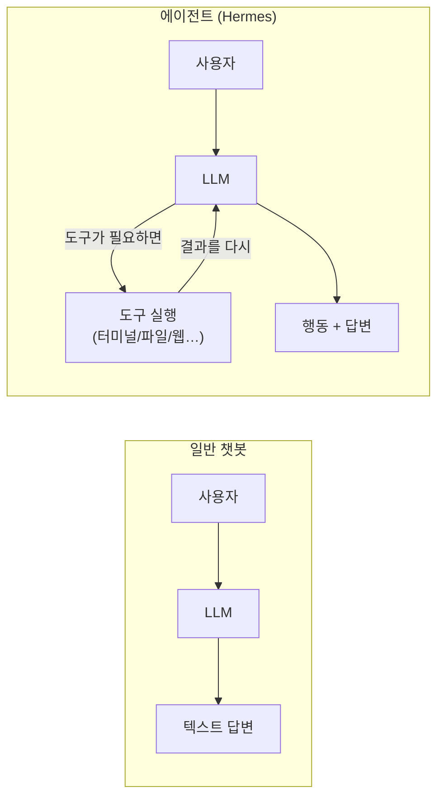
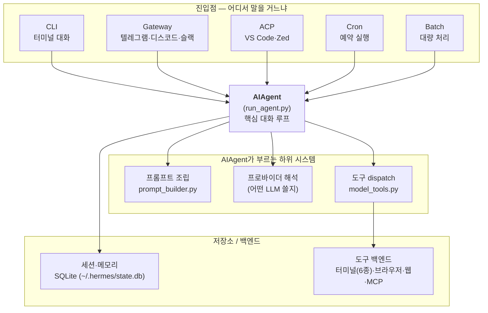
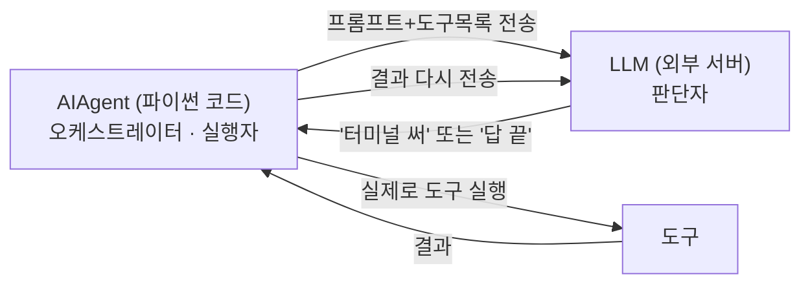
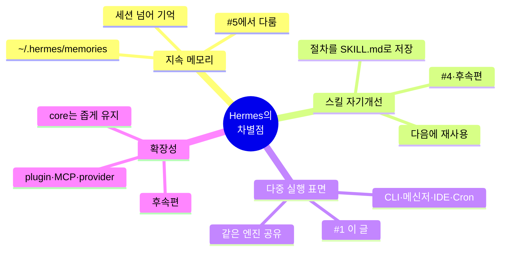
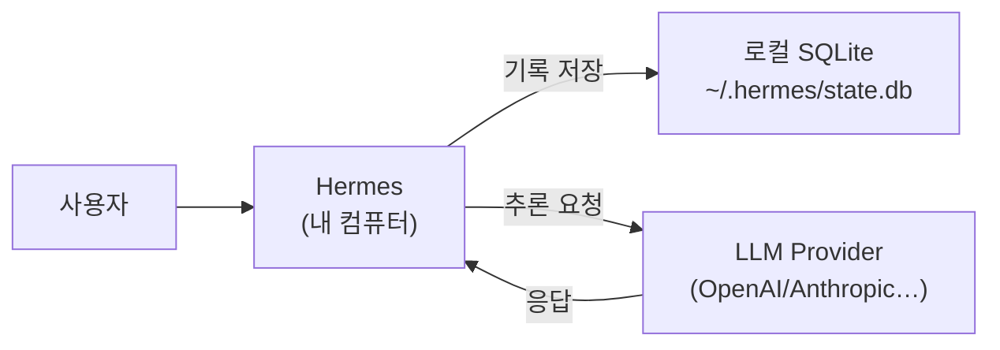
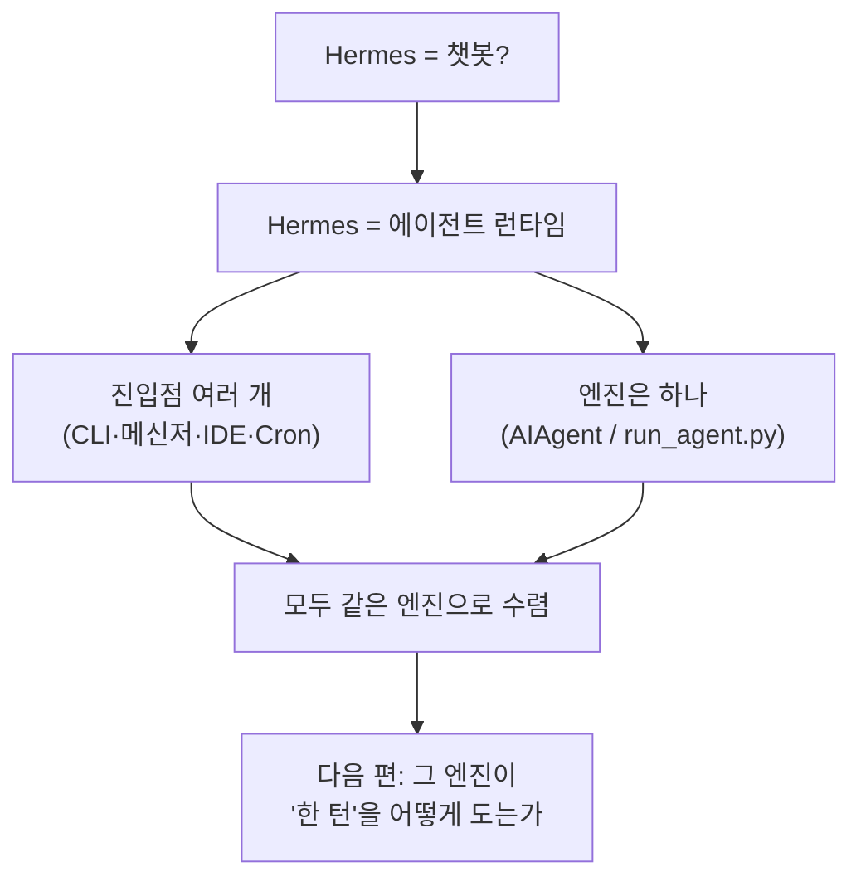

이 글에서 다루는 내용: Hermes는 "챗봇"보다는 에이전트 런타임에 가깝다. 그게 무슨 뜻인지, 그리고 여러 진입점이 결국 하나의 엔진으로 모인다는 점을 그림으로 정리한다.

---

## 들어가며: "이거 그냥 ChatGPT 같은 거 아닌가?"

이 시리즈는 Hermes Agent의 내부 구조를 코드와 문서 기준으로 하나씩 뜯어본 기록이다. 같은 코드를 처음 보는 사람이 큰 그림을 빠르게 잡는 데 도움이 되도록 정리했다.

터미널에 `hermes`를 치면 대화창이 뜬다. 언뜻 보면 평범한 챗봇 같다. 그런데 이런 요청을 해보면 차이가 드러난다.

> "방금 고친 파일 테스트 돌려보고, 통과하면 커밋해줘"

요즘은 ChatGPT 같은 챗봇도 코드 인터프리터로 간단한 계산이나 파일 처리는 한다. 하지만 그건 격리된 임시 샌드박스 안의 이야기다. 내 실제 작업 폴더, 내 git 저장소, 내가 방금 수정한 파일에는 손대지 못한다.

Hermes는 다르다. 위 요청을 받으면 내 실제 환경에서 여러 단계를 스스로 이어서 처리한다. 테스트를 실제로 실행하고(`pytest`), 그 출력을 읽어서 통과 여부를 판단하고, 통과했으면 실제로 `git commit`을 한다. 한 번의 도구 실행으로 끝나는 게 아니라, 결과를 보고 다음 행동을 결정하는 흐름이 이어진다.

핵심 차이는 두 가지다. 하나는 격리된 샌드박스가 아니라 내 실제 머신에서 동작한다는 것, 다른 하나는 "도구 실행 → 결과 확인 → 다음 판단"을 여러 번 반복하며 일을 끝까지 끌고 간다는 것이다.

그 차이를 그림으로 그리면 이렇다.



챗봇은 `사용자 → LLM → 텍스트`로 끝난다. 에이전트는 그 사이에 도구 실행 루프가 들어간다. LLM이 "이건 테스트를 돌려봐야겠다"고 판단하면 도구를 실행하고, 그 결과를 다시 LLM에 넣고, 다음 행동(커밋할지 말지)을 정하고, 답이 완성될 때까지 이 루프를 돈다.

---

## Hermes를 한 문장으로 정의하면

LLM에 터미널·파일·브라우저·메모리·스킬·예약실행·메시징을 연결한 오픈소스 개인 AI 에이전트 런타임이다.

여기서 "런타임"이라는 단어가 핵심이다. Hermes의 정체는 특정 모델이 아니다. 모델은 갈아끼울 수 있다(OpenAI, Anthropic, Gemini, 로컬 모델 모두 가능). Hermes가 제공하는 것은 그 모델을 감싸서 "기억하고, 도구 쓰고, 어디서든 호출되게" 만드는 실행 환경이다.

---

## 가장 중요한 그림: 모든 입구는 하나로 모인다

이 시리즈 전체를 관통하는 구조다. Hermes는 CLI 프로그램 하나가 아니라, 같은 엔진을 여러 입구가 공유하는 형태다.



이 그림이 말하는 것은 세 가지다.

1. 진입점은 껍데기에 가깝다. 텔레그램이든 CLI든 하는 일은 "사용자 메시지를 받아 AIAgent에 넘기고 답을 돌려주는 것"이다.
2. AIAgent(`run_agent.py`)가 중심이다. 프롬프트 조립, 모델 선택, 도구 실행, 저장을 여기서 조율한다.
3. 하위 시스템은 AIAgent가 필요할 때 부른다. 프롬프트를 만들고, 어떤 LLM을 쓸지 정하고, 도구를 돌리고, 결과를 SQLite에 저장한다.

관련 코드:
- 진입점: `cli.py`(CLI), `gateway/run.py`(메시징), `acp_adapter/`(IDE), `cron/`(예약), `batch_runner.py`(배치)
- 중심: `run_agent.py`의 `AIAgent` 클래스
- 하위 시스템: `agent/prompt_builder.py`, `model_tools.py`, `hermes_state.py`

---

## 짚고 갈 점: AIAgent는 LLM이 아니다

여기서 헷갈리기 쉽다. 위에서 AIAgent를 "중심"이라고 불렀지만, AIAgent가 LLM(GPT·Claude 같은 모델) 자체인 것은 아니다.

AIAgent는 LLM을 호출하는 파이썬 코드, 즉 오케스트레이터다. 코드를 열어보면 `AIAgent`는 `self.client`를 들고 있는데, 이것이 LLM 서버(OpenAI/Anthropic)로의 연결이다. LLM은 AIAgent "안에" 있는 게 아니라 네트워크 너머의 외부 서버이고, AIAgent가 그것을 호출한다.



역할을 둘로 나누면 정리가 된다.

| | 누가 | 무엇을 |
|---|------|--------|
| 판단 | LLM (외부) | "터미널을 써야겠다", "이제 답할 때다" |
| 실행·제어 | AIAgent (코드) | 프롬프트 조립, 도구 실행, 루프 반복, 저장 |

LLM은 "무엇을 할지"를 결정하고, AIAgent는 그 결정을 받아 실제로 도구를 실행하고 결과를 다시 LLM에 전달한다. 이 왕복을 LLM이 "끝"이라고 할 때까지 반복하는 것도 AIAgent의 일이다(자세한 루프는 [#2](./02-agent-loop)에서 다룬다).

이 구분이 중요한 이유는 위 그림의 "프로바이더 해석(어떤 LLM 쓸지)" 단계와 연결되기 때문이다. AIAgent가 LLM이었다면 어떤 LLM을 쓸지 고르는 단계가 필요 없다. AIAgent는 LLM이 아니라서 "이번엔 GPT 서버에 붙을지 Claude에 붙을지"를 정하는 단계가 따로 있고, 덕분에 오케스트레이션 코드는 그대로 두고 연결하는 모델만 바꿀 수 있다.

---

## Hermes가 내세우는 네 가지 차별점

공식 문서와 코드를 보면 Hermes가 "또 하나의 LLM 래퍼"와 구분되는 근거가 네 가지 있다. 시리즈 뒤에서 하나씩 다루므로 여기서는 지도만 그려둔다.



| 차별점 | 한 줄 설명 | 다루는 편 |
|--------|-----------|----------|
| 지속 메모리 | 세션이 끝나도 사용자 선호·환경을 기억 | #5 |
| 스킬 기반 자기개선 | 복잡한 작업 절차를 스스로 저장해 재사용 | #4 + 후속 |
| 다중 실행 표면 | CLI·메신저·IDE·예약작업이 한 엔진 공유 | #1 (이 글) |
| 확장성 | plugin·MCP·custom provider로 기능 추가 | 후속 |

---

## 디렉터리 구조 — 어디에 뭐가 있나

코드를 처음 열면 폴더가 많아 부담스럽다. 먼저 알아둘 것만 추렸다.

```text
hermes-agent/
├── run_agent.py        # AIAgent — 핵심 대화 루프 (여기가 중심)
├── cli.py              # 터미널 UI
├── model_tools.py      # 도구 discovery + dispatch
├── toolsets.py         # 도구 묶음(toolset) 정의
├── hermes_state.py     # SQLite 세션 저장소
│
├── agent/              # 에이전트 내부 부품들
│   ├── prompt_builder.py   # 시스템 프롬프트 재료(상수)
│   ├── system_prompt.py    # 그 재료를 조립
│   └── ...                 # 압축·메모리·프로바이더 어댑터 등
│
├── tools/              # 도구 구현 (도구당 파일 1개)
│   ├── registry.py         # 도구 등록소
│   ├── terminal_tool.py    # 터미널
│   ├── file_tools.py       # 파일 읽기/쓰기
│   └── ...
│
├── gateway/            # 메시징 게이트웨이 (텔레그램 등 20+ 플랫폼)
├── cron/               # 예약 작업 스케줄러
├── skills/             # 번들 스킬
└── website/docs/       # 공식 문서
```

폴더 전체를 외울 필요는 없다. `run_agent.py`가 중심이고 나머지는 그것이 부르는 부품이라고 보면 된다.

---

## 한 가지 더: "로컬"의 의미

Hermes는 대화 기록과 메모리를 내 컴퓨터의 `~/.hermes/`에 저장한다(클라우드가 아니다). 그래서 과거 대화를 검색하는 기능이 가능하다.

다만 한 가지는 구분해야 한다.



- 기록과 메모리는 내 로컬에 저장된다.
- 추론은 LLM 제공자에게 API로 전송된다.

즉 "로컬 저장"은 Hermes가 보관하는 사본을 말하는 것이고, 대화 내용 자체는 모델 제공자에게 전송된다. 이 부분은 #5에서 더 다룬다.

---

## 이번 편 정리



- Hermes는 LLM에 행동 능력(도구)과 기억(메모리)을 붙인 에이전트 런타임이다.
- CLI·메신저·IDE·예약작업 등 입구는 많지만 엔진은 `AIAgent` 하나다.
- 그래서 Hermes를 이해하는 출발점은 AIAgent가 한 턴을 어떻게 처리하는지 보는 것이다.

---

## 다음 편 예고

#2 Agent Loop — 한 턴이 도는 방식

`hermes`에 한 줄을 입력하면 답이 나올 때까지 코드가 어떤 순서로 움직이는지 `run_conversation()`을 따라가며 분해한다. 도구 호출 루프, 메시지 교대 규칙, 중단(interrupt) 처리까지 다룬다.

관련 코드: `run_agent.py` · 관련 문서: `developer-guide/agent-loop.md`
