이 글에서 다루는 내용: `hermes`에 한 줄을 입력하면, 답이 나올 때까지 코드가 어떤 순서로 움직이는지 따라간다. `AIAgent`의 핵심 루프를 분해한다.

[#1 큰 그림](./01-hermes-overview)에서 "모든 입구는 AIAgent 하나로 모인다"고 정리했다. 이번 편은 그 AIAgent 안으로 들어간다.

---

## 도구를 쓴다는데, 누가 언제 부르는가

#1에서 Hermes가 "터미널을 실제로 실행한다"는 점을 봤다. 여기서 몇 가지 질문이 생긴다.

- LLM이 "터미널을 써야겠다"고 어떻게 결정하는가
- 도구 실행 결과를 누가 다시 LLM에 전달하는가
- 답이 다 나온 것을 어떻게 아는가

이 답은 모두 에이전트 루프(agent loop) 안에 있다. 핵심 함수는 `run_agent.py`의 `run_conversation()`이다.

---

## 큰 그림: 루프는 "도구 호출이 없을 때까지" 돈다

먼저 전체 흐름을 본다. 이 그림 하나가 이번 편의 핵심이다.

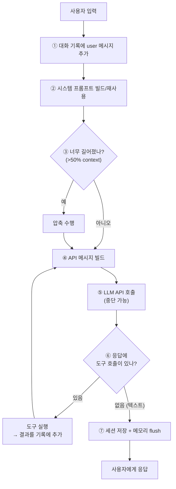

루프의 종료 조건은 "LLM이 도구 호출 없이 텍스트로만 답할 때"다. 도구를 부르는 한, ⑤→⑥→실행→④로 계속 돈다.

헷갈리기 쉬운 점은 이 루프를 누가 도느냐다. [#1에서 짚었듯이](./01-hermes-overview#짚고-갈-점-aiagent는-llm이-아니다) 이 루프를 도는 것은 AIAgent(파이썬 코드)이지 LLM이 아니다. 위 그림에서 ⑤ "LLM API 호출"만 외부 LLM에게 가고, 나머지 단계(①②③④⑥⑦)는 전부 코드가 한다. LLM은 ⑤에서 "도구를 쓸지, 답을 낼지"를 판단만 하고, 그 판단을 받아 실제로 도구를 실행하고 루프를 다시 돌리는 것은 코드다. 즉 "LLM이 알아서 반복한다"가 아니라 "코드가 LLM을 반복 호출한다"가 정확한 표현이다.

---

## 한 단계씩 뜯어보기

`agent-loop.md` 문서에 적힌 `run_conversation()`의 실제 단계다. 의사코드로 보면 다음과 같다.

```text
run_conversation()
  ① task_id가 없으면 생성
  ② user 메시지를 대화 기록에 추가
  ③ 캐시된 system prompt를 빌드하거나 재사용
  ④ preflight 압축이 필요한지 확인 (context >50%)
  ⑤ 대화 기록에서 API 메시지 빌드
       - chat_completions: OpenAI 형식 그대로
       - codex_responses: Responses API 형식으로 변환
       - anthropic_messages: anthropic_adapter.py로 변환
  ⑥ 중단 가능한 API 호출 수행
  ⑦ 응답 파싱:
       - 도구 호출이면 → 실행하고 결과 추가 → ⑤로 돌아감
       - 텍스트면 → 세션 저장, 메모리 flush, 반환
```

처음 볼 때 헷갈리기 쉬운 포인트만 짚어 설명한다.

### ⑤ "API 메시지 빌드" — 모델마다 형식이 다르다

Hermes는 내부적으로는 항상 OpenAI 형식으로 메시지를 들고 있다.

```python
{"role": "system",    "content": "..."}
{"role": "user",      "content": "..."}
{"role": "assistant", "content": "...", "tool_calls": [...]}
{"role": "tool",      "tool_call_id": "...", "content": "..."}
```

그런데 실제 LLM마다 요구하는 형식이 다르다. 그래서 API 호출 직전에 변환한다.

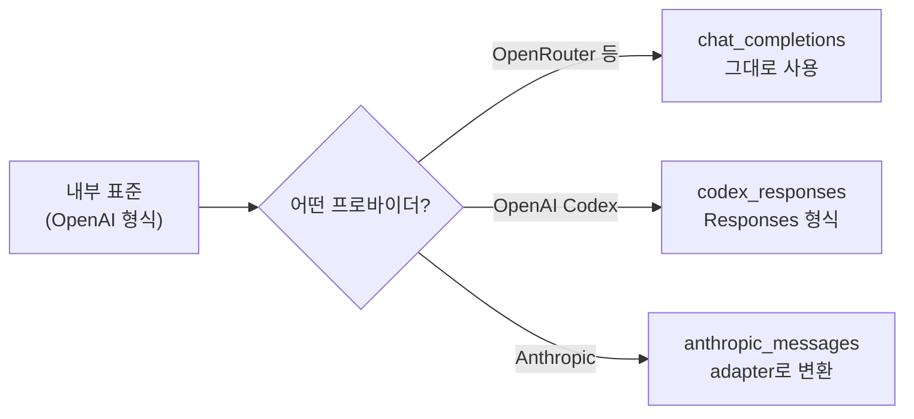

이래서 #1에서 "모델은 갈아끼울 수 있다"고 한 것이 가능하다. 내부 표현은 하나로 통일하고, API 경계에서만 모델별로 변환하기 때문이다.

### ⑥ "중단 가능한 API 호출" — 이유

`_interruptible_api_call()`이라는 함수로 API 호출을 감싼다. 실제 HTTP 호출은 백그라운드 스레드에서 돌리고, 메인 스레드는 "응답 / 중단 / 타임아웃" 중 무엇이 먼저 오는지 지켜본다.

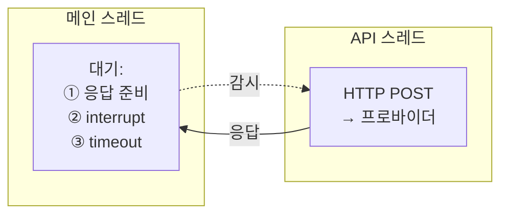

이유는 다음과 같다. 사용자가 답을 기다리다가 새 메시지를 보내거나 `/stop`을 누르면 즉시 멈춰야 한다. 이때 진행 중이던 API 응답은 버린다(부분 응답은 대화 기록에 넣지 않는다). 구조는 복잡하지만, 사용자가 언제든 끼어들 수 있게 하려는 설계다.

### ⑦ 메시지 교대 규칙 — 눈에 잘 안 띄는 함정

이 부분은 중요한데 눈에 잘 안 띈다. 에이전트 루프는 엄격한 role 교대를 강제한다.

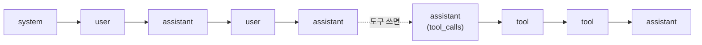

규칙은 다음과 같다.

- system 다음엔 `user → assistant → user → assistant …`
- assistant가 도구를 부르면 → `tool` 결과들 → 다시 `assistant`
- assistant 두 번 연속 금지
- user 두 번 연속 금지
- `tool`만 연속 가능 (병렬 도구 결과)

프로바이더 API가 이 순서를 검증하고, 어기면 요청을 거부한다. 그래서 Hermes는 대화 기록을 함부로 건드리지 않는다. 나중에 "압축"할 때도 이 규칙을 깨면 안 되므로 조심스럽게 다룬다(#5에서 다룬다).

---

## 도구 실행: 1개면 직접, 여러 개면 병렬

⑥에서 LLM이 도구를 부르면 어떻게 실행하는가.

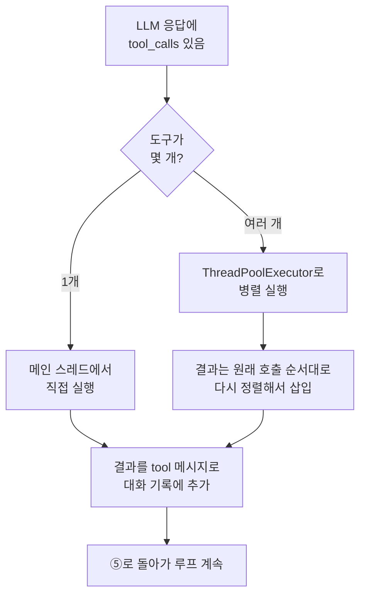

- 단일 도구는 직접 실행한다.
- 여러 도구는 병렬 실행한다. 단 결과는 완료 순서가 아니라 원래 호출 순서대로 다시 끼워넣는다.
- 예외로, `clarify`(사용자에게 질문)처럼 상호작용이 필요한 도구는 병렬에서 빼고 순차 실행한다.

#### 병렬 실행의 실제 구현

이 부분의 실제 코드는 `agent/tool_executor.py`의 `execute_tool_calls_concurrent()`에 있다. 단순히 "스레드 여러 개로 돌린다"보다 몇 가지 장치가 더 있다.

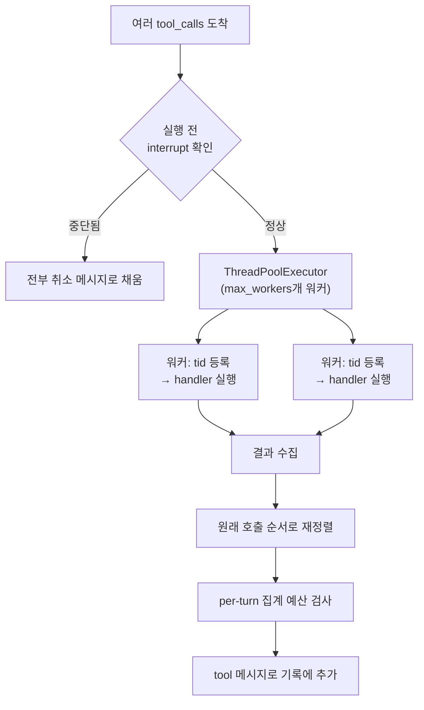

코드에서 확인되는 장치들:

- 워커마다 thread id를 등록한다. 사용자가 중단하면 `AIAgent.interrupt()`가 실행 중인 워커 각각에 interrupt 신호를 fan-out 할 수 있어야 하기 때문이다. 등록은 워커가 시작할 때 가장 먼저 한다.
- 실행 직전, 실행 중, 각 단계마다 interrupt를 확인한다. `web_search`처럼 자체 interrupt 확인이 없는 도구는 중간에 끊지 못하지만, 그 외에는 워커별 신호로 중단된다.
- 끝나면 per-turn 집계 예산을 검사한다(`enforce_turn_budget`). 한 턴 안에서 도구들이 만든 결과의 총량이 너무 크면 여기서 잘린다.

순차 실행 경로(`execute_tool_calls_sequential`)도 따로 있고, 각 도구를 시작하기 전에 interrupt를 먼저 확인한 뒤 실행한다.

관련 코드: `agent/tool_executor.py`의 `execute_tool_calls_concurrent` / `execute_tool_calls_sequential`

### 도구 실행 안쪽 흐름


```text
각 tool_call마다:
  1. tools/registry.py에서 handler를 찾음
  2. pre_tool_call 플러그인 hook 실행
  3. 위험한 명령인지 검사 (tools/approval.py)
     - 위험하면 → 사용자 승인 대기
  4. handler 실행
  5. post_tool_call 플러그인 hook 실행
  6. 결과를 {"role": "tool", ...}로 기록에 추가
```

도구를 어떻게 찾고 실행하는지(`registry`, `dispatch`)는 #4 도구 시스템에서 자세히 다룬다. 여기서는 "루프 안에서 이 시점에 도구가 실행된다"는 점만 알면 된다.

---

## 자세히: hook과 위험 검사는 어떻게 맞물리나

위 "안쪽 흐름"의 2~3번(pre hook → 위험 검사)과 5번(post hook)이 헷갈리기 쉽다. 세 가지를 짚는다.

### ① pre hook이 위험 검사보다 먼저인 이유

직관적으로는 "내장 안전검사부터 하고 플러그인을 부르는 것"이 맞을 것 같다. 하지만 둘은 목적도 주체도 다르다.

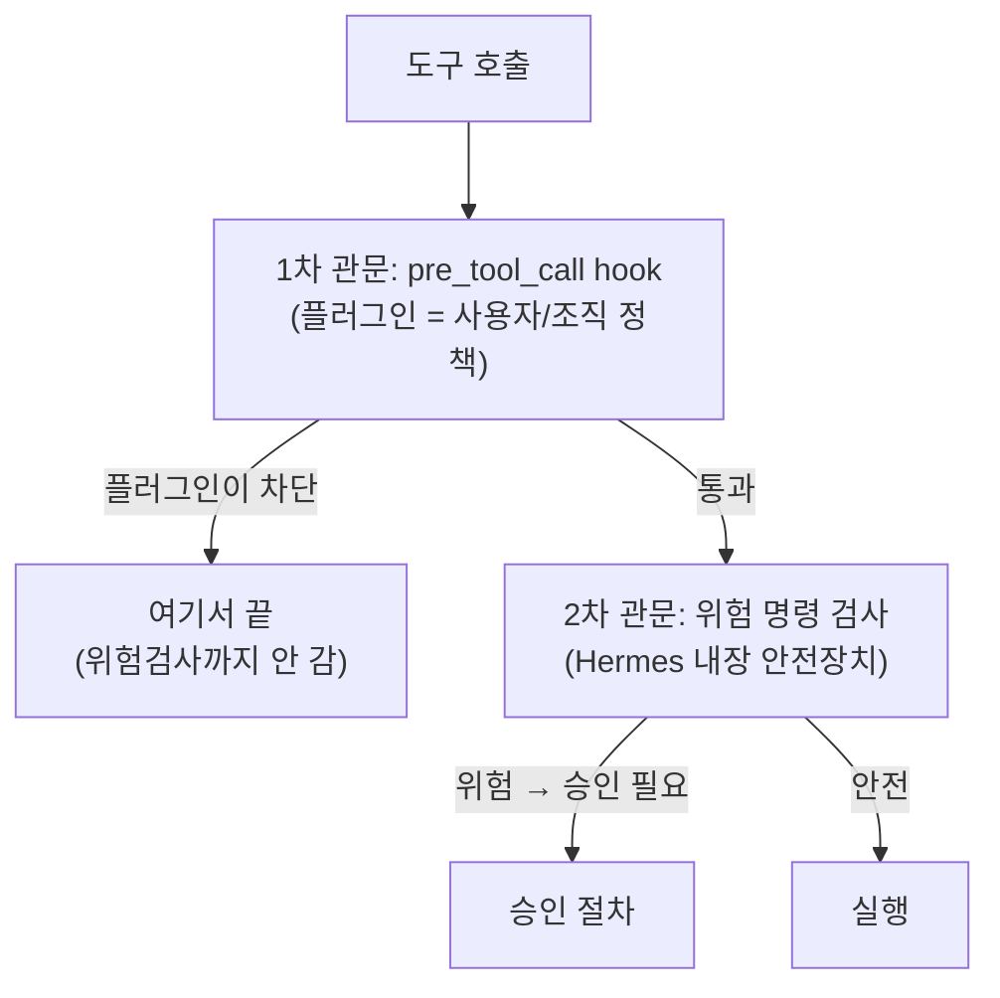

- pre hook은 플러그인(사용자/조직이 설치한 정책)이 끼어드는 바깥쪽 관문이다.
- 위험 검사는 Hermes 내장 규칙(`rm -rf` 등)인 안쪽 관문이다.

"플러그인(사용자/조직이 설치한 정책)"의 의미는 다음과 같다. 플러그인은 Hermes core를 건드리지 않고 기능을 추가하는 확장이다(자세히는 [#11](./11-extending)). 그중 하나가 `pre_tool_call` hook 등록인데, 이걸로 사용자나 회사가 자기만의 차단 규칙을 심을 수 있다. 예를 들어 "`/회사기밀/` 폴더는 건드리지 마", "외부로 데이터 보내는 도구 금지", "업무시간 외 배포 금지" 같은 규칙이다. Hermes 기본에는 없는, 상황에 맞춘 규칙이라 "정책"이라 부른다. 즉 pre hook은 커스텀 규칙이 작동하는 자리이고, 위험 검사는 Hermes가 기본 제공하는 안전망이다. 플러그인을 아무것도 깔지 않았으면 pre hook은 그냥 통과하고 내장 위험 검사만 작동한다.

순서가 "바깥(넓은 정책) → 안(내장 규칙)"인 이유는 다음과 같다. 플러그인이 먼저 막을 명령이면 내장 검사·승인 프롬프트까지 갈 필요가 없다. 사용자 정책을 1차로 존중하고, 그것을 통과한 것만 내장 안전망으로 거른다.

### ② pre_tool_call vs post_tool_call — 둘로 나눈 이유

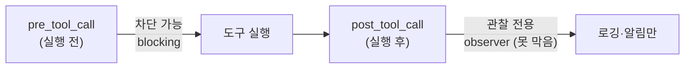

| | 시점 | 권한 |
|---|------|------|
| `pre_tool_call` | 실행 전 | 차단 가능 — 반환값으로 실행을 막음 |
| `post_tool_call` | 실행 후 | 관찰 전용 — 결과 보고 로깅/알림만, 못 막음 |

나눈 이유는 시점이 곧 권한이기 때문이다. "막을지 결정"하려면 실행 전이어야 하고, "무슨 일이 일어났는지 기록"하려면 실행 후여야 한다. 그래서 post는 코드에서도 순수 observer로 구현돼 있고, 등록된 hook이 없으면 싸게 no-op으로 통과한다.

### ③ "위험한 명령" 검사는 코드인가, LLM인가, 사용자인가

탐지는 코드(정규식), 결정은 모드에 따라 사용자 또는 보조 LLM이 한다. 3단계다.

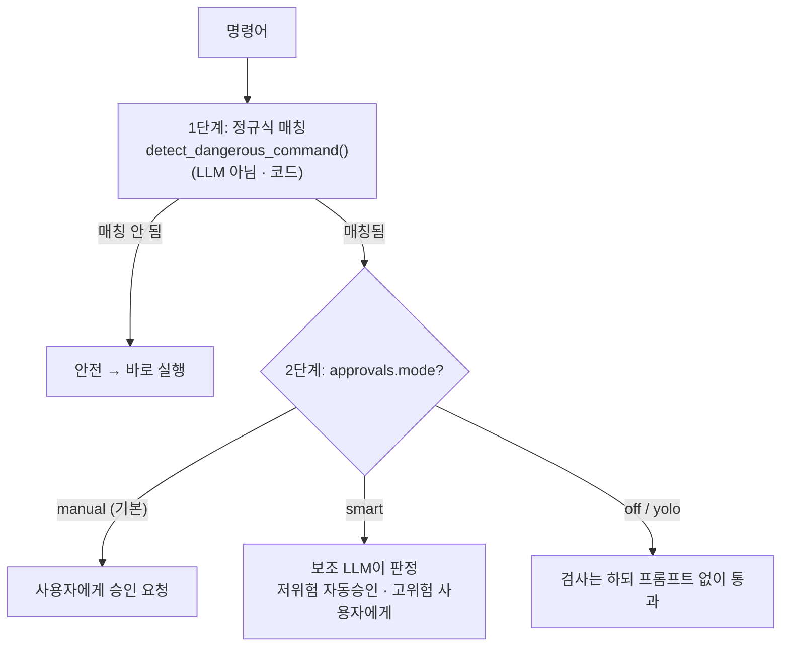

1단계는 정규식 탐지(코드)다. `tools/approval.py`의 `DANGEROUS_PATTERNS`라는 정규식 리스트로 매칭한다. LLM도 사용자도 아닌, 결정적인 패턴 매칭이다.

```python
# tools/approval.py — DANGEROUS_PATTERNS 일부
(r'\brm\s+-[^\s]*r', "recursive delete"),               # rm -rf
(r'\bmkfs\b', "format filesystem"),                      # 디스크 포맷
(r'\bDELETE\s+FROM\b(?![^\n]*\bWHERE\b)', "DELETE without WHERE"),  # WHERE 없는 삭제
(r':\(\)\s*\{\s*:\s*\|\s*:\s*&\s*\}\s*;\s*:', "fork bomb"),  # 포크밤
(r'\bsystemctl\s+...(stop|restart|disable|mask)\b', "stop service"),
```

2단계는 모드에 따른 결정이다. `config.yaml`의 `approvals.mode`로 정한다.

| 모드 | 동작 |
|------|------|
| `manual` (기본) | 사용자에게 승인 요청 (CLI 프롬프트 / 게이트웨이 메시지) |
| `smart` | 보조 LLM이 저위험이면 자동 승인, 고위험이면 사용자에게 |
| `off` (=`--yolo`) | 검사는 하되 프롬프트 없이 통과 |

정리하면 "위험한가?"는 코드(정규식)가 판단하고, "그래서 실행할까?"는 모드에 따라 사용자 또는 보조 LLM이 결정한다. 안전선(정규식 탐지)은 LLM의 판단에 맡기지 않는다. #6 교훈 7 "안전은 코드로도 친다"가 여기서 구현된다.

코드 위치는 다음과 같다. 탐지는 `tools/approval.py`의 `detect_dangerous_command()` + `DANGEROUS_PATTERNS`. hook은 `model_tools.py`의 `get_pre_tool_call_block_message()`(pre, 차단형)와 `_emit_post_tool_call_hook()`(post, 관찰형)이다. 승인 흐름 전체는 #4에서 더 다룬다.

---

## 안전장치 2개: 무한루프 방지 & 실패 시 대체

### Iteration Budget (무한루프 방지)

루프가 도구를 계속 부르면 영원히 끝나지 않을 수 있다. 그래서 턴 수 예산이 있다.

- 기본 90회 (`agent.max_turns`로 설정)
- 100% 도달하면 멈추고 "여기까지 한 작업 요약"을 반환
- subagent(하위 에이전트)는 별도 예산(기본 50)

90이라는 숫자의 근거는 코드에서 명시적으로 확인되지 않는다. 코드를 뒤져봐도 "90인 이유"를 설명하는 계산식은 보이지 않았다. 다만 몇 가지는 확인된다. 이 90은 토큰/컨텍스트 길이에서 계산된 값이 아니다. 단위가 다르다. 90은 "루프를 몇 바퀴 돌까(턴 수)"이고, 컨텍스트 초과는 [#10의 압축](./10-context-compression)이 따로 막는다. 즉 max_turns(무한루프 방지)와 compression(토큰 초과 방지)은 독립이다. 그렇다면 90이라는 숫자 자체는, 모델 스펙에서 자동 유도되는 값이 아니라 경험적 기본값(자주 쓰는 작업은 이 안에서 끝난다는 운영 경험)으로 정한 안전 상한으로 추정된다. 정확한 선정 근거는 설계자/커밋 히스토리의 영역이라 단정할 수 없다. 분명한 것은 사용자가 `agent.max_turns`로 바꿀 수 있다는 점이다. 90은 정답이 아니라 출발점이다.

### Fallback 모델 (실패 시 대체)

주 모델이 실패하면(429 rate limit, 5xx, 401/403 인증오류) 다른 모델로 갈아탄다.

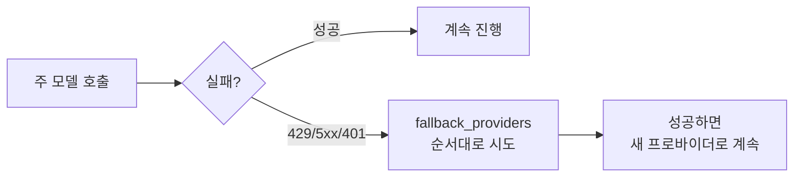

401/403(인증 오류)이면 갈아타기 전에 credential 갱신부터 시도한다. 토큰 만료 같은 경우라면 모델을 바꾸지 않아도 되기 때문이다.

#### 실패의 종류를 먼저 분류한다

위 그림은 단순화한 것이고, 실제로는 "실패했으니 무조건 갈아탄다"가 아니다. 실패마다 올바른 대응이 다르기 때문에, 먼저 에러를 분류한다. 이 분류기가 `agent/error_classifier.py`의 `classify_api_error()`이고, 결과는 `FailoverReason` enum이다. 실패 원인별로 대응이 갈린다.

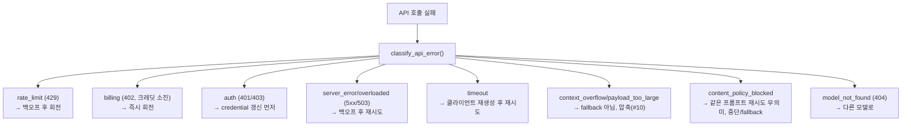

핵심은 모든 실패가 "다른 모델로 갈아타기"로 해결되지 않는다는 점이다. 분류에 따라 대응이 셋으로 갈린다.

- 재시도(retry): 같은 모델에 백오프 후 다시 시도 (server_error, timeout, overloaded 등). 백오프는 `jittered_backoff`로 지터를 넣어 동시 재시도 충돌을 줄인다.
- 회전/대체(fallback): 다른 프로바이더로 전환 (billing, model_not_found, 갱신 후에도 실패한 auth_permanent 등).
- 압축(compress): context_overflow나 payload_too_large는 모델을 바꿀 문제가 아니라 입력이 너무 큰 것이라 [#10 압축](./10-context-compression)으로 보낸다. 한 턴 안에서 압축 시도는 최대 3회로 제한된다.

content_policy_blocked는 특히 중요한 분류다. 프로바이더의 안전 필터가 거부한 경우, 같은 프롬프트를 그대로 재시도하면 똑같이 거부당한다. 그래서 이건 "재시도 불가(retryable=False)"로 분류하고 바로 fallback이나 사용자 안내로 넘긴다. 무의미한 3회 재시도를 막는 장치다.

`FailoverReason`에는 이 외에도 프로바이더별 특수 케이스가 더 있다(Anthropic thinking signature, long-context tier gate, llama.cpp 문법 패턴 등). 같은 "실패"라도 어느 모델·게이트웨이를 쓰느냐에 따라 원인과 대응이 다르기 때문에 enum이 세분화돼 있다.

#### 루프 안에서의 실제 흐름

`agent/conversation_loop.py`의 `run_conversation()`을 보면, 메인 while 루프 안에 retry 루프가 중첩돼 있다.

```text
while (api_call_count < max_iterations and budget 남음):
    ...
    retry_count = 0
    while retry_count < max_retries:
        try:
            API 호출
            break  # 성공
        except 분류 가능한 에러:
            분류 → retry / fallback / compress 중 선택
            fallback 활성화되면 retry_count, compression_attempts 리셋
            jittered_backoff 만큼 대기
```

iteration budget을 다룬 부분도 여기서 한 가지 추가된다. fallback이 활성화되면 그 실패한 호출은 예산을 까먹지 않도록 `iteration_budget.refund()`로 되돌린다. 모델 탓에 실패한 것을 사용자의 턴 예산에서 빼는 건 부당하기 때문이다.

관련 코드: `agent/error_classifier.py`(`classify_api_error`, `FailoverReason`), `agent/conversation_loop.py`(retry/fallback 루프), `agent/retry_utils.py`(`jittered_backoff`)

---

## 두 개의 진입 함수: chat() vs run_conversation()

코드를 보면 진입점이 두 개라 헷갈릴 수 있다.

```python
# 간단 버전 — 최종 응답 문자열만 반환
response = agent.chat("main.py의 버그 고쳐줘")

# 풀 버전 — 메시지·메타데이터·토큰 사용량까지 dict로 반환
result = agent.run_conversation(user_message="...", task_id="...")
```

`chat()`은 `run_conversation()`을 감싼 얇은 래퍼다. 안에서 `final_response` 필드만 꺼내준다. 즉 실제 엔진은 `run_conversation()` 하나다.

---

## 이번 편 정리

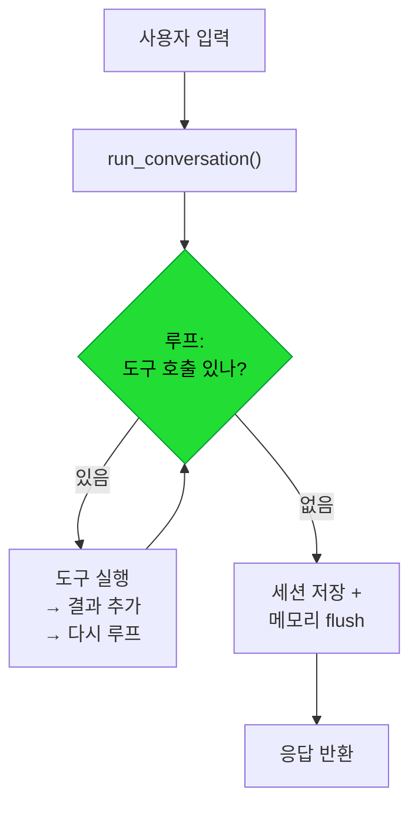

- 에이전트 루프의 중심은 `run_conversation()`이고, "도구 호출이 없을 때까지" 돈다.
- 내부 메시지는 OpenAI 형식으로 통일하고, API 경계에서만 모델별로 변환한다.
- 사용자가 언제든 끼어들 수 있게 중단 가능한 API 호출로 감싼다.
- 메시지 role 교대 규칙을 어기면 안 된다(프로바이더가 거부한다).
- Iteration budget(무한루프 방지)과 fallback(실패 대체)이 안전장치다.

---

## 다음 편 예고

#3 시스템 프롬프트 — 조립되는 정체성

②단계 "시스템 프롬프트 빌드"를 확대한다. Hermes의 "프롬프트"는 한 덩어리가 아니라 작은 조각(상수)들의 조건부 조립이다. 어떤 모델·도구·플랫폼이냐에 따라 프롬프트가 달라지는 메커니즘을 다룬다.

관련 코드: `run_agent.py`(`run_conversation`, `_interruptible_api_call`) · 관련 문서: `developer-guide/agent-loop.md`
