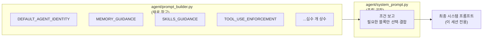
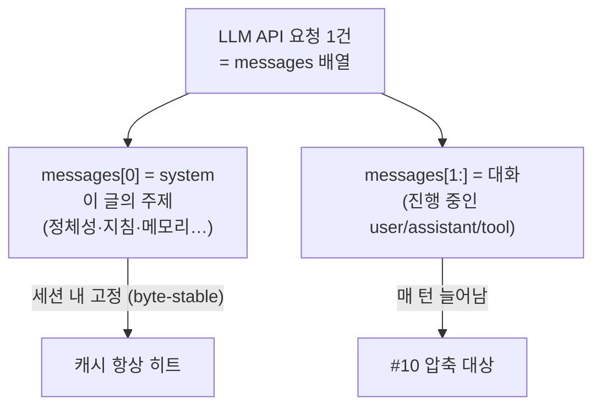
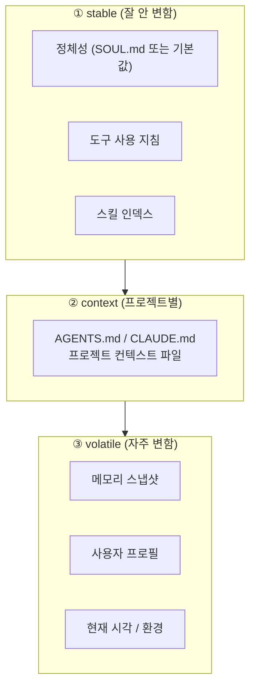
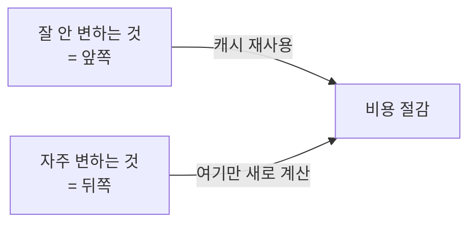
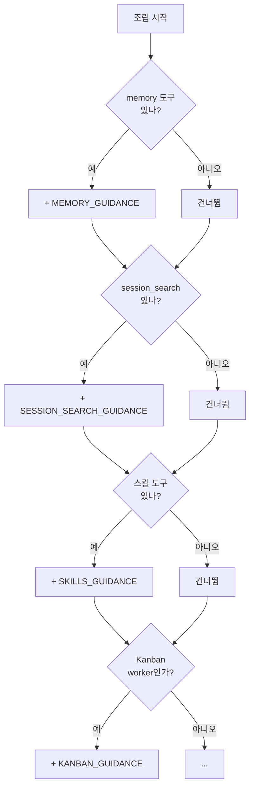
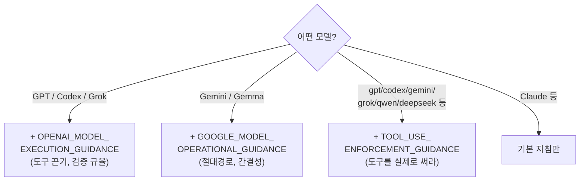
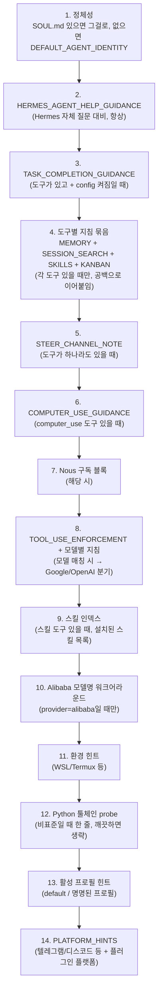
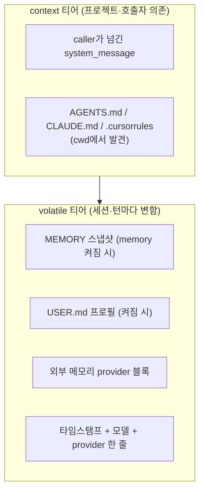
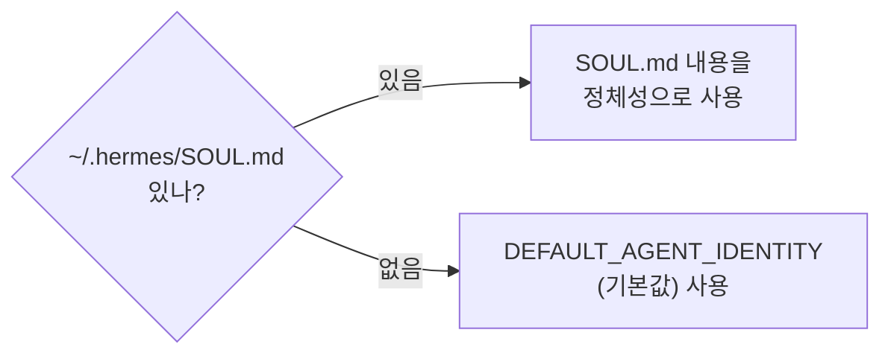
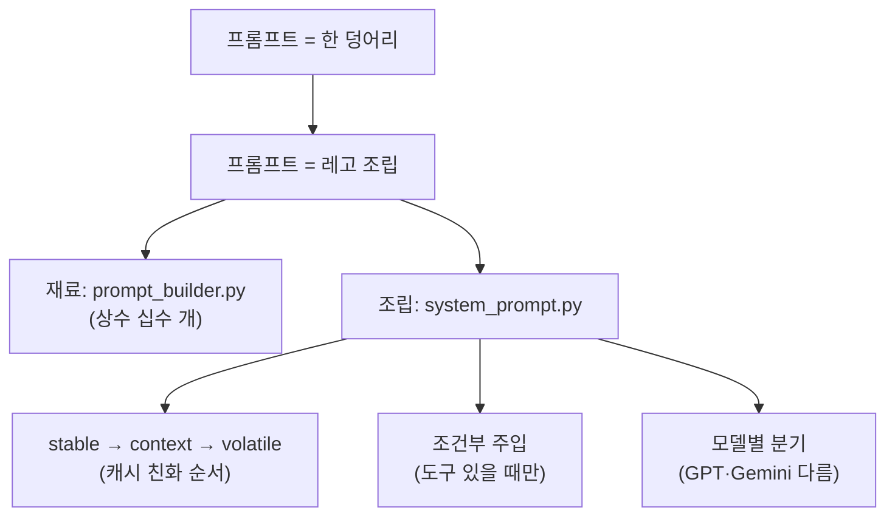

이 글에서 다루는 내용: Hermes의 "시스템 프롬프트"는 하나의 고정된 문서가 아니라, 작은 조각(상수)들을 조건에 따라 조립한 결과물이다. 그래서 같은 Hermes라도 모델·도구·플랫폼에 따라 프롬프트가 달라진다. [#2](./02-agent-loop)의 ②단계 "시스템 프롬프트 빌드"를 확대하는 편이다.

---

## 프롬프트는 어디 한 군데 적혀 있을까?

`SYSTEM_PROMPT = "You are Hermes..."` 같은 문자열이 파일 어딘가에 통째로 들어 있을 법하지만, 코드에는 그런 단일 상수가 없다. 대신 잘게 쪼개진 상수 십수 개가 있다.

```
DEFAULT_AGENT_IDENTITY      # 기본 정체성
MEMORY_GUIDANCE             # 메모리 규칙
SKILLS_GUIDANCE             # 스킬 규칙
TOOL_USE_ENFORCEMENT_...    # 도구 강제
OPENAI_MODEL_EXECUTION_...  # GPT 전용
GOOGLE_MODEL_OPERATIONAL_...# Gemini 전용
... (계속)
```

즉 Hermes의 프롬프트는 "레고 블록"에 가깝다. 상황에 맞는 블록만 골라 조립한다.

---

## 큰 그림: 재료(prompt_builder) → 조립(system_prompt)

프롬프트 시스템은 두 파일로 나뉜다.



`prompt_builder.py`는 재료를 정의하고, `system_prompt.py`는 그걸 조립한다. 어떤 블록을 넣을지는 조립 단계에서 조건부로 결정된다.

---

## 먼저 짚고 가기: 시스템 프롬프트는 "전체 요청의 맨 앞 한 칸"이다

본격적으로 들어가기 전에 큰 그림 하나. 이 글은 "시스템 프롬프트 조립"을 다루는데, 시스템 프롬프트는 LLM에 보내는 요청의 일부일 뿐이다. 실제 요청은 이렇게 생겼다.

```python
messages = [
    {"role": "system",    "content": "<이 글에서 다루는 시스템 프롬프트 전체>"},  # ← 맨 앞 1칸
    {"role": "user",      "content": "이 폴더 파이썬 파일 몇 개야?"},   # ┐
    {"role": "assistant", "tool_calls": [...]},                       # │ 진행 중인 대화
    {"role": "tool",      "content": "3"},                            # │ (계속 늘어남)
    {"role": "assistant", "content": "3개입니다"},                     # │
    {"role": "user",      "content": "그럼 JS 파일은?"},               # ┘ ← 지금 질문
]
```



여기서 구분할 점. "진행 중인 대화"는 시스템 프롬프트 *안에* 들어가는 게 아니라, 시스템 프롬프트(`messages[0]`) *뒤에 이어지는 메시지들*(`messages[1:]`)이다. [#5의 messages 테이블](./05-memory-and-sessions) 행들이 바로 이 `messages[1:]`로 복원되고, [#2의 루프](./02-agent-loop)가 돌면서 끝에 계속 append되며, 길어지면 [#10 압축](./10-context-compression)이 이 부분(system은 빼고)을 줄인다. 이 글(#3)이 다루는 건 그중 맨 앞 `messages[0]` 한 칸을 어떻게 조립하느냐다.

---

## 조립 규칙 1: 3개의 층(tier)으로 쌓는다

조립에는 순서가 있다. 그냥 막 붙이는 게 아니라 `stable → context → volatile` 순서다.



이 순서를 택한 이유는 prompt caching(프롬프트 캐싱) 때문이다.



LLM은 프롬프트 앞부분이 동일하면 그 부분 계산을 캐시해서 재사용한다(비용·속도 이득). 그래서 안 변하는 정체성을 맨 앞에, 매번 바뀌는 시각·메모리를 맨 뒤에 둔다. 정체성을 자주 바꾸면 캐시가 깨져서 비용이 늘어난다.

이래서 "도구를 켜고 끄면 새 세션부터 적용된다"는 제약이 생긴다. 대화 중간에 프롬프트를 바꾸면 캐시가 깨지므로, 세션이 시작될 때 고정하는 방식을 쓴다.

---

## 조립 규칙 2: 조건부 주입 (있을 때만 넣는다)

모든 블록이 항상 들어가는 게 아니다. 해당 기능이 켜져 있을 때만 그 블록을 넣는다.



이렇게 하면 프롬프트가 낭비 없이 만들어진다. 메모리 도구가 없으면 메모리 사용법을 안 넣는다. 토큰은 비싸고, 매 호출에 들어가기 때문이다.

### 그런데 "켜져 있다"를 어떻게 판단하지?

위 그림이 "memory 도구 있나?"라고 묻는데, 코드는 이걸 별도의 ON/OFF 스위치로 확인하지 않는다. "그 도구 이름이 도구 목록에 들어있나?"를 본다.

```python
# agent/system_prompt.py
if "memory" in agent.valid_tool_names:
    tool_guidance.append(MEMORY_GUIDANCE)
if "session_search" in agent.valid_tool_names:
    tool_guidance.append(SESSION_SEARCH_GUIDANCE)
```

즉 `agent.valid_tool_names`(이 세션이 실제로 쓸 수 있는 도구 이름 목록)에 `"memory"`가 있으면 켜진 것으로 보고 사용법을 넣는다. 도구의 존재 자체가 신호다.

그럼 그 목록은 누가 정하나? 세션이 시작될 때 [#4의 toolset](./04-tools-system)으로 확정된다.


판단 방식은 블록마다 조금씩 다르지만 원리는 같다.

| 블록 | 판단 |
|------|------|
| MEMORY_GUIDANCE | `"memory" in valid_tool_names` (도구 1개 존재?) |
| SKILLS 관련 | `any(n in valid_tool_names for n in ['skills_list','skill_view','skill_manage'])` (여럿 중 하나라도?) |
| STEER_CHANNEL_NOTE | `if agent.valid_tool_names:` (도구가 하나라도 있나?) |
| 모델별 지침 | `"gpt" in model_lower` (이건 도구가 아니라 모델 이름 매칭) |

도구 존재로 판단하는 이유는 다음과 같다. 별도 "기능 ON 플래그"를 두면 둘이 어긋날 수 있다. 플래그는 켰는데 도구는 안 켜졌으면 쓸 수도 없는 사용법이 프롬프트에 들어가고, 반대면 도구는 있는데 사용법은 없는 혼란이 생긴다. 도구 존재 하나만 보면 "도구가 있으면 사용법도 반드시 같이 들어간다"가 보장된다. [#4의 `check_fn`](./04-tools-system)("못 쓰는 도구는 LLM에게 안 보인다")과 같은 철학이다.

---

## 조립 규칙 3: 모델마다 다른 지침을 넣는다

같은 Hermes인데 어떤 모델을 쓰느냐에 따라 프롬프트가 달라진다.



모델마다 알려진 약점이 다르기 때문이다. 코드 주석에 실제 사례가 적혀 있다.

- GPT 계열: "도구 안 쓰고 말로 때우기", "검증 없이 done 선언" → 그래서 실행 규율을 강하게 둔다.
- Gemini 계열: 상대경로 실수, 장황함 → 그래서 절대경로/간결성 지침을 둔다.
- 여러 모델 공통: "하겠다고만 하고 안 함" → TOOL_USE_ENFORCEMENT로 "지금 당장 도구 불러라"를 강제한다.

코드 위치를 보면, `prompt_builder.py`에 `TOOL_USE_ENFORCEMENT_MODELS = ("gpt", "codex", "gemini", "gemma", "grok", "glm", "qwen", "deepseek")` 같은 리스트가 있어서, 모델 이름에 이 문자열이 들어가면 해당 지침을 켠다.

---

## 주요 블록들 한눈에

재료 목록을 정리하면 다음과 같다. (전체 번역은 별도 노트 `hermes_prompts_ko.md`에 있음)

| 블록 | 역할 | 언제 들어가나 |
|------|------|--------------|
| `DEFAULT_AGENT_IDENTITY` | 기본 정체성 | SOUL.md 없을 때 |
| `MEMORY_GUIDANCE` | 메모리 저장 규칙 | memory 도구 있을 때 |
| `SESSION_SEARCH_GUIDANCE` | 과거 대화 검색 규칙 | session_search 있을 때 |
| `SKILLS_GUIDANCE` | 스킬 저장/갱신 규칙 | 스킬 도구 있을 때 |
| `KANBAN_GUIDANCE` | 멀티에이전트 작업 규약 | Kanban worker일 때 |
| `TOOL_USE_ENFORCEMENT_GUIDANCE` | "도구를 실제로 써라" | 특정 모델군 |
| `TASK_COMPLETION_GUIDANCE` | "끝까지 끝내라/지어내지 마라" | 모든 모델 |
| `OPENAI_MODEL_EXECUTION_GUIDANCE` | GPT/Codex/Grok 실행 규율 | 해당 모델군 |
| `GOOGLE_MODEL_OPERATIONAL_GUIDANCE` | Gemini/Gemma 운영 지침 | 해당 모델군 |
| `COMPUTER_USE_GUIDANCE` | macOS 데스크톱 제어 | computer_use 도구 있을 때 |
| `STEER_CHANNEL_NOTE` | 턴 중간 사용자 개입 신뢰 규칙 | steer 활성 시 |
| `PLATFORM_HINTS` | 플랫폼별 렌더링 힌트 | 텔레그램/디스코드 등 |

---

## 실제 해부 ①: stable 티어는 정확히 이 순서로 쌓인다

"조건부 조립"이라는 말이 추상적이라, `system_prompt.py`의 `build_system_prompt_parts()`가 실제로 블록을 append하는 순서를 그대로 따라가 본다. stable 티어는 이 순서로 쌓인다 (위에서 아래로).



코드 위치를 보면, `agent/system_prompt.py`의 `build_system_prompt_parts()` 함수 한 곳에서 이 순서가 전부 결정된다(약 85~287번째 줄). "if 도구 있으면 append" 패턴이 14번 반복되는 구조다.

여기서 눈여겨볼 디테일 두 가지.

1. 도구별 지침은 하나로 합쳐진다. MEMORY/SESSION_SEARCH/SKILLS/KANBAN는 따로 넣지 않고, 켜진 것만 모아 공백으로 이어붙인 한 덩어리로 들어간다. (코드에선 `tool_guidance` 리스트)
2. TOOL_USE_ENFORCEMENT는 4단계 판정을 거친다. config의 `agent.tool_use_enforcement` 값이 `true`/`false`/리스트/`"auto"`냐에 따라 분기한다.

```text
tool_use_enforcement 판정 (config 값에 따라):
  true/always/yes/on   → 무조건 주입
  false/never/no/off   → 절대 안 넣음
  ["gpt","my-model"]   → 모델명에 이 문자열 들어가면 주입 (커스텀)
  "auto" (기본값)       → TOOL_USE_ENFORCEMENT_MODELS 기본 리스트로 매칭
```

즉 "모델별로 다른 프롬프트"는 하드코딩이 아니라 config로 조정 가능한 정책이다. `config.yaml`에서 `agent.tool_use_enforcement: true`로 두면 Claude에도 강제 지침이 붙는다.

---

## 실제 해부 ②: 진짜 텍스트는 어떻게 생겼나

블록 이름만 보면 감이 안 오니, 실제 들어가는 영어 원문과 전체 한글 번역을 나란히 펼쳐본다. (더 많은 블록의 대조는 별도 노트 `hermes_prompts_ko.md`에 정리돼 있다.)

### DEFAULT_AGENT_IDENTITY (기본 정체성)

```text
You are Hermes Agent, an intelligent AI assistant created by Nous Research.
You are helpful, knowledgeable, and direct. You assist users with a wide
range of tasks including answering questions, writing and editing code,
analyzing information, creative work, and executing actions via your tools.
You communicate clearly, admit uncertainty when appropriate, and prioritize
being genuinely useful over being verbose unless otherwise directed below.
Be targeted and efficient in your exploration and investigations.
```

> 전체 번역:
> 너는 Nous Research가 만든 지능형 AI 어시스턴트 Hermes Agent다. 너는 도움이 되고, 박식하며, 직설적이다. 너는 질문에 답하고, 코드를 작성·편집하고, 정보를 분석하고, 창의적 작업을 하고, 도구를 통해 실제 행동을 실행하는 등 폭넓은 작업에서 사용자를 돕는다. 너는 명확하게 소통하고, 적절할 때 불확실함을 인정하며, 아래에서 달리 지시하지 않는 한 장황함보다 진짜로 유용한 것을 우선한다. 탐색과 조사는 목표 지향적이고 효율적으로 하라.

핵심은 마지막 두 줄이다. "장황함보다 진짜 유용함을 우선", "탐색은 목표 지향적·효율적으로" — 이게 에이전트의 기본 성격을 만든다.

### TASK_COMPLETION_GUIDANCE (끝까지 끝내라 / 지어내지 마라)

이건 에이전트를 "에이전트답게" 만드는 중요한 블록 중 하나다. 위에서는 "…"로 줄였지만, 여기 전체 원문을 펼친다.

```text
# Finishing the job
When the user asks you to build, run, or verify something, the deliverable is
a working artifact backed by real tool output — not a description of one.
Do not stop after writing a stub, a plan, or a single command. Keep working
until you have actually exercised the code or produced the requested result,
then report what real execution returned.
If a tool, install, or network call fails and blocks the real path, say so
directly and try an alternative (different package manager, different
approach, ask the user). NEVER substitute plausible-looking fabricated
output (made-up data, invented file contents, synthesised API responses)
for results you couldn't actually produce. Reporting a blocker honestly
is always better than inventing a result.
```

> 전체 번역:
> # 작업을 끝까지 마무리하기
> 사용자가 무언가를 만들거나(build), 실행하거나(run), 검증하라고(verify) 하면, 산출물은 그것에 대한 *설명*이 아니라 실제 도구 출력으로 뒷받침되는, 동작하는 결과물이다. 스텁(껍데기), 계획, 또는 명령어 한 줄만 쓰고 멈추지 마라. 실제로 코드를 돌려보거나 요청된 결과를 만들어낼 때까지 계속 작업하고, 그런 다음 실제 실행이 무엇을 반환했는지 보고하라.
> 도구·설치·네트워크 호출이 실패해서 정상 경로가 막히면, 그 사실을 직접적으로 말하고 대안을 시도하라(다른 패키지 매니저, 다른 접근법, 사용자에게 묻기). 네가 실제로 만들어낼 수 없었던 결과를 그럴듯해 보이는 가짜 출력(지어낸 데이터, 날조한 파일 내용, 합성한 API 응답)으로 절대 대체하지 마라. 막혔다고 정직하게 보고하는 것이 결과를 지어내는 것보다 언제나 낫다.

에이전트를 만들 때 이 블록은 LLM의 두 가지 고질적 실패 — ① 스텁만 만들고 "끝났다" 하기, ② 막히면 그럴듯하게 지어내기 — 를 프롬프트로 직접 다룬다. 코드 주석에는 실제 관측 사례(Opus가 3번 호출 후 85바이트 파일만 쓰고 종료, DeepSeek이 PEP-668 벽을 뚫고 가짜 부동산 매물을 생성)까지 적혀 있다.

### TOOL_USE_ENFORCEMENT_GUIDANCE (도구를 말로 때우지 말고 실제로 써라)

[조립규칙3](#조립-규칙-3-모델마다-다른-지침을-넣는다)에서 특정 모델군에 붙는다고 한 그 블록이다.

```text
# Tool-use enforcement
You MUST use your tools to take action — do not describe what you would do
or plan to do without actually doing it. When you say you will perform an
action (e.g. 'I will run the tests', 'Let me check the file', 'I will create
the project'), you MUST immediately make the corresponding tool call in the same
response. Never end your turn with a promise of future action — execute it now.
Keep working until the task is actually complete. ...
Every response should either (a) contain tool calls that make progress, or
(b) deliver a final result to the user. ...
```

> 전체 번역:
> # 도구 사용 강제
> 너는 행동을 위해 반드시 도구를 사용해야 한다 — 실제로 하지 않으면서 "하려는 것"이나 "할 계획"을 설명하지 마라. 어떤 행동을 하겠다고 말하면(예: "테스트를 돌리겠습니다", "파일을 확인해 볼게요", "프로젝트를 만들겠습니다"), 같은 응답 안에서 즉시 그에 해당하는 도구 호출을 해야 한다. 미래 행동의 약속으로 네 턴을 끝내지 마라 — 지금 실행하라.
> 작업이 실제로 끝날 때까지 계속하라. 다음번에 무엇을 할지에 대한 요약으로 멈추지 마라. 작업을 완수할 수 있는 도구가 있다면, 사용자에게 무엇을 하겠다고 말하는 대신 그 도구를 사용하라.
> 모든 응답은 (a) 진전을 만드는 도구 호출을 포함하거나, (b) 사용자에게 최종 결과를 전달해야 한다. 행동 없이 의도만 설명하는 응답은 허용되지 않는다.

### 모델별 지침의 실제 차이

같은 의도("도구 잘 써라")인데 모델군마다 다르게 적는다. 두 블록의 전체 번역이다.

#### GPT/Codex/Grok → OPENAI_MODEL_EXECUTION_GUIDANCE (XML 태그 구조)

> 전체 번역:
> # 실행 규율
> `<tool_persistence>` (도구 끈기)
> - 정확성·완전성·근거를 개선한다면 언제든 도구를 사용하라.
> - 또 한 번의 도구 호출이 결과를 실질적으로 개선할 수 있을 때 일찍 멈추지 마라.
> - 도구가 빈/부분 결과를 반환하면, 포기하기 전에 다른 질의나 전략으로 재시도하라.
> - 다음 둘이 충족될 때까지 계속 도구를 호출하라: (1) 작업 완료, 그리고 (2) 결과 검증 완료.
>
> `<mandatory_tool_use>` (필수 도구 사용)
> 다음은 기억이나 암산으로 절대 답하지 말고 항상 도구를 써라:
> - 산수·수학·계산 → terminal 또는 execute_code
> - 해시·인코딩·체크섬 → terminal (sha256sum, base64 등)
> - 현재 시각·날짜·타임존 → terminal (date 등)
> - 시스템 상태: OS·CPU·메모리·디스크·포트·프로세스 → terminal
> - 파일 내용·크기·줄 수 → read_file, search_files, terminal
> - git 히스토리·브랜치·diff → terminal
> - 현재 사실(날씨·뉴스·버전) → web_search
> 네 메모리와 사용자 프로필은 *사용자*를 설명하는 것이지, 네가 돌고 있는 *시스템*을 설명하는 게 아니다. 실행 환경은 사용자 프로필이 말하는 개인 설정과 다를 수 있다.
>
> `<act_dont_ask>` (묻지 말고 행동)
> 질문에 명백한 기본 해석이 있으면, 확인을 구하지 말고 즉시 행동하라. 예:
> - "443 포트 열려 있어?" → *이* 머신을 확인 ("어디서 열렸냐"고 묻지 마라)
> - "내 OS 뭐야?" → 실제 시스템 확인 (사용자 프로필 쓰지 마라)
> - "지금 몇 시야?" → `date` 실행 (추측하지 마라)
> 모호함이 호출할 도구를 진짜로 바꿀 때만 확인을 구하라.
>
> `<prerequisite_checks>` (선행 조건 확인)
> - 행동 전에, 선행 발견·조회·맥락 수집 단계가 필요한지 확인하라.
> - 최종 행동이 뻔해 보인다고 선행 단계를 건너뛰지 마라.
> - 작업이 이전 단계의 출력에 의존하면, 그 의존부터 해결하라.
>
> `<verification>` (검증)
> 응답을 확정하기 전에:
> - 정확성: 출력이 명시된 모든 요구를 충족하는가?
> - 근거: 사실 주장이 도구 출력이나 제공된 맥락으로 뒷받침되는가?
> - 형식: 출력이 요청된 형식·스키마에 맞는가?
> - 안전: 다음 단계에 부작용(파일 쓰기·명령·API 호출)이 있으면, 실행 전 범위를 확인하라.
>
> `<missing_context>` (맥락 누락)
> - 필요한 맥락이 없으면, 추측하거나 답을 지어내지 마라.
> - 누락 정보가 조회 가능하면 적절한 조회 도구를 써라(search_files, web_search, read_file 등).
> - 도구로 가져올 수 없을 때만 확인 질문을 하라.
> - 불완전한 정보로 진행해야 한다면, 가정을 명시적으로 라벨링하라.

#### Gemini/Gemma → GOOGLE_MODEL_OPERATIONAL_GUIDANCE (불릿 구조)

> 전체 번역:
> # Google 모델 운영 지침
> 다음 운영 규칙을 엄격히 따르라:
> - 절대 경로: 모든 파일시스템 작업에 항상 절대 경로를 구성해 사용하라. 프로젝트 루트와 상대 경로를 결합하라.
> - 먼저 검증: 변경 전에 read_file/search_files로 파일 내용과 프로젝트 구조를 확인하라. 파일 내용을 절대 추측하지 마라.
> - 의존성 확인: 라이브러리가 있다고 가정하지 마라. import 전에 package.json, requirements.txt, Cargo.toml 등을 확인하라.
> - 간결성: 설명은 짧게 — 문단이 아니라 몇 문장. 서술보다 행동과 결과에 집중하라.
> - 병렬 도구 호출: 독립적인 작업 여러 개(예: 여러 파일 읽기)가 필요하면, 순차가 아니라 한 응답에서 모든 도구 호출을 하라.
> - 비대화형 명령: -y, --yes, --non-interactive 같은 플래그로 CLI 도구가 프롬프트에서 멈추지 않게 하라.
> - 계속 진행: 작업이 완전히 해결될 때까지 자율적으로 작업하라. 계획으로 멈추지 말고 — 실행하라.

GPT 계열엔 `<xml_tag>` 구조(OpenAI가 그렇게 훈련됨), Gemini엔 간결한 불릿을 쓴다. 모델의 학습 성향에 맞춰 프롬프트 포맷까지 바꾸는 부분이다. 내용은 비슷해도(도구 써라, 검증해라, 추측 마라) 같은 메시지를 모델이 가장 잘 따르는 형식으로 재포장한 것이다.

---

## 실제 해부 ③: context / volatile 티어

stable 다음에 붙는 두 티어는 짧지만 역할이 분명하다.



여기서 짚어둘 디테일 하나.

타임스탬프는 '분'이 아니라 '날짜'까지만 넣는다. `system_prompt.py`를 보면 `now.strftime('%A, %B %d, %Y')` — 분 단위로 넣으면 매 턴 프롬프트가 바뀌어서 캐시가 매번 깨지기 때문이다. 정확한 시각이 필요하면 LLM이 도구로 `date`를 부르면 된다. (실제 PR로 개선된 부분)

이 한 가지가 #3 전체를 관통하는 원칙을 보여준다. 프롬프트는 최대한 byte-stable하게 유지해서 캐시를 살린다.

---

## 주요 블록들 한눈에 (요약 표)

위 "실제 해부" 섹션이 자세한 버전이고, 아래는 빠른 참조용 요약이다.

| 블록 | 역할 | 언제 들어가나 |
|------|------|--------------|
| `DEFAULT_AGENT_IDENTITY` | 기본 정체성 | SOUL.md 없을 때 |
| `MEMORY_GUIDANCE` | 메모리 저장 규칙 | memory 도구 있을 때 |
| `SESSION_SEARCH_GUIDANCE` | 과거 대화 검색 규칙 | session_search 있을 때 |
| `SKILLS_GUIDANCE` | 스킬 저장/갱신 규칙 | 스킬 도구 있을 때 |
| `KANBAN_GUIDANCE` | 멀티에이전트 작업 규약 | Kanban worker일 때 |
| `TOOL_USE_ENFORCEMENT_GUIDANCE` | "도구를 실제로 써라" | 특정 모델군 |
| `TASK_COMPLETION_GUIDANCE` | "끝까지 끝내라/지어내지 마라" | 모든 모델 |
| `OPENAI_MODEL_EXECUTION_GUIDANCE` | GPT/Codex/Grok 실행 규율 | 해당 모델군 |
| `GOOGLE_MODEL_OPERATIONAL_GUIDANCE` | Gemini/Gemma 운영 지침 | 해당 모델군 |
| `COMPUTER_USE_GUIDANCE` | macOS 데스크톱 제어 | computer_use 도구 있을 때 |
| `STEER_CHANNEL_NOTE` | 턴 중간 사용자 개입 신뢰 규칙 | steer 활성 시 |
| `PLATFORM_HINTS` | 플랫폼별 렌더링 힌트 | 텔레그램/디스코드 등 |

---

## 정체성을 바꾸고 싶다면? → SOUL.md

기본 정체성(`DEFAULT_AGENT_IDENTITY`)은 `~/.hermes/SOUL.md` 파일이 있으면 그걸로 대체된다(1순위).



즉 말투·원칙·페르소나를 바꾸고 싶으면 코드를 건드릴 게 아니라 SOUL.md를 쓰면 된다. 단, 너무 많은 규칙을 넣으면 모든 작업에 영향을 주니 주의한다. 프로젝트별 규칙은 AGENTS.md, 반복 절차는 스킬로 분리하는 것이 일반적이다.

---

## 보안 한 조각: STEER_CHANNEL_NOTE

작업 도중 사용자가 끼어드는 메시지(`/steer`)는 도구 결과 끝에 붙는다. 그런데 거기는 프롬프트 인젝션 방어가 "의심하라"고 학습된 위치다. 그래서 진짜 사용자 메시지임을 알리는 특수 마커로 감싸고, "이 마커만 믿어라"라고 프롬프트에 명시한다.


프롬프트 설계는 단순히 "지시 적기"가 아니라 보안까지 고려한 엔지니어링이다. "신뢰할 채널"과 "의심할 채널"을 프롬프트로 구분한다.

---

## 이번 편 정리



- Hermes 프롬프트는 작은 상수들의 조건부 조립이다.
- 순서는 stable → context → volatile, 이유는 prompt caching(비용·속도)이다.
- 도구가 있을 때만 해당 지침을 넣고, 모델에 따라 다른 규율을 넣는다.
- 정체성은 SOUL.md로 커스텀 가능하다(코드 수정 불필요).
- 프롬프트는 보안(신뢰 채널 구분)까지 포함한 엔지니어링이다.

---

## 다음 편 예고

#4 도구 시스템 — registry / dispatch / toolset

#2에서 미뤄둔 "도구를 어떻게 찾고 실행하는가"를 통째로 뜯는다. 각 도구가 어떻게 자기 자신을 등록(`registry.register`)하고, LLM의 호출이 어떻게 실제 함수로 연결되는지(dispatch), 그리고 `check_fn`으로 "쓸 수 없는 도구는 아예 안 보이게" 하는 메커니즘까지.

관련 코드: `agent/prompt_builder.py`, `agent/system_prompt.py` · 관련 문서: `developer-guide/prompt-assembly.md` · 별도 노트: `hermes_prompts_ko.md`
