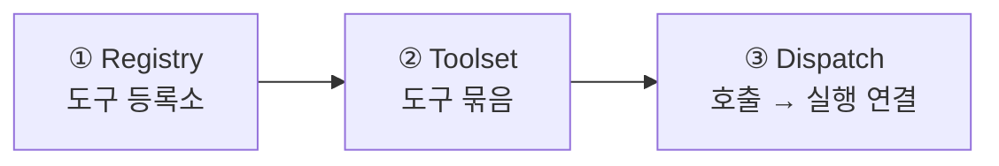
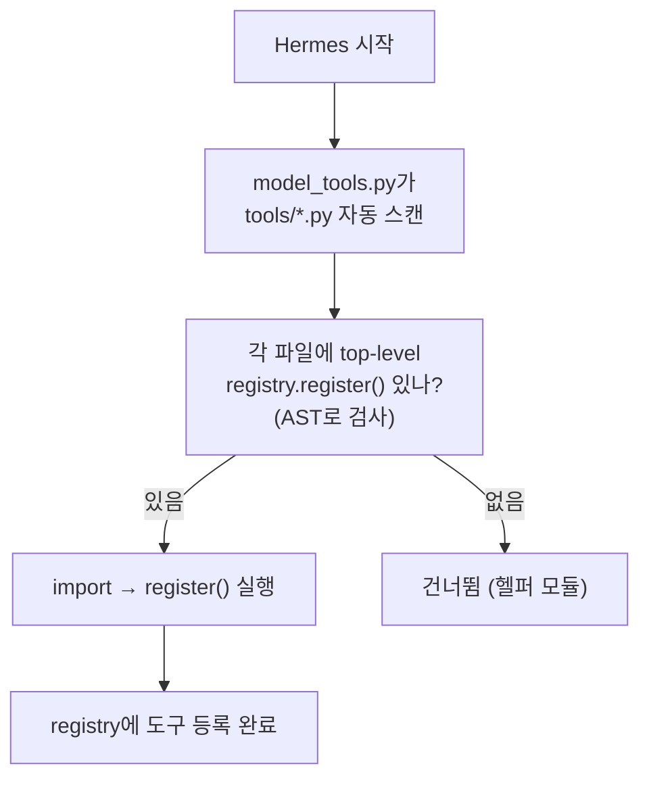
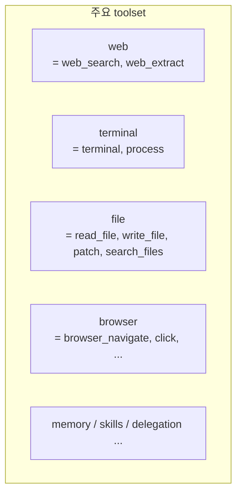
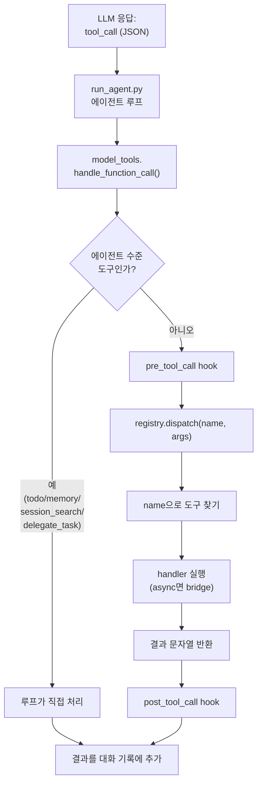
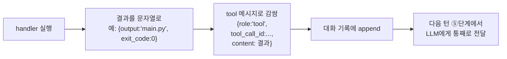
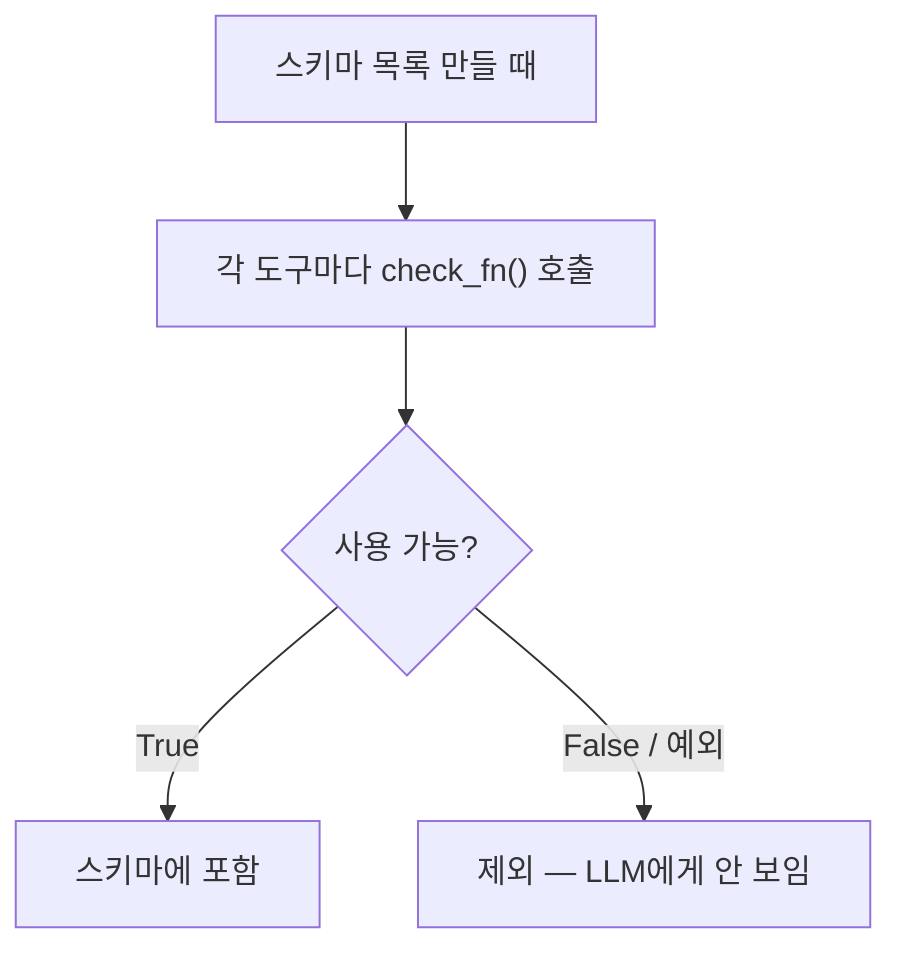
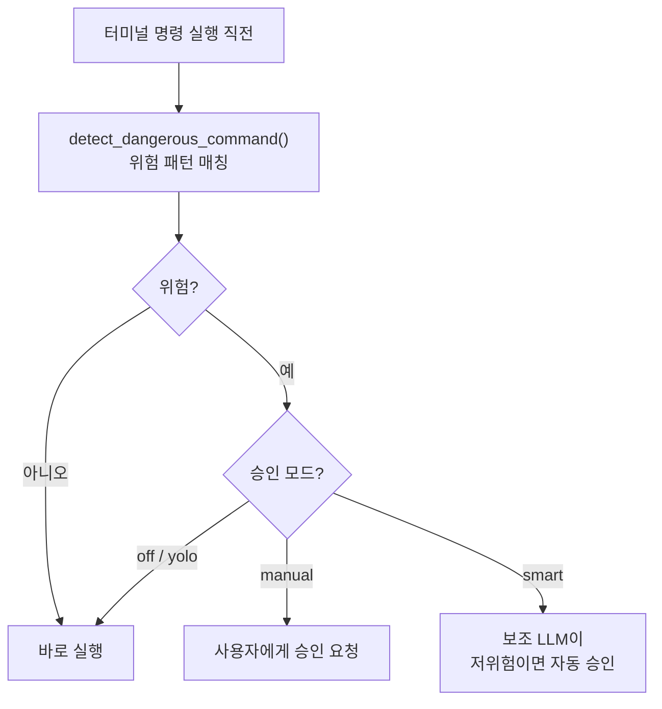
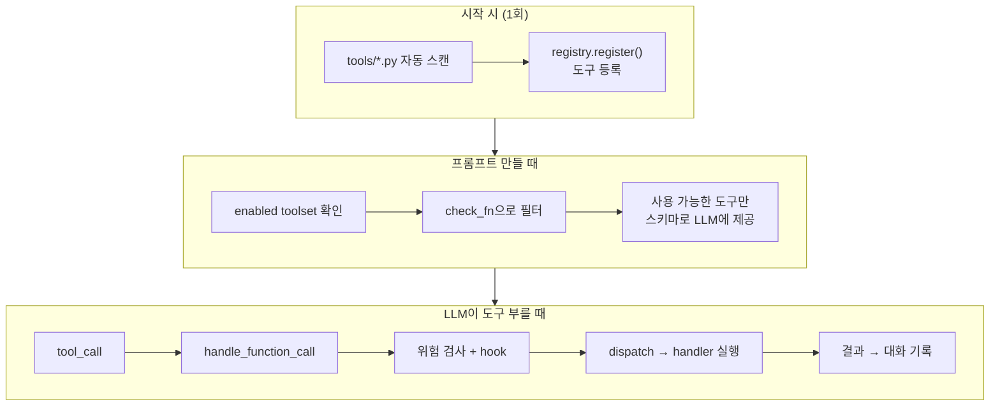
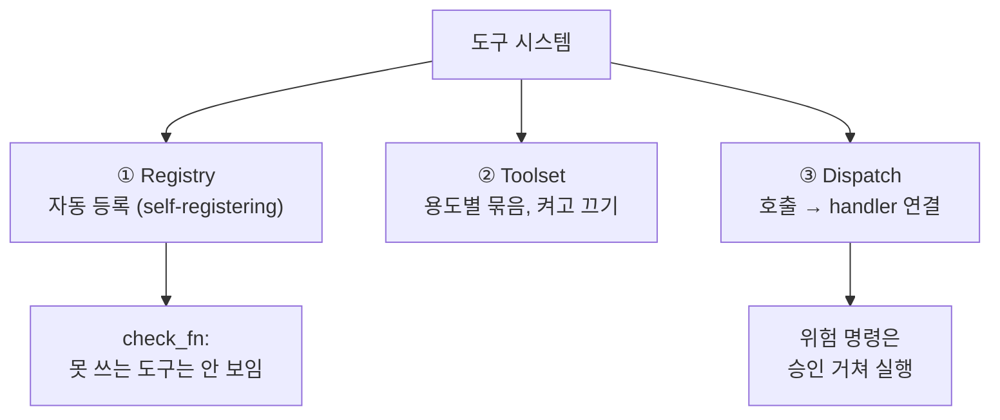

이 글에서 다루는 내용: LLM이 실제 행동(터미널·파일·웹)을 하는 메커니즘이다. 도구가 어떻게 자기를 등록하고, LLM의 호출이 어떻게 실제 함수로 연결되며, 쓸 수 없는 도구는 왜 안 보이는지를 정리한다.

[#2 Agent Loop](./02-agent-loop)에서 "도구 실행은 #4에서"라고 미뤄둔 부분을 이 글에서 다룬다.

---

## LLM이 부른 도구가 어떻게 실제 코드가 될까

#2에서 봤듯 LLM은 응답에 `tool_calls`를 담아서 "터미널 써줘"라고 한다. 하지만 그건 JSON 텍스트일 뿐이다. 이게 어떻게 실제 파이썬 함수 실행으로 이어질까.

세 가지 개념으로 정리할 수 있다.



1. Registry(등록소): 모든 도구가 자신을 등록하는 곳
2. Toolset(묶음): 도구들을 용도별로 그룹핑 (web, terminal, file…)
3. Dispatch(연결): LLM의 도구 호출을 실제 handler 함수로 연결

---

## ① Registry — 도구가 스스로 등록한다

주목할 만한 부분이다. 도구 목록을 어딘가 한 곳에 수동으로 적어두는 게 아니다. 각 도구 파일이 import될 때 스스로 등록한다.

```python
# tools/terminal_tool.py (개념)
registry.register(
    name="terminal",            # LLM이 부를 이름
    toolset="terminal",         # 어느 묶음 소속인지
    schema={...},               # LLM에게 보여줄 스키마(설명+파라미터)
    handler=handle_terminal,    # 실제 실행될 함수
    check_fn=check_terminal,    # 사용 가능 여부 판단 (선택)
    requires_env=["SOME_VAR"],  # 필요한 환경변수 (선택)
)
```

그리고 시작할 때 `tools/` 폴더를 자동 스캔한다.



이 방식이면 새 도구를 추가할 때 어딘가 목록에 등록하는 것을 누락할 일이 없다. 파일을 만들고 `registry.register()`만 부르면 자동으로 발견된다. 이것이 "self-registering" 패턴이다.

관련 코드: 등록소는 `tools/registry.py`, 자동 스캔은 `model_tools.py`의 `discover_builtin_tools()`.

---

## ② Toolset — 도구를 용도별로 묶는다

도구가 70개가 넘는데 매번 다 켜면 프롬프트가 비대해진다(#3에서 본 토큰 비용). 그래서 묶음(toolset) 단위로 켜고 끈다.



| Toolset | 들어있는 도구 | 용도 |
|---------|--------------|------|
| `web` | web_search, web_extract | 웹 검색/추출 |
| `terminal` | terminal, process | 셸 명령 |
| `file` | read_file, write_file, patch, search_files | 파일 작업 |
| `browser` | browser_navigate, click, snapshot… | 브라우저 조작 |
| `memory` | memory | 영구 기억 |
| `delegation` | delegate_task | 하위 에이전트 |

플랫폼마다 다른 묶음을 쓸 수 있다. 예를 들어 텔레그램에선 `terminal`을 빼고 안전한 것만 켜는 식이다.

"도구를 켜고 끈다"는 건 사실 이 toolset 목록을 조정하는 것이다. 그리고 #3에서 봤듯 이건 새 세션부터 적용된다(프롬프트 캐시 보호).

---

## ③ Dispatch — 호출이 실제 함수로 연결되는 지점

#2에서 미뤄둔 부분이다. LLM이 `tool_call`을 뱉으면 어떻게 실제 함수가 실행될까.



흐름은 다음과 같다.
1. LLM의 `tool_call` → 루프 → `handle_function_call()`
2. 에이전트 수준 도구(todo, memory, session_search, delegate_task)는 루프가 직접 처리한다. 이들은 에이전트 내부 상태를 만져야 해서 registry를 거치지 않는다.
3. 나머지는 pre-hook → `registry.dispatch()` → 이름으로 handler를 찾아 실행 → post-hook 순으로 처리된다.
4. 결과는 항상 문자열(JSON)로 반환되어 대화 기록에 `tool` 메시지로 추가된다.

에러 처리: dispatch는 2중으로 감싸여 있어서, handler가 실패해도 LLM은 항상 정형화된 `{"error": "..."}` JSON을 받는다. raw 예외가 LLM에 전달되지 않는다.

### 자세히: dispatch 안에서 일어나는 일

"handler 실행"이 추상적이라, `registry.dispatch`의 실제 코드를 보면 구조가 단순하다. 핵심은 17줄 정도다.

```python
# tools/registry.py
def dispatch(self, name: str, args: dict, **kwargs) -> str:
    entry = self.get_entry(name)              # ① 이름으로 등록정보 찾기
    if not entry:
        return json.dumps({"error": f"Unknown tool: {name}"})
    try:
        if entry.is_async:                    # ② async면 동기로 변환
            return _run_async(entry.handler(args, **kwargs))
        return entry.handler(args, **kwargs)  # ③ 파이썬 함수 호출
    except Exception as e:
        return json.dumps({"error": sanitized})  # ④ 에러도 JSON으로
```

핵심은 ③번 줄 `entry.handler(args, **kwargs)`다. "terminal 도구 실행"의 실체는 `handle_terminal({"command":"ls"})`라는 파이썬 함수를 부르는 것이다. 별도의 복잡한 처리가 있는 건 아니다.

도구마다 LLM이 따로 있는 게 아니다. 도구는 LLM이 아니라 함수다. 전체 흐름에서 LLM은 "무엇을 부를지 판단"하는 한 곳뿐이고, dispatch부터 handler까지는 LLM 없는 코드다. (일부 도구는 handler 안에서 다시 LLM을 부르기도 한다 — `delegate_task` 등, [#7](./07-delegation-and-multiagent) — 하지만 dispatch 메커니즘 자체가 LLM인 건 아니다.)

### 도구 결과는 어떻게 LLM에 들어가나

dispatch의 반환 타입은 `-> str`, 항상 문자열(대개 JSON)이다. 이게 LLM에 직접 들어가는 게 아니라, 대화 기록에 텍스트로 쌓였다가 다음 호출 때 함께 전송된다.



1. handler가 결과를 문자열로 반환 (예: `{"output":"main.py\nutils.py","exit_code":0}`)
2. `{"role":"tool", "tool_call_id":"...", "content": 결과}` 메시지로 감쌈
3. 대화 기록에 추가 ([#2의 "tool 메시지"](./02-agent-loop))
4. 다음 루프의 ⑤단계 "API 메시지 빌드"가 이 tool 메시지까지 포함해 LLM에 전송

그래서 LLM은 "ls 결과가 main.py, utils.py"라는 것을 다음 턴에 본다. 결과가 LLM에 즉시 반영되는 게 아니라, 메시지 리스트에 쌓였다가 다음 API 호출에 함께 실려 간다. 이것이 #2 루프가 "⑤→⑥→실행→④"로 도는 이유다. 한 바퀴 돌아야 LLM이 결과를 본다.

### dispatch의 3가지 안전장치 (코드 확인)

단순하지만 예외 상황을 처리한다.

| 상황 | 처리 |
|------|------|
| 모르는 도구 이름 | `{"error":"Unknown tool"}` 반환 (LLM이 오타·없는 도구 불러도 안전) |
| async handler | `_run_async()`로 자동 동기화 (LLM은 동기/비동기 구분 안 함) |
| handler가 예외 | 전부 catch → `{"error":...}` JSON으로 정리(sanitize) → raw 예외가 LLM에 안 감 |

---

## check_fn — 쓸 수 없는 도구는 LLM에게 보이지 않는다

주목할 만한 설계다. 이미지 생성 도구는 API 키가 있어야 한다. 키가 없으면 그 도구를 LLM에게 아예 보여주지 않는다.



```python
# 개념
if entry.check_fn:
    try:
        available = bool(entry.check_fn())   # 예: API 키 있나?
    except Exception:
        available = False                    # 예외 = 사용 불가 (안전)
    if not available:
        continue                             # 이 도구 건너뜀
```

이 방식의 의미: LLM이 쓸 수 없는 도구를 부르는 헛수고를 차단한다. 키 없는 이미지 생성을 LLM이 부를 일이 없다. 보이지 않기 때문이다. 이것이 #1에서 말한 "서비스 게이트 도구" 패턴의 핵심이다.

---

## 위험한 명령 승인 — DANGEROUS_PATTERNS

터미널 도구는 위험한 명령(`rm -rf`, `DROP TABLE`…)을 실행할 수 있다. 그래서 실행 전 패턴 검사와 승인 절차가 들어간다.



검사 대상 예: 재귀 삭제(`rm -rf`), 디스크 포맷(`mkfs`, `dd`), SQL 파괴(`DROP TABLE`), 원격 실행(`curl | sh`), 포크밤 등.

관련 코드: `tools/approval.py`의 `DANGEROUS_PATTERNS` 리스트와 `detect_dangerous_command()`.

---

## 전체를 하나로: 도구의 일생

지금까지 본 것을 한 그림으로 합치면 다음과 같다.



---

## 이번 편 정리



- 도구는 스스로 등록한다(`registry.register`). 수동 목록이 없다.
- toolset으로 묶어서 켜고 끈다 (새 세션부터 적용).
- LLM의 `tool_call` → `handle_function_call` → `dispatch` → handler 실행.
- 에이전트 수준 도구(memory/todo/session_search/delegate_task)는 루프가 직접 처리한다.
- check_fn으로 사용 불가 도구는 LLM에게 보여주지 않는다.
- 위험한 명령은 승인 절차를 거친다.

---

## 다음 편 예고

#5 메모리 & 세션 저장 — SQLite/FTS5 + 메모리 압축

Hermes가 어떻게 기억하는지 다룬다. 대화는 어디에 저장되고(로컬 SQLite), 과거 대화는 어떻게 검색하며(FTS5), "영구 메모리"는 왜 글자수로 제한하고 어떻게 압축하는지(LLM이 직접 처리) 정리한다. 메모리 기반 챗봇을 직접 만들 때의 참고 사항까지 다룬다.

관련 코드: `tools/registry.py`, `model_tools.py`, `toolsets.py`, `tools/approval.py` · 관련 문서: `developer-guide/tools-runtime.md`
