> 이 글에서 다루는 내용: Hermes가 "어떻게 기억하는가". 대화는 어디에 저장되고, 과거 대화는 어떻게 검색하며, "영구 메모리"는 왜 글자수로 제한하고 누가 압축하는지 살펴본다. 그리고 메모리 챗봇을 직접 만들 때 참고할 점도 정리한다.

> 시리즈 #1~#4가 "에이전트가 한 턴을 처리하는 방법"이었다면, 이번 편은 그 턴들이 세션을 넘어 쌓이는 방법이다.

---

## 대화를 기억하던데, 어디다 저장하는 걸까

Hermes와 며칠 대화하다 보면 선호("간결한 답 선호")를 기억하고, "지난번에 얘기한 것"이라고 하면 찾아낸다. 클라우드에 저장하는 것은 아니다.

답은 두 종류의 기억이 따로 있다는 것이다.

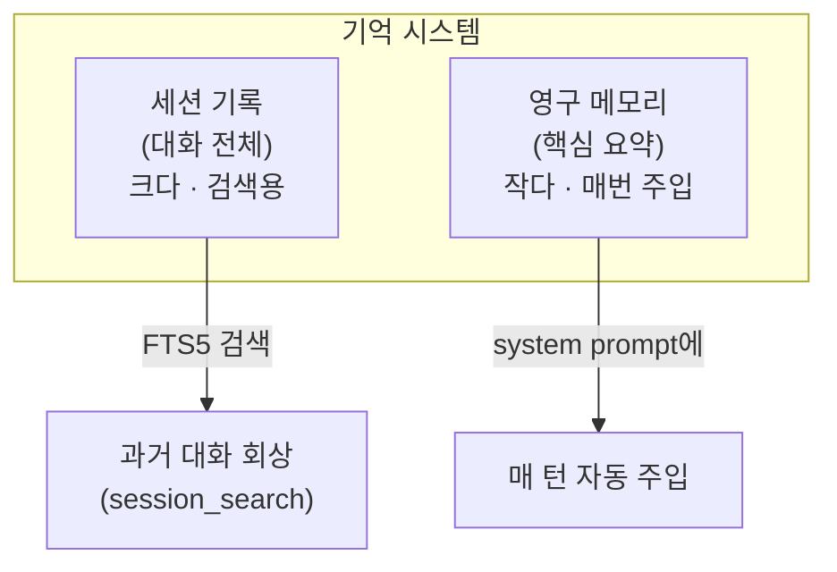

| | 세션 기록 | 영구 메모리 |
|---|---|---|
| 무엇 | 모든 메시지 전체 | 엄선된 핵심 사실 |
| 크기 | 큼 (무제한) | 작음 (글자 제한) |
| 쓰임 | "지난주에 뭐 했지?" 검색 | "이 사람은 간결한 답 선호" 항상 알기 |
| 저장 | `~/.hermes/state.db` (SQLite) | `~/.hermes/memories/*.md` |
| 비용 | 검색할 때만 | 매 호출 프롬프트에 들어감 |

> "전체 로그"와 "프롬프트에 넣을 요약"을 분리한 것이 Hermes 메모리 설계의 골자다. 둘을 나누지 않으면 비용이 커지거나 기억이 부실해진다.

---

## Part 1. 세션 저장 — 로컬 SQLite

### 어디에 저장되나

코드에 명시돼 있다 (`hermes_state.py`):

```python
DEFAULT_DB_PATH = get_hermes_home() / "state.db"
```

`get_hermes_home()`은 기본값이 `~/.hermes/`다. 즉 로컬의 `~/.hermes/state.db`라는 SQLite 파일 하나에 모든 대화가 들어간다.

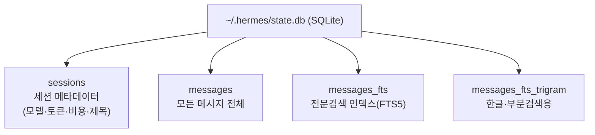

### 실제 스키마 해부: 에이전트 DB는 이렇게 설계한다

위 4개는 큰 그림이고, `hermes_state.py`의 `SCHEMA_SQL`을 열면 테이블이 더 있다. 에이전트용 DB를 직접 설계할 때 참고가 되도록 실제 스키마를 살펴본다.

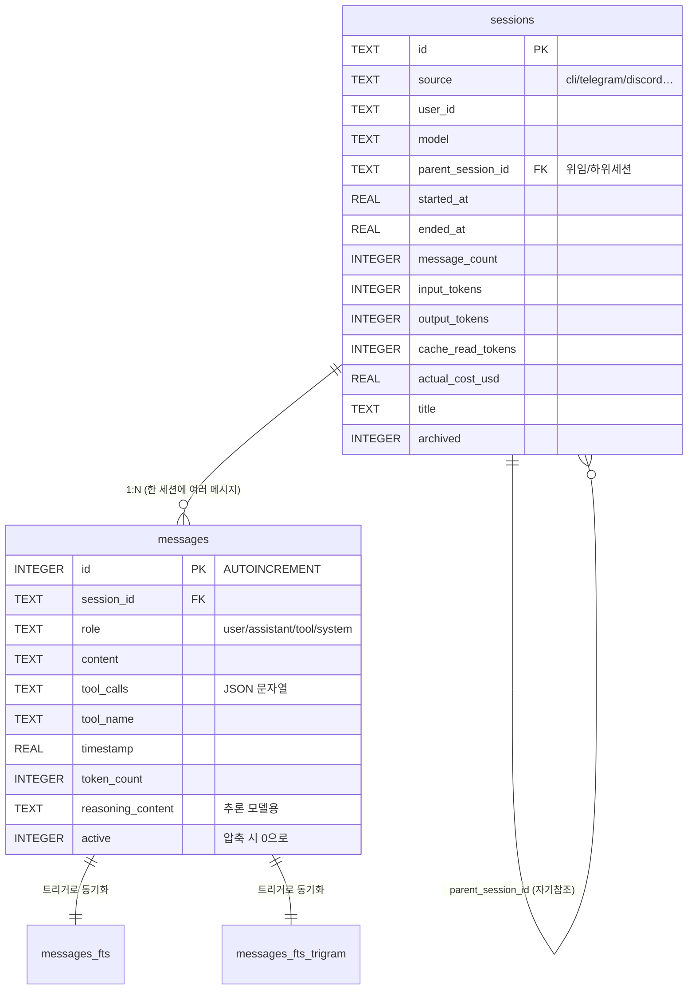

#### 핵심 테이블 2개

`sessions` — 대화 한 건의 "메타데이터 카드". 주요 컬럼은 다음과 같다.

| 컬럼 | 의미 | 설계 포인트 |
|------|------|------------|
| `id` (PK) | 세션 식별자 | TEXT(UUID 등). 메시지가 이걸로 묶임 |
| `source` | `cli`/`telegram`/… | 진입점 구분 ([#8](./08-gateway)) — 한 DB에 다 모으되 출처 태그 |
| `parent_session_id` (FK) | 부모 세션 | 자기참조 — 위임/하위 세션을 트리로 ([#7](./07-delegation-and-multiagent)) |
| `input_tokens`·`output_tokens`·`cache_read_tokens`… | 토큰 회계 | 비용 추적을 세션 단위로 집계 |
| `actual_cost_usd`·`estimated_cost_usd` | 비용 | 추정/실제 분리 (정산 전후) |
| `title` | 세션 제목 | 자동 생성된 요약 제목 |
| `archived` | 보관 여부 | 삭제 대신 soft delete |

`messages` — 실제 대화 내용. 한 줄이 메시지 하나다.

| 컬럼 | 의미 | 설계 포인트 |
|------|------|------------|
| `id` (PK, AUTOINCREMENT) | 순번 | 정수 자동증가 → 시간순 정렬·페이징에 유리 |
| `session_id` (FK) | 소속 세션 | `sessions.id` 참조 |
| `role` | user/assistant/tool/system | [#2의 교대 규칙](./02-agent-loop)의 그 role |
| `content` | 메시지 본문 | 텍스트 |
| `tool_calls` | 도구 호출 정보 | JSON을 통째로 TEXT에 저장 (정규화 안 함) |
| `tool_name` | 어떤 도구였나 | 검색·필터용 |
| `token_count`·`finish_reason` | 메타 | 디버깅·회계 |
| `reasoning_content` | 추론 과정 | 추론 모델(o1 등) 대응 컬럼 |
| `active` | 활성 여부 | 압축 시 0으로 — 삭제 안 하고 비활성화 ([#10](./10-context-compression)) |

> 설계 교훈 1 — JSON을 컬럼에 통째로 넣는다. `tool_calls`는 구조가 복잡한데, 이걸 별도 테이블로 정규화하지 않고 JSON 문자열로 한 컬럼에 넣었다. 에이전트 DB는 "메시지를 그대로 복원"이 목적이라, 과도한 정규화보다 "왔던 모양 그대로 저장"이 실용적이다.

> 설계 교훈 2 — 삭제 대신 비활성화. 압축(#10)이 오래된 메시지를 치울 때 `DELETE`가 아니라 `active=0`으로 바꾼다. `archived`도 마찬가지다. 에이전트는 "되감기(rewind)"나 디버깅이 잦아서, 데이터를 지우기보다 숨기는 설계가 안전하다.

#### 보조 테이블들

큰 그림엔 없지만 `SCHEMA_SQL`에 더 있는 것들이다.

| 테이블 | 역할 |
|--------|------|
| `schema_version` | 마이그레이션 버전 추적 (스키마 진화 관리) |
| `state_meta` | key-value 잡동사니 저장소 |
| `compression_locks` | 압축 동시 실행 방지 락 (만료시간 포함) |
| `messages_fts` | FTS5 전문검색 (아래) |
| `messages_fts_trigram` | CJK(한글)·부분문자열 검색 (아래) |

#### 검색 테이블은 "트리거로 자동 동기화"된다

주목할 부분이다. `messages_fts`(검색용)는 `messages`(원본)와 트리거로 자동 연결돼 있다.

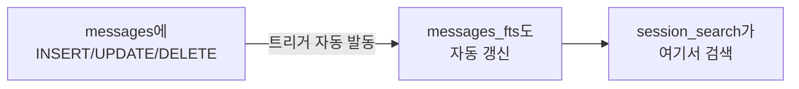

```sql
-- 실제 트리거 (hermes_state.py)
CREATE TRIGGER messages_fts_insert AFTER INSERT ON messages BEGIN
    INSERT INTO messages_fts(rowid, content) VALUES (
        new.id,
        COALESCE(new.content,'') || ' ' ||
        COALESCE(new.tool_name,'') || ' ' ||
        COALESCE(new.tool_calls,'')
    );
END;
```

> 설계 교훈 3 — 원본과 인덱스를 트리거로 묶는다. 애플리케이션 코드가 "메시지 저장할 때 검색 인덱스도 갱신"을 일일이 신경 쓰지 않는다. `messages`에 INSERT만 하면 트리거가 `messages_fts`를 채운다. content + tool_name + tool_calls를 합쳐 넣어서, 도구 이름이나 인자로도 검색된다.

> 설계 교훈 4 — 언어 때문에 검색 테이블이 2개. 기본 FTS5(unicode61 토크나이저)는 한글·중국어를 글자 단위로 쪼개서 구문 검색이 깨진다. 그래서 trigram 토크나이저를 쓰는 `messages_fts_trigram`을 따로 둬서 한글 부분검색이 되게 했다. (영어는 단어 단위가 자연스럽고, CJK는 3글자 겹침이 자연스럽다)

#### 인덱스: 무엇으로 자주 조회하나

스키마 끝에 인덱스가 줄줄이 있는데, 이것이 곧 "이 DB를 어떤 질문으로 두드리나"를 보여준다.

```sql
idx_sessions_source          -- 출처별 ("텔레그램 세션만")
idx_sessions_started (DESC)  -- 최근순 ("최근 대화")
idx_sessions_parent          -- 부모별 (위임 트리)
idx_messages_session         -- 세션+시간순 (대화 복원)
idx_messages_session_active  -- 활성 메시지만 (압축 후 조회)
```

> 설계 교훈 5 — 인덱스는 "주요 쿼리의 지문"이다. 세션은 출처·시간·부모로 찾고, 메시지는 "세션 안에서 시간순으로" 또는 "활성인 것만" 찾는다. 에이전트 DB를 설계할 땐 "이 데이터를 어떻게 꺼낼지"를 먼저 정하고 거기에 인덱스를 건다.

#### 실제로 어떻게 저장되나: 한 대화를 따라가 보기

표만 보면 추상적이니, 실제 대화 한 건이 테이블에 어떻게 들어가는지 본다. 사용자가 이렇게 했다고 하자.

> 사용자: "이 폴더에 파이썬 파일 몇 개야?"
> (에이전트가 terminal로 `ls *.py | wc -l` 실행 → "3개입니다" 응답)

`sessions` 테이블 — 이 대화 1건이 1행:

| id | source | model | parent_session_id | started_at | message_count | input_tokens | output_tokens | actual_cost_usd | title | archived |
|----|--------|-------|-------------------|-----------|--------------|-------------|--------------|----------------|-------|----------|
| `a1b2c3…` | `cli` | `claude-opus-4` | `NULL` | 1718...3.2 | 4 | 1820 | 95 | 0.014 | "폴더 내 파이썬 파일 수 확인" | 0 |

> 한 줄로 "이 대화는 CLI에서 opus로 했고, 메시지 4개, 토큰 이만큼, 비용 1.4센트"가 요약된다. `parent_session_id`가 NULL이니 위임으로 생긴 하위 세션이 아니라 최상위 대화다.

`messages` 테이블 — 위 대화가 4행으로 (#2의 role 교대 그대로):

| id | session_id | role | content | tool_calls | tool_name | timestamp | active |
|----|-----------|------|---------|-----------|-----------|-----------|--------|
| 1 | `a1b2c3…` | `user` | "이 폴더에 파이썬 파일 몇 개야?" | NULL | NULL | …3.2 | 1 |
| 2 | `a1b2c3…` | `assistant` | NULL | `[{"id":"call_01","name":"terminal","args":{"command":"ls *.py \| wc -l"}}]` | NULL | …3.5 | 1 |
| 3 | `a1b2c3…` | `tool` | `{"output":"3","exit_code":0}` | NULL | `terminal` | …3.8 | 1 |
| 4 | `a1b2c3…` | `assistant` | "이 폴더에 파이썬 파일은 3개입니다." | NULL | NULL | …4.1 | 1 |

여기서 [#2](./02-agent-loop)·[#4](./04-tools-system)에서 본 것이 데이터로 그대로 보인다.

- 2번 행 (assistant + tool_calls): LLM이 "도구 쓸래"라고 판단한 순간. `content`는 NULL이고 `tool_calls`에 JSON이 통째로 들어간다(설계 교훈 1). 도구 호출의 `id`(`call_01`)도 여기 보존돼서 나중에 tool 결과와 짝지어진다.
- 3번 행 (tool): [#4에서 본 "결과를 tool 메시지로"](./04-tools-system)가 이것이다. dispatch가 반환한 문자열 `{"output":"3",...}`이 `content`에, `tool_name`엔 `terminal`이 따로 들어간다(검색·필터용).
- 4번 행 (assistant): 도구 결과를 본 뒤 LLM의 최종 답. 이제 `tool_calls`가 없으니 [#2의 루프 종료 조건](./02-agent-loop)("도구 없이 텍스트로 답")을 충족해 루프가 끝난다.

검색 테이블 (`messages_fts`) — 트리거가 자동으로 채운 모습:

```text
rowid │ content (= content + ' ' + tool_name + ' ' + tool_calls 합침)
──────┼──────────────────────────────────────────────────────────────
  1   │ 이 폴더에 파이썬 파일 몇 개야?
  2   │ [{"name":"terminal","args":{"command":"ls *.py | wc -l"}}]
  3   │ {"output":"3","exit_code":0} terminal
  4   │ 이 폴더에 파이썬 파일은 3개입니다.
```

> INSERT한 적 없는데도 이 검색 테이블이 채워져 있다. [설계 교훈 3의 트리거](#검색-테이블은-트리거로-자동-동기화된다)가 `messages`에 INSERT될 때마다 자동으로 넣어준 것이다. 그래서 나중에 `session_search`로 "terminal" 또는 "파이썬 파일"을 검색하면 이 행들이 잡힌다.

압축이 일어나면 (#10):

만약 이 대화가 아주 길어져서 2~3번이 압축 대상이 되면, 그 행들은 `DELETE`되지 않고 `active`가 1에서 0으로 바뀐다(설계 교훈 2). 원본은 DB에 남아 되감기·디버깅이 가능하고, LLM에 보낼 때만 `active=1`인 것 + 요약을 쓴다.

> 관련 코드: 이 저장 로직은 `hermes_state.py`의 `SessionDB.add_message()`·`create_session()`에 있다. 위 예시의 JSON 직렬화(`tool_calls`를 문자열로)도 거기서 일어난다.

#### 그럼 계속 쌓이기만 하나 — 정리 로직

"메시지가 무한정 쌓이면 `state.db`가 터지지 않나?" 코드를 보면 정리 로직이 3가지 있는데, 메시지를 실제로 DELETE하는 경우는 거의 없다. 전부 "지우기"가 아니라 "숨기기"다.

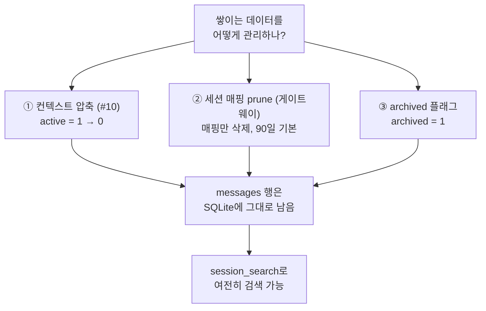

| 로직 | 대상 | 방식 | 메시지 행은? |
|------|------|------|------------|
| ① 압축 (#10) | 길어진 대화의 중간 | `active=0` | 남음 |
| ② prune (게이트웨이) | 오래 안 쓴 세션 매핑 | 매핑만 삭제 | 남음 |
| ③ archive | 보관 처리된 세션 | `archived=1` | 남음 |

② prune은 이름과 달리 매핑만 지우고 기록은 지우지 않는다. `gateway/session.py`의 `prune_old_entries(max_age_days)`(기본 90일)는 메시지를 지우지 않는다. 코드 주석에도 명시돼 있다.

> "the transcript in SQLite stays, but the session_key → session_id mapping is dropped"

즉 90일간 안 쓴 텔레그램 대화는 다음에 말 걸면 새 세션으로 시작될 뿐, 과거 `messages`는 DB에 그대로 남아 `session_search`로 찾을 수 있다. (게다가 `suspended`거나 백그라운드 프로세스가 붙은 세션은 prune에서 제외된다.)

> 정리하면, Hermes에는 오래된 메시지를 자동으로 DELETE하는 로직이 기본적으로 없다. 압축·prune·archive 셋 다 "숨기기/끊기"지 "삭제"가 아니다. [앞서 본 "삭제 대신 비활성화" 철학](#실제-스키마-해부-에이전트-db는-이렇게-설계한다)을 끝까지 지키는 것으로, 되감기·감사·검색을 위해 원본을 보존한다.

> 트레이드오프: 안 지우니 안전하지만, 오래 쓰면 `state.db`가 계속 커진다. 디스크 정리는 별도 메커니즘이다 — WAL 체크포인트(50쓰기마다 자동), 그리고 정말 줄이려면 사용자가 직접 오래된 세션을 지우거나 `VACUUM`을 돌려야 한다. 이는 "자동으로 잊는" 게 아니라 "사용자가 결정하는" 영역으로 남겨둔 설계다.

> 메모리(2,200자)와 헷갈리지 말 것: [Part 2의 영구 메모리](#part-2-영구-메모리--압축의-정체)는 글자수로 강제 제한되지만, 그건 "매 프롬프트에 들어가는 요약"이라 작아야 하기 때문이다. 여기 `messages`(전체 로그)는 정반대로 안 지우는 것이 의도다. 둘은 목적이 달라서 정책도 반대다.

### "로컬"의 진짜 의미 (중요)

#1에서도 짚었지만 다시 정리한다. 기록은 로컬, 추론은 클라우드다.

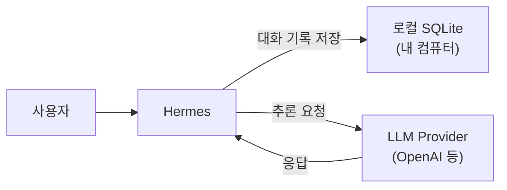

대화 기록의 사본은 내 컴퓨터에 남지만, 추론을 위해 대화 내용은 모델 제공자에게 API로 전송된다. "로컬 저장 = 완전 비공개"가 아니라는 점에 유의한다.

### 진입점이 달라도 같은 DB

CLI든 텔레그램이든 전부 같은 `state.db`에 쌓인다. 그래서 `source` 컬럼(`cli`, `telegram`…)으로 출처를 구분한다.

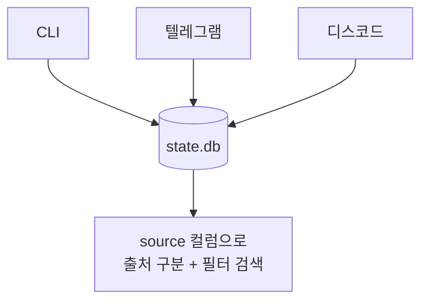

여러 프로세스가 한 파일을 공유하니 충돌 위험이 있다. 그래서 다음을 둔다.
- WAL 모드 (동시 읽기 다수 + 쓰기 1개)
- 재시도 + jitter (20~150ms, 최대 15회) — "convoy effect"(다 같이 같은 간격으로 재시도해서 막히는 현상) 회피

### FTS5 — 과거 대화 검색

`session_search` 도구가 이 위에서 돈다. SQLite의 FTS5(전문 검색)로 과거 메시지를 키워드 검색한다.

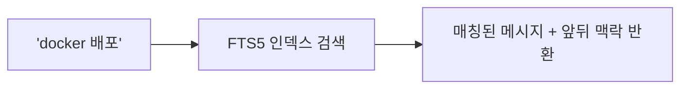

- 키워드 AND, "정확한 구문", `OR`, `NOT`, `접두사*` 지원
- 한글/부분 문자열은 별도 trigram 인덱스로 처리
- LLM 호출 없이 순수 DB 검색이라 빠르고 비용이 들지 않는다

---

## Part 2. 영구 메모리 — "압축"의 정체

여기가 이번 편의 중심이다. "메모리 압축"이라길래 알고리즘이 요약하는 줄 알기 쉽지만, 그렇지 않다.

### 특이한 점: 코드는 압축을 안 한다. LLM이 한다.

`tools/memory_tool.py`를 보면 글자 제한이 박혀 있다.

```python
def __init__(self, memory_char_limit: int = 2200, user_char_limit: int = 1375):
```

- 메모리(에이전트 노트): 2,200자
- user(사용자 프로필): 1,375자
- 토큰이 아니라 글자수 (모델마다 토크나이저가 달라서 글자수가 더 안정적)

그리고 `add()`가 이 한도를 넘으면 저장을 거부하고 LLM에게 "압축해라"라고 되돌려준다.

```python
if new_total > limit:
    return {
        "success": False,
        "error": (
            f"Memory at {current}/{limit} chars. "
            f"Adding this entry would exceed the limit. "
            f"Consolidate now: use 'replace' to merge overlapping entries... "
            f"or 'remove' stale entries, then retry."
        ),
        "current_entries": entries,   # ← 현재 메모리 전체를 같이 줌
    }
```

### 압축의 분업 구조

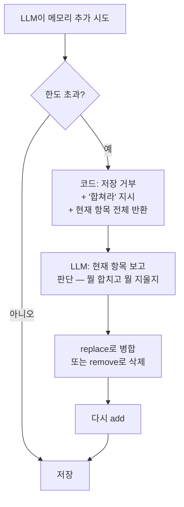

세 주체가 역할을 나눈다.

| 주체 | 역할 |
|------|------|
| 코드 | 글자 한도 강제 + "압축하라" 신호 + 안전장치 |
| 프롬프트 (#3의 MEMORY_GUIDANCE) | 선별 기준 ("뭘 저장할 가치가 있나") |
| LLM | 실제 압축 판단 (뭘 합치고 뭘 버릴지) |

> 핵심은 "지능이 필요한 일(무엇을 합칠지)은 LLM에게, 규칙(한도 강제)은 코드에" 맡긴다는 것이다. 압축 알고리즘을 직접 짜지 않는다.

### 코드가 기계적으로 보장하는 안전장치

LLM에게 전부 맡기지는 않는다. 코드가 직접 막는 것들이 있다.

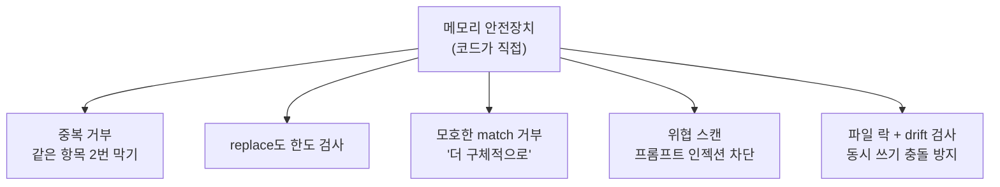

특히 위협 스캔이 중요하다. 메모리는 #3에서 본 것처럼 system prompt에 주입되니까, 악의적 인젝션 패턴이 들어가면 위험하다. 그래서 저장 전에 스캔한다.

---

## Part 3. 메모리 챗봇 만들 때의 교훈

이 구조를 서비스로 옮긴다면 어떻게 될지 정리한다.

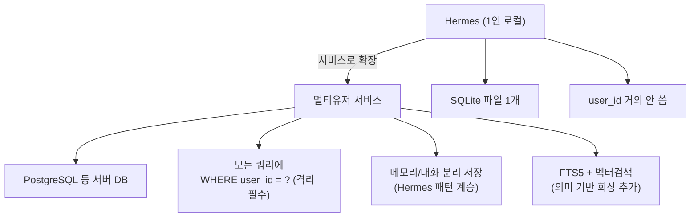

핵심 교훈 4가지.

1. 메모리에 무제한 쌓지 않는다. 하드 리밋을 둔다. 매 요청 프롬프트 비용이 고정된다.
2. 압축을 직접 알고리즘으로 짜지 말고 LLM에게 맡긴다. "꽉 찼으니 합쳐라 + 현재 내용 이거다"를 주면 LLM이 판단한다. (단 백그라운드로 돌려 응답 지연을 막는다.)
3. 선별 기준은 프롬프트로 둔다. "뭘 기억할 가치가 있나"를 명시한다.
4. 코드는 안전장치만 맡는다. 중복/한도/인젝션은 기계적으로 막는다. LLM을 믿되 검증한다.

> 흔한 실수: "대화 전체를 매번 프롬프트에 다 넣기"는 토큰 폭발과 응답 지연으로 이어진다. Hermes가 메모리를 2,200자로 작게 유지하는 이유가 이것이다. 매 요청에 들어가는 건 "전체 기록"이 아니라 "엄선된 핵심"이어야 한다.

---

## 두 가지 "압축"을 헷갈리지 말자

마지막으로 정리한다. Hermes에는 "압축"이 두 종류 있고 대상이 다르다.

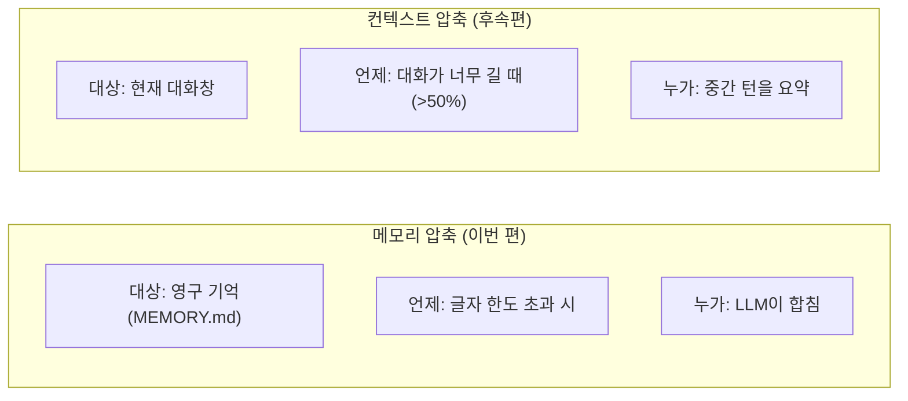

- 메모리 압축: 장기 기억을 작게 유지 (이번 편)
- 컨텍스트 압축: 길어진 대화창을 줄임 (`context_compressor.py`, 후속편)

둘 다 "압축"이지만 하나는 영구 기억, 하나는 현재 대화창이다.

---

## 이번 편 정리

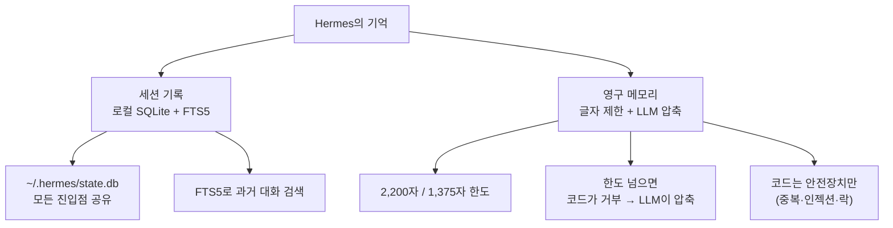

- 기억은 세션 기록(큰 로그)과 영구 메모리(작은 요약)로 분리된다.
- 세션은 로컬 SQLite(`state.db`)에 저장하고 FTS5로 검색한다. 단 추론은 클라우드로 나간다.
- 영구 메모리는 글자수로 하드 제한하고, 넘치면 LLM이 직접 압축한다.
- 코드의 역할은 강제와 안전장치이고, 지능적 판단은 LLM의 몫이다.
- 메모리 챗봇 설계 시: 한도 두기 / LLM에 압축 위임 / 기준은 프롬프트 / 코드는 검증.

---

## 시리즈 1부 완결 + 다음 예고

여기까지가 Hermes 아키텍처의 척추에 해당한다.

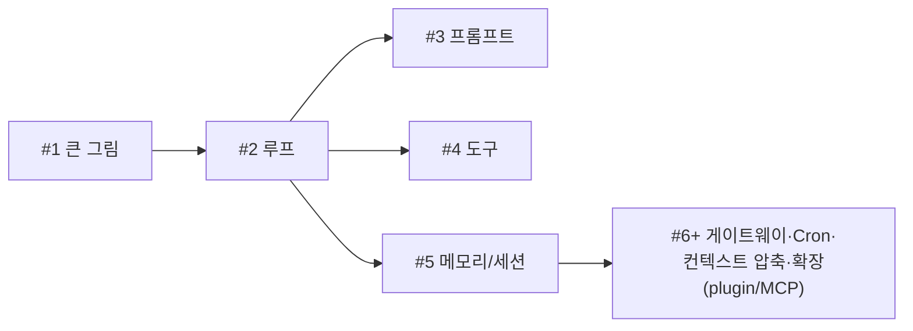

다음 편(#6): 지금까지 살펴본 구조를 뒤집어서, "내가 에이전트를 직접 만든다면 Hermes의 어떤 결정을 참고할 것인가"를 7가지 설계 교훈으로 정리한다.

그 이후(#7+) 예고:
- 메시징 게이트웨이는 어떻게 20개 플랫폼을 한 프로세스로 돌리나
- Cron — 예약 작업이 어떻게 새 에이전트를 띄우나
- 컨텍스트 압축 심화 (이번 편에서 예고한 두 번째 압축)
- 확장 — plugin / MCP로 기능 추가하기

> 관련 코드: `hermes_state.py`, `tools/memory_tool.py`, `agent/memory_manager.py` · 관련 문서: `developer-guide/session-storage.md`, `user-guide/features/memory.md`
