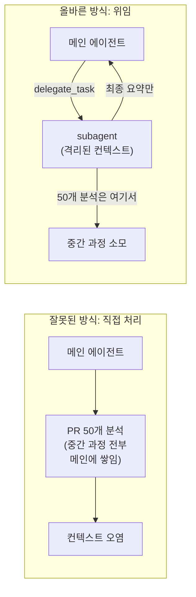
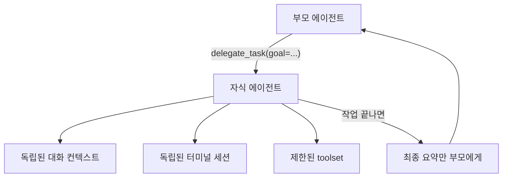
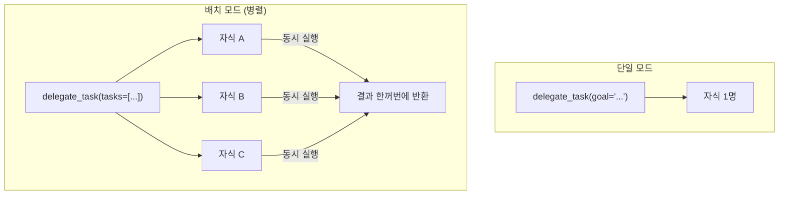
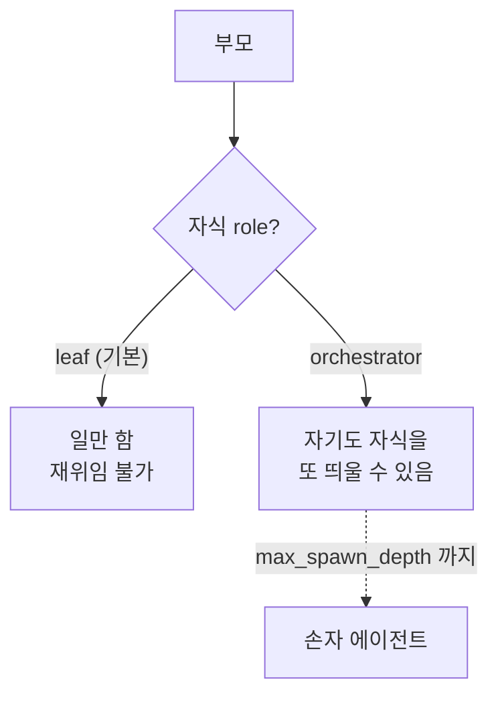
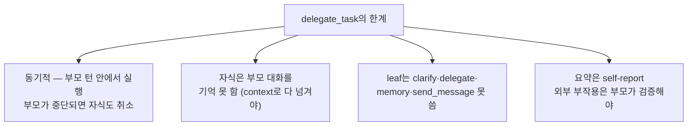
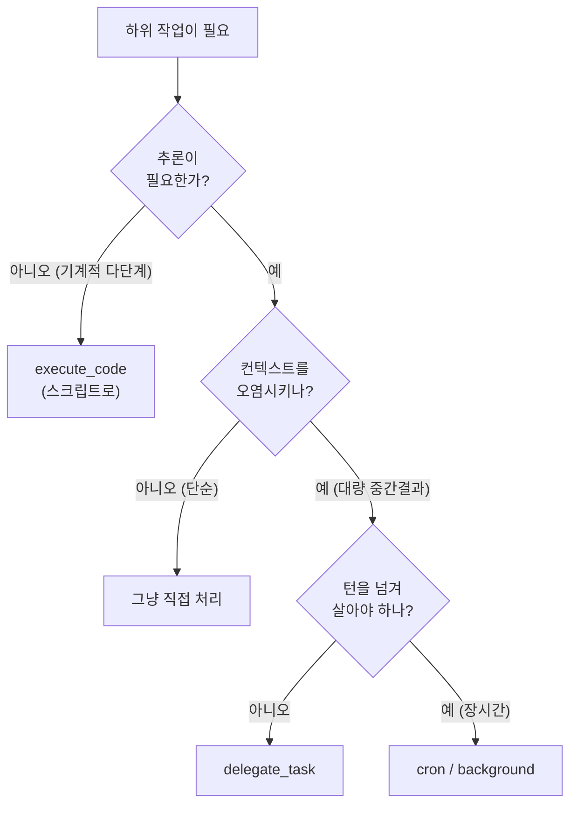
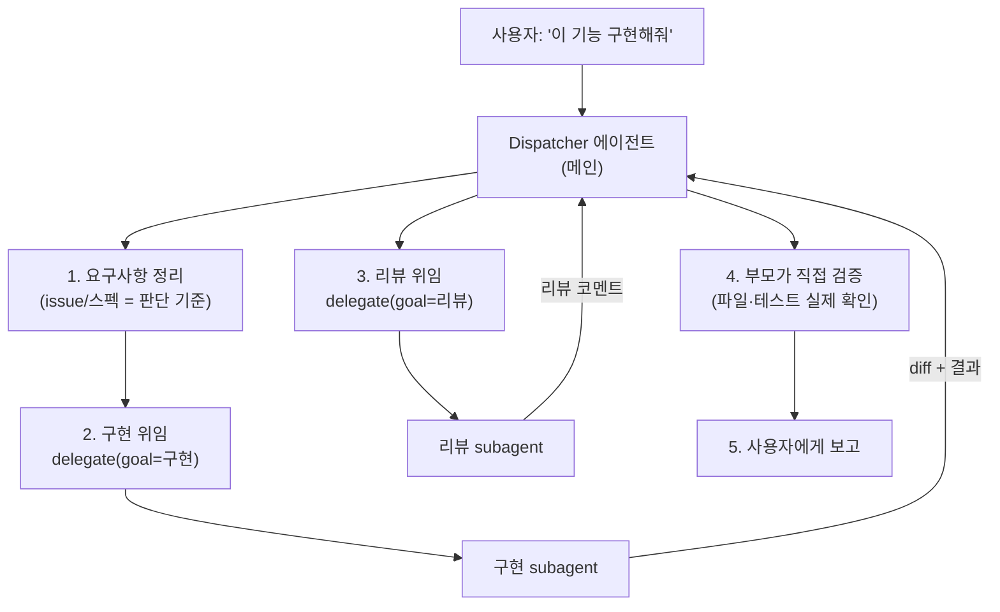
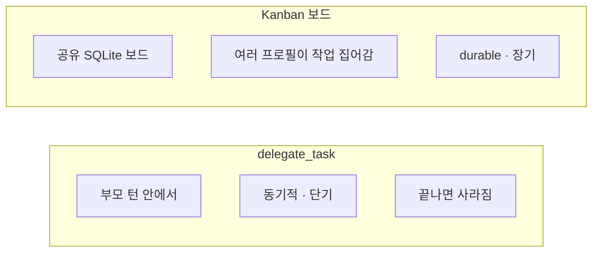
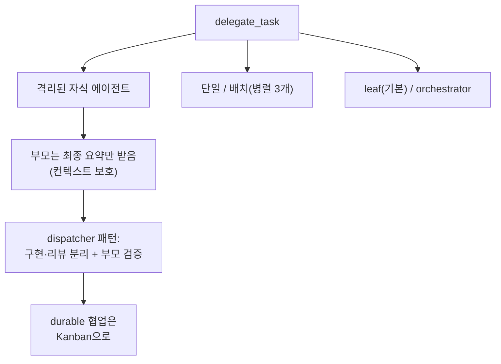

이번 편에서는 에이전트가 다른 에이전트에게 일을 맡기는 방식을 본다. 위임이 왜 컨텍스트를 아끼는 전략인지, 그리고 "구현은 A에게, 리뷰는 B에게" 같은 dispatcher 패턴을 어떻게 만들 수 있는지 따라간다.

[#6 교훈 6](./06-lessons-for-builders)에서 위임을 짧게 예고했다. 이번 편은 그 내용을 더 깊게 다룬다. 코딩 자동화에 관심이 있다면 이 편이 핵심이다.

---

## 들어가며: 에이전트 하나로는 부족할 때

Hermes를 쓰다 보면 이런 상황이 온다.

> "이 PR 50개를 분석해서 위험한 것만 추려줘"

이걸 메인 대화에서 그대로 처리하면 어떻게 될까. PR 50개의 diff, 파일 내용, 중간 분석이 전부 메인 컨텍스트에 쌓인다. 토큰은 폭발하고, 정작 중요한 "최종 결론"은 그 더미에 파묻힌다.

여기서 쓸 수 있는 것이 위임(delegation)이다.

위임은 일손을 늘리는 수단이기도 하지만, 더 본질적으로는 메인 에이전트의 컨텍스트를 깨끗하게 지키는 전략이다.

---

## delegate_task란

`delegate_task`는 자식 AIAgent를 띄우는 도구다. 자식은 독립된 환경을 가진다.

가장 중요한 특성은 부모가 자식의 중간 과정을 보지 않는다는 점이다. 부모는 오직 최종 요약만 받는다.

#2에서 봤듯 도구 결과는 전부 대화 기록에 쌓인다. 그런데 위임은 그 규칙을 우회한다. 자식이 도구를 100번 부르든, 부모가 받는 것은 마지막 요약 한 덩어리뿐이다.

관련 코드: `tools/delegate_tool.py`. 주석 첫 줄에 이렇게 적혀 있다. *"Spawns child AIAgent instances with isolated context... The parent's context only sees the delegation call and the summary result."*

---

## 두 가지 모드: 단일 vs 배치(병렬)

- 단일: `goal` 하나 → 자식 1명
- 배치: `tasks=[{...}, {...}]` → 여러 자식 병렬 실행

병렬은 `ThreadPoolExecutor`로 돌고, 동시 실행 수는 `delegation.max_concurrent_children`(기본 3)으로 제한된다.

독립적인 일 여러 개(예: A 조사 + B 조사를 동시에)는 배치가 적합하다. 서로 의존하는 작업이면 순차로 해야 하므로 단일을 여러 번 호출한다.

---

## 역할(role): leaf vs orchestrator

자식 에이전트에는 두 가지 역할이 있다.

| 역할 | 설명 | 재위임 |
|------|------|--------|
| `leaf` (기본) | 집중 작업자. 일만 하고 끝 | 안됨 |
| `orchestrator` | 자기도 하위 작업자를 띄울 수 있음 | 가능 (깊이 제한 내) |

기본은 `leaf`이고, 깊이 제한(`MAX_DEPTH = 1`)이 걸려 있다. 즉 기본 설정에서는 부모(0) → 자식(1)까지만 가고, 손자는 막힌다. `delegation.max_spawn_depth`를 올리면 더 깊이 갈 수 있다.

기본값이 평평한(flat) 이유는 무한 재귀 위임으로 에이전트가 폭증하는 것을 막기 위해서다. 깊이를 열려면 사용자가 명시적으로 설정해야 한다.

---

## 위임의 한계

위임은 유용하지만 만능은 아니다. 코드와 문서에서 확인한 제약은 다음과 같다.

특히 두 가지가 실무에서 중요하다.

1. 자식은 부모 대화를 모른다. 자식은 백지에서 시작하므로, 필요한 정보(파일 경로, 제약, 에러 메시지)를 `context`에 전부 명시해야 한다. "아까 그거"는 통하지 않는다.

2. 요약은 자기 보고(self-report)다. 자식이 "파일 업로드 성공"이라고 해도 그것은 자식의 주장일 뿐이다. HTTP POST, 파일 생성 같은 외부 부작용은 부모가 직접 검증(URL fetch, 파일 stat)해야 한다.

오래 걸리는 durable 작업(턴을 넘겨 살아야 하는 것)은 위임이 아니라 cron이나 background 프로세스를 써야 한다. 위임은 부모 턴이 끝나면 같이 종료되기 때문이다. (cron은 #9에서 다룬다.)

---

## 위임 vs 다른 선택지

언제 위임을 쓰고 언제 다른 것을 쓸지 판단하는 기준이다.

| 상황 | 선택 |
|------|------|
| 기계적 다단계 (추론 불필요) | `execute_code` (스크립트) |
| 단순 단일 작업 | 그냥 직접 |
| 컨텍스트 오염 + 추론 필요 | `delegate_task` |
| 장시간 / 턴 넘김 | cron / background |

---

## 실전: dispatcher 패턴 만들기

위임으로 "구현은 A, 리뷰는 B" 같은 dispatcher를 만들 수 있다. 코딩 자동화에서 유용한 패턴이다.

dispatcher 패턴의 핵심 원칙은 다음과 같다.

1. Dispatcher는 직접 코드를 짜지 않는다. 요구사항을 정리하고, 일을 나눠 위임하고, 결과를 검증·종합한다.
2. 판단 기준(Source of Truth)을 먼저 고정한다. issue 본문, 스펙 등을 기준으로 삼아야 자식들의 결과를 평가할 수 있다.
3. 구현과 리뷰를 분리한다. 같은 에이전트가 짜고 리뷰하면 자기 검열이 약하다. 다른 subagent에게 맡긴다.
4. 외부 부작용은 dispatcher가 직접 검증한다. "테스트 통과했다"는 자식 보고를 그대로 믿지 말고, 부모가 실제로 돌려본다.

Hermes는 한 발 더 나아가, `delegate_task`의 `acp_command`로 외부 코딩 CLI(Codex, Claude Code 등)를 자식으로 띄울 수도 있다. 즉 "Hermes가 dispatcher, 실제 구현은 Codex"라는 조합도 가능하다.

---

## 멀티에이전트의 더 큰 그림: Kanban

`delegate_task`는 "부모 턴 안의 단기 위임"이다. 그런데 더 크고 durable한 멀티에이전트 협업이 필요하면 어떻게 할까. Hermes에는 Kanban이라는 별도 시스템이 있다.

| | `delegate_task` | Kanban |
|---|---|---|
| 수명 | 부모 턴 (단기) | 보드에 영구 (장기) |
| 방식 | 동기적 호출 | 작업 큐에서 집어감 |
| 협업 | 부모↔자식 | 여러 프로필 간 |
| 용도 | 빠른 병렬 하위작업 | 크로스 에이전트 핸드오프 |

[#3](./03-system-prompt)에서 `KANBAN_GUIDANCE` 프롬프트를 봤다. 그것이 바로 Kanban worker로 스폰된 에이전트가 받는 작업 규약이다. (Kanban 심화는 [#15 Kanban 독립 워커](./15-kanban-workers)에서 다룬다.)

선택 기준은 단순하다. 한 번의 작업 안에서 끝나는 병렬 처리는 `delegate_task`, 여러 세션·프로필을 넘나드는 지속적 협업은 Kanban이다.

---

## 이번 편 정리

- 위임은 일손 늘리기이자 컨텍스트를 지키는 전략이다 (부모는 요약만 받음).
- 단일/배치(병렬), leaf/orchestrator 역할, 깊이 제한이 있다.
- 자식은 부모 대화를 모르므로 context에 다 넘겨야 하고, 요약은 self-report라 검증이 필요하다.
- dispatcher 패턴은 요구사항 고정 → 구현/리뷰 분리 위임 → 부모가 검증 → 보고 순으로 진행한다.
- 단기 병렬은 `delegate_task`, 장기 협업은 Kanban이다.

---

## 다음 편 예고

#8 게이트웨이, 20개 플랫폼을 한 프로세스로

지금까지는 "에이전트 내부"를 다뤘다. 이제 밖으로 나가서, Hermes가 어떻게 텔레그램·디스코드·슬랙 등 20개 메시징 플랫폼을 하나의 게이트웨이 프로세스로 돌리는지, 그리고 그 메시지가 어떻게 #2에서 본 AIAgent로 흘러가는지 본다.

관련 코드: `tools/delegate_tool.py` · 관련 문서: `developer-guide/tools-runtime.md`, `user-guide/features/delegation.md`
