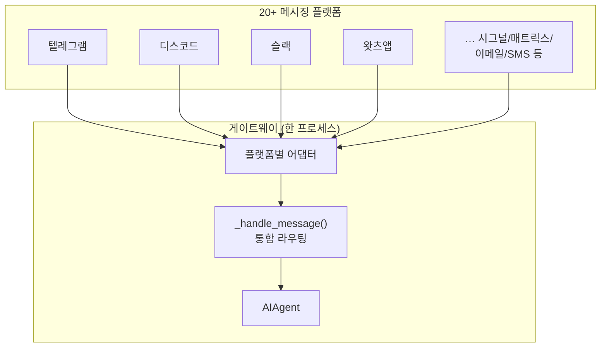
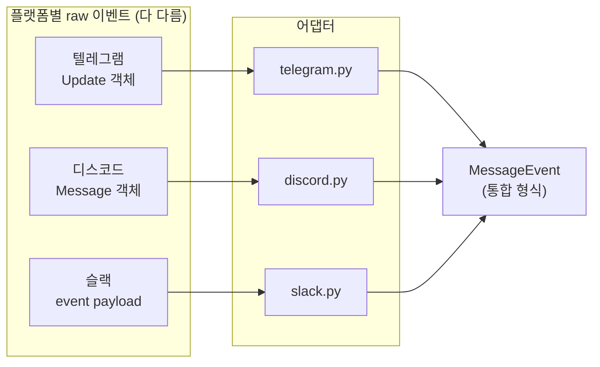
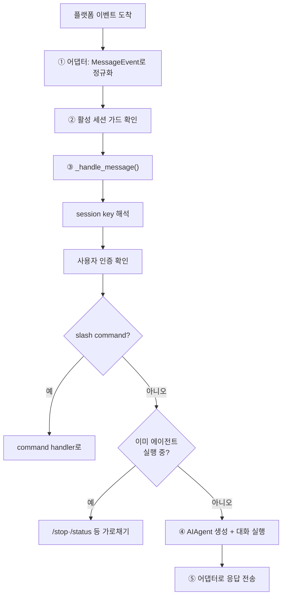
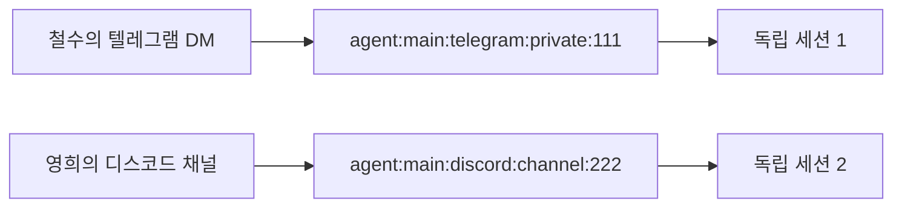
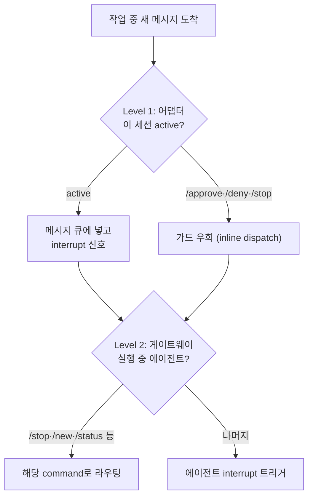
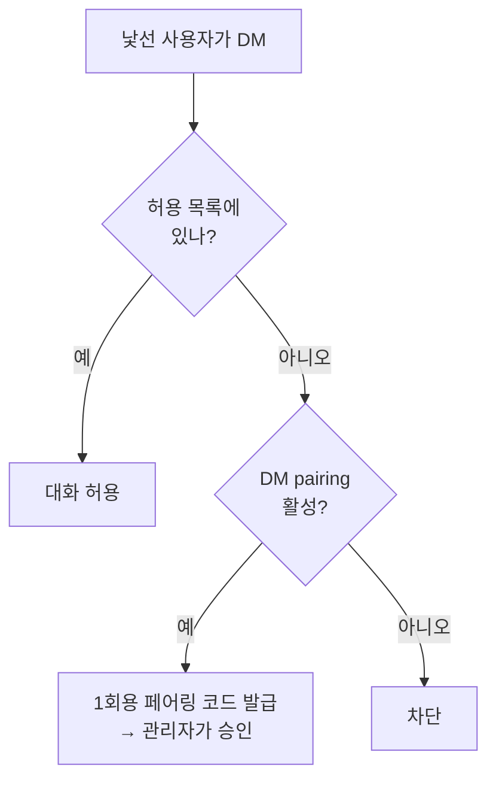
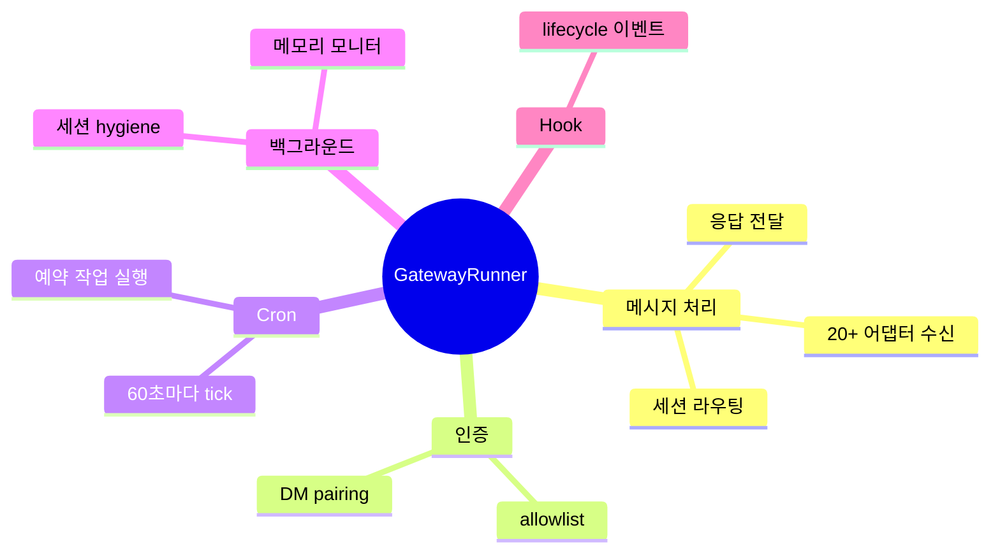
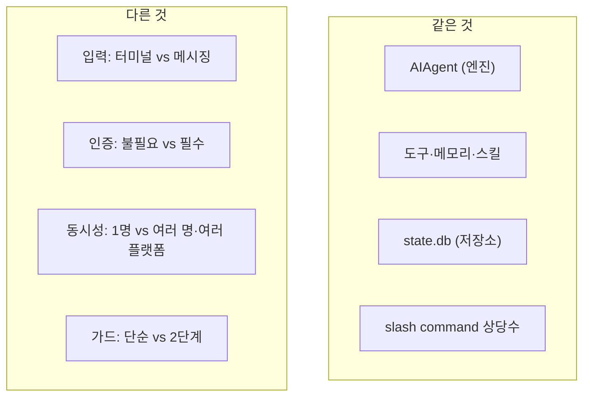
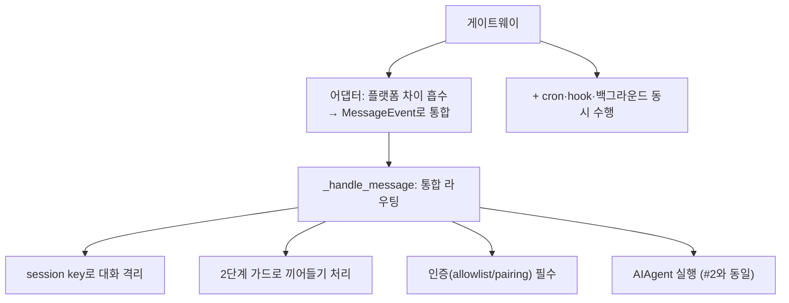

이 글에서 다루는 내용: Hermes가 어떻게 텔레그램·디스코드·슬랙 등 20개 이상의 메시징 플랫폼을 하나의 게이트웨이 프로세스로 돌리는지, 그리고 그 메시지가 어떻게 #2에서 본 AIAgent로 흘러가는지 정리한다.

[#1](./01-hermes-overview)에서 "진입점은 여러 개, 엔진은 하나"라고 했다. 이번 편은 그 진입점 중 가장 복잡한 게이트웨이를 연다.

---

## 들어가며: 텔레그램에서 에이전트를 부린다고?

Hermes의 특징 중 하나는 노트북 터미널에 묶이지 않는다는 점이다. 서버에서 게이트웨이를 켜두면 출근길에 텔레그램으로 "어제 PR 요약해줘"를 보낼 수 있다. 디스코드, 슬랙, 왓츠앱, 시그널 등도 가능하다.

여기서 질문이 생긴다.

> 플랫폼마다 API가 다 다른데, 어떻게 하나의 에이전트가 다 받지?

답은 어댑터(adapter) 패턴과 통합 라우팅이다.



핵심은 이렇다. 플랫폼마다 다른 건 어댑터가 흡수하고, 그 안쪽은 전부 똑같은 길(`_handle_message → AIAgent`)로 모은다.

---

## 어댑터 패턴: 플랫폼 차이를 흡수하는 층

각 플랫폼은 메시지 형식이 다 다르다. 텔레그램의 메시지 객체와 디스코드의 메시지 객체는 완전히 다른 모양이다. 어댑터가 이걸 공통 형식(`MessageEvent`)으로 번역한다.



모든 어댑터는 같은 베이스 클래스(`BasePlatformAdapter`)를 상속하고 똑같은 메서드를 구현한다.

| 메서드 | 역할 |
|--------|------|
| `connect()` | 연결 수립 (WebSocket / long-poll / HTTP 서버) |
| `disconnect()` | 안전 종료 |
| `send()` | 채팅에 메시지 전송 |
| `handle_message()` | 수신 메시지를 게이트웨이로 전달 |

관련 코드: `gateway/platforms/`에 플랫폼당 파일 하나씩 들어 있고, 베이스는 `gateway/platforms/base.py`다. 새 플랫폼 추가는 이 베이스를 상속해서 4개 메서드만 구현하면 된다 (#11에서 직접 다룬다).

---

## 메시지 흐름: 도착부터 응답까지

메시지가 플랫폼에 도착해서 답이 나가기까지의 전체 경로다.



#2에서 본 `run_conversation()`이 ④단계에서 호출된다. 즉 게이트웨이는 플랫폼 메시지를 AIAgent가 처리할 수 있는 형태로 만들어주는 껍데기에 가깝다.

---

## Session Key: 대화를 구분하는 주소

여러 사람이 여러 플랫폼에서 동시에 말을 걸 텐데, 각 대화는 어떻게 구분할까. Session key로 구분한다.

```text
agent:main:{platform}:{chat_type}:{chat_id}

예) agent:main:telegram:private:123456789
    agent:main:discord:channel:987654321
```



이 key로 각 대화가 독립된 세션으로 분리된다. #5에서 본 SQLite의 `source` 컬럼과 연결된다. 같은 `state.db`에 저장되지만 session key로 격리된다.

스레드를 지원하는 플랫폼(텔레그램 토픽, 디스코드 스레드)은 chat_id에 thread ID까지 포함된다. 코드 쪽에서는 session key를 직접 만들지 말고 `build_session_key()`를 쓰도록 권한다.

---

## 2단계 메시지 가드: 작업 중 끼어들기 처리

#2에서 "사용자가 언제든 끼어들 수 있다(중단 가능한 API 호출)"고 했다. 게이트웨이에서는 이게 더 정교하다. 에이전트가 작업 중인데 사용자가 또 메시지를 보내면 어떻게 될까.



두 겹으로 막는 이유는 다음과 같다.
- Level 1 (어댑터): 메시지가 게이트웨이에 도달하기 전에 잡아서 큐에 쌓는다.
- Level 2 (게이트웨이): `/stop` `/status` 같은 명령은 가로채고, 나머지는 실행 중 에이전트를 중단한다.

`/approve`처럼 에이전트가 멈춰서 승인을 기다리는 동안 반드시 전달돼야 하는 명령은 큐를 우회해 즉시(inline) 전달된다. 그렇지 않으면 영영 승인이 안 되는 교착이 생긴다.

---

## Authorization: 아무나 못 부린다

게이트웨이는 터미널 접근 권한이 있는 봇이다. 아무나 말을 걸어서 `rm -rf`를 시키면 문제가 된다. 그래서 기본이 "전원 차단"이다.



두 가지 방식이 있다.
1. Allowlist: `TELEGRAM_ALLOWED_USERS` 같은 환경변수로 허용할 사용자 ID를 지정한다.
2. DM Pairing: 낯선 사용자가 DM하면 1회용 코드를 발급하고, 관리자가 `hermes pairing approve`로 승인한다.

기본값이 "전부 거부"라는 점이 중요하다. 봇에 터미널 권한이 있으니 안전을 우선한다. `GATEWAY_ALLOW_ALL_USERS=true`로 전체 개방할 수도 있지만 권장하지 않는다.

---

## 게이트웨이가 동시에 하는 일들

게이트웨이는 메시지만 받는 게 아니다. long-running 프로세스로서 여러 일을 동시에 한다.



특히 Cron 스케줄러가 게이트웨이 안에서 60초마다 tick하면서 예약 작업을 실행한다 (다음 편 #9 주제).

---

## CLI와 게이트웨이, 무엇이 같고 다른가

#1에서 "엔진은 하나"라고 했다. 정리하면 다음과 같다.



정리하면 게이트웨이는 AIAgent를 멀티유저·멀티플랫폼 환경에 노출시키는 어댑터이자 라우터다. 엔진 자체는 CLI와 동일하다.

---

## 이번 편 정리



- 게이트웨이는 어댑터 패턴으로 20개 플랫폼의 차이를 흡수하고, 안쪽은 하나의 길로 모은다.
- 메시지는 정규화 → 세션 키 해석 → 인증 → (명령 or AIAgent 실행) → 응답 순으로 흐른다.
- session key로 대화를 격리하고, 2단계 가드로 작업 중 끼어들기를 처리한다.
- 터미널 권한 때문에 인증이 기본 필수다(allowlist/DM pairing).
- 엔진(AIAgent)은 CLI와 동일하며, 게이트웨이는 그걸 멀티유저 환경에 노출하는 층이다.

---

## 다음 편 예고

#9 Cron & 자동화 — 예약 작업이 새 에이전트를 띄우는 구조

게이트웨이 안에서 60초마다 도는 cron 스케줄러를 연다. "매일 아침 9시에 PR 요약해줘" 같은 예약 작업이 어떻게 기록 없는 새 에이전트를 띄워서 실행하고, 결과를 원하는 플랫폼으로 전달하는지 본다.

관련 코드: `gateway/run.py`, `gateway/session.py`, `gateway/platforms/base.py`, `gateway/pairing.py` · 관련 문서: `developer-guide/gateway-internals.md`
