이번 편에서는 "매일 아침 9시에 PR 요약해줘" 같은 예약 작업이 어떻게 도는지 본다. Hermes의 cron은 단순 셸 cron이 아니다. 새 에이전트 세션을 띄워 자연어 작업을 실행하고, 결과를 다시 사용자에게 돌려주는 시스템이다.

[#8](./08-gateway)에서 "게이트웨이가 60초마다 cron을 tick한다"고 했다. 이번 편은 그 cron을 연다.

---

## 들어가며: cron인데 셸 cron이 아니다?

리눅스 cron을 아는 사람이라면 "그냥 정해진 시각에 명령 실행하는 거 아닌가" 싶을 수 있다. Hermes cron은 다르다. 실행하는 게 셸 명령이 아니라 "자연어 작업"이다.

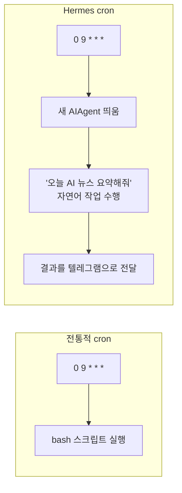

핵심은 이렇다. Hermes cron의 작업 단위는 "명령"이 아니라 "에이전트에게 시키는 일"이다. 그래서 도구 사용, 추론, 결과 전달까지 다 한다.

---

## 4가지 예약 방식

언제 실행할지 지정하는 방법이 네 가지다.

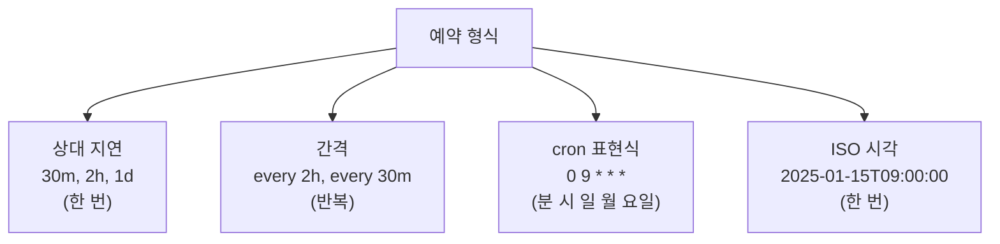

| 형식 | 예 | 동작 |
|------|-----|------|
| 상대 지연 | `30m`, `2h` | 지정 시간 후 1회 |
| 간격 | `every 2h` | 일정 간격 반복 |
| cron 표현식 | `0 9 * * *` | 표준 5필드 cron |
| ISO 시각 | `2025-01-15T09:00:00` | 정확한 시각 1회 |

사용자는 이걸 직접 외울 필요가 없다. "매일 아침 9시에 ~해줘"라고 자연어로 말하면 에이전트가 `cronjob` 도구로 등록한다.

---

## Job은 어디에, 어떻게 저장되나

각 예약 작업(job)은 `~/.hermes/cron/jobs.json`에 저장된다. #5에서 본 대화는 SQLite였지만, cron job은 JSON 파일이다.

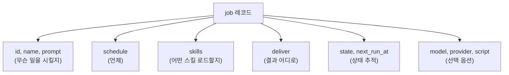

job 하나의 실제 모습(일부)은 다음과 같다.

```json
{
  "id": "a1b2c3d4e5f6",
  "name": "Daily briefing",
  "prompt": "Summarize today's AI news and funding rounds",
  "schedule": { "kind": "cron", "expr": "0 9 * * *" },
  "skills": ["ai-funding-daily-report"],
  "deliver": "telegram:-1001234567890",
  "state": "scheduled",
  "next_run_at": "2025-01-16T09:00:00Z"
}
```

관련 코드: `cron/jobs.py`가 job 모델과 `jobs.json` 저장(임시 파일에 쓰고 rename하는 atomic write)을 담당하고, `cron/scheduler.py`가 실행 루프를 담당한다.

### Job의 생명주기 상태

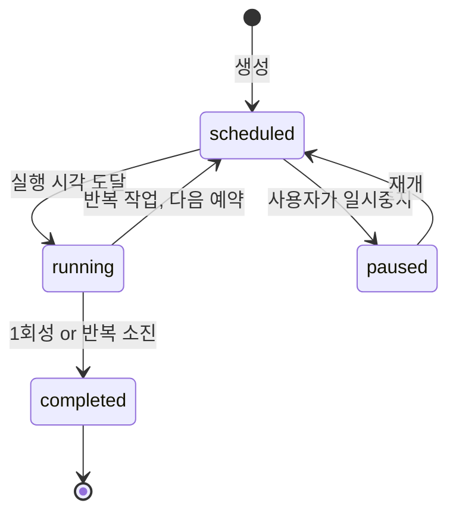

---

## tick: 60초마다 무슨 일이 일어나나

게이트웨이 안에서 스케줄러가 60초마다 `tick()`을 부른다. 이게 cron의 심장이다.

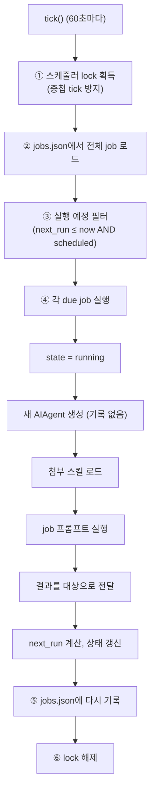

여기서 중요한 포인트는 ④-b다.

> "새 AIAgent 세션 생성 (대화 기록 없음)"

이게 cron의 핵심 특성이다. cron 작업은 백지 상태의 새 에이전트가 실행한다. 사용자와의 기존 대화를 이어받지 않는다.

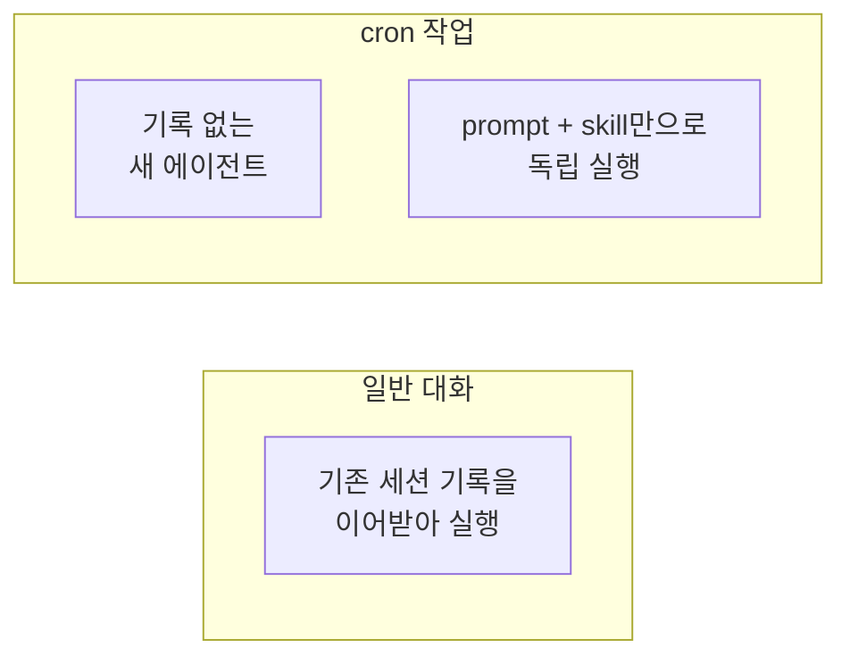

기록이 없는 이유는 이렇다. cron은 정해진 시각에 독립적으로 도는 작업이라 특정 대화 맥락에 묶이면 안 된다. 그래서 prompt는 자기 완결적이어야 한다. "아까 그거 이어서"는 통하지 않고, 필요한 맥락을 prompt에 다 담아야 한다.

---

## 스킬을 붙여서 능력을 주입

cron job은 스킬을 붙일 수 있다. #4에서 본 스킬(절차형 지식)을 작업 시작 전에 로드하는 방식이다.

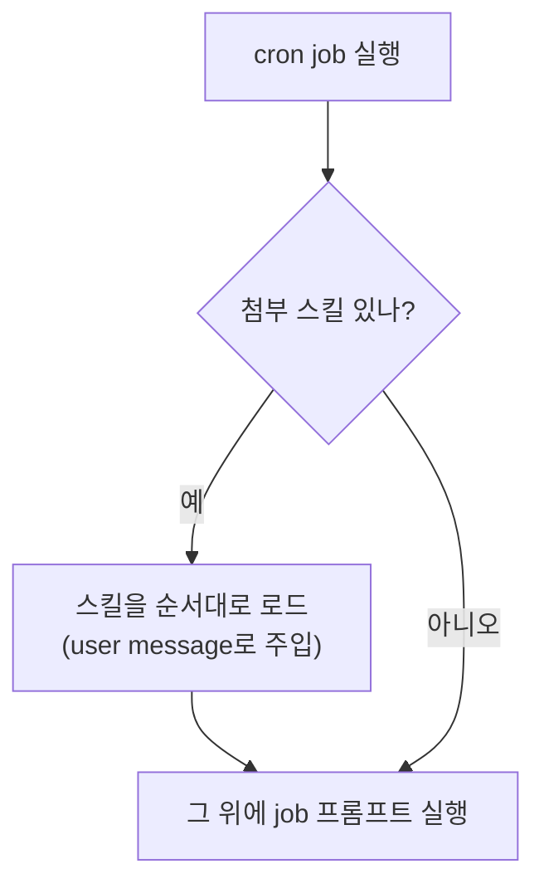

예를 들어 "매시간 블로그 피드 확인" 작업에 `blogwatcher` 스킬을 붙이면, 매번 그 스킬의 절차(피드 목록, 확인 방법)를 로드한 상태로 실행된다. 같은 절차를 prompt에 매번 적을 필요가 없다.

이는 #4에서 본 "스킬 = 재사용 가능한 절차"의 실전 활용이다. cron과 스킬 조합으로 복잡한 정기 작업을 정리할 수 있다.

---

## 결과 전달(deliver): 어디로 보낼까

작업 결과는 `deliver` 설정에 따라 여러 곳으로 보낼 수 있다.

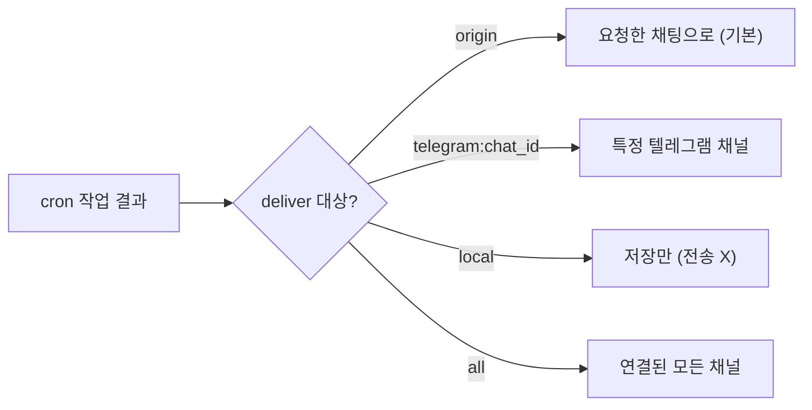

#8에서 본 게이트웨이의 delivery 시스템을 그대로 쓴다. "매일 아침 9시 요약을 팀 슬랙 채널로" 같은 게 가능한 이유다.

---

## 특수 모드: no-agent (LLM 없이 스크립트만)

항상 LLM을 쓰는 건 아니다. `no_agent` 모드면 LLM 없이 스크립트만 돌리고 그 출력을 그대로 전달한다.

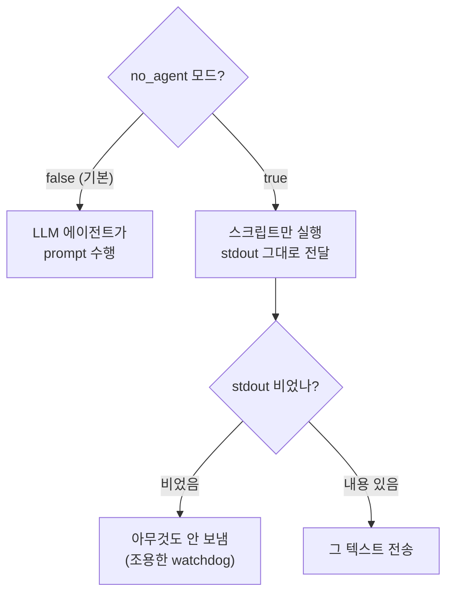

용도가 갈린다.
- 추론이 필요한 작업(뉴스 요약, 브리핑 작성)은 일반 모드(LLM)를 쓴다.
- 고정 출력 작업(디스크 용량 경보, 헬스체크)은 no-agent 모드(스크립트)를 쓴다.

no-agent와 "출력 비면 조용히" 조합이 watchdog 패턴이다. 문제가 없으면 침묵하고, 임계치를 넘으면 알린다. 토큰을 쓰지 않는다.

---

## 안전장치: 무한 cron 방지

cron 작업이 또 cron을 만들면 무한 증식이 된다. 그래서 막혀 있다.

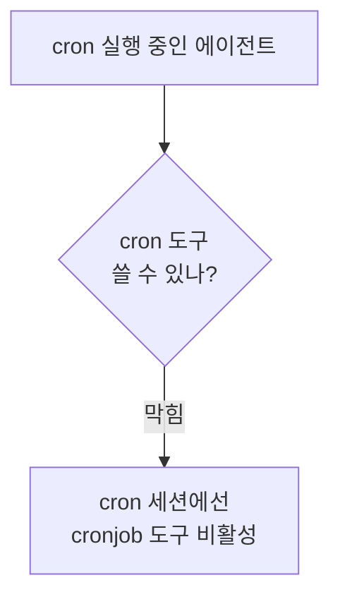

추가로 다음 장치가 있다.
- tick 중첩 방지: `.tick.lock` 파일로 같은 tick이 두 번 돌지 않게 한다.
- 3분 하드 인터럽트: 한 작업이 너무 오래 끌면 강제 중단한다.
- 기본 skip_memory: cron 세션은 기본적으로 메모리에 쓰지 않는다.

#7에서 "위임은 부모 턴이 끝나면 죽으니 장시간 작업은 cron"이라고 했다. cron은 게이트웨이가 살아있는 한 durable하게 반복된다. 위임(단기)과 cron(durable)의 차이다.

---

## cron의 짝: webhook: 시간이 아니라 이벤트로 깨우기

cron이 "시간"으로 에이전트를 깨운다면, webhook은 "외부 이벤트"로 깨운다. 둘은 트리거 방식만 다른 짝이다. GitHub 이슈가 올라오거나, Stripe 결제가 들어오거나, CI 빌드가 끝나거나, IoT 센서가 임계값을 넘으면, 그 서비스가 Hermes의 URL로 POST를 보내 에이전트 실행을 트리거한다.

설정은 webhook 플랫폼을 켜고(`hermes gateway setup` 또는 config의 `platforms.webhook.enabled`), 구독을 만든다.

```bash
hermes webhook subscribe github-issues \
  --events "issues" \
  --prompt "새 이슈 #{issue.number}: {issue.title}\n작성자: {issue.user.login}\n\n이 이슈를 분류해줘." \
  --deliver telegram \
  --deliver-chat-id "-100123456789"
```

이 명령이 webhook URL과 HMAC 시크릿을 돌려준다. 사용자는 GitHub 저장소 설정에서 그 URL로 이슈 이벤트를 보내게 등록한다. 핵심 요소들.

- **프롬프트 템플릿**: `{issue.title}`, `{pull_request.user.login}`, `{data.object.amount}`처럼 `{점.표기법}`으로 POST 페이로드의 중첩 필드를 꺼내 프롬프트에 끼운다. 프롬프트를 안 주면 전체 JSON이 그대로 에이전트에 들어간다.
- **스킬 부착**: `--skills github-code-review`처럼 이벤트 처리에 필요한 스킬을 미리 로드한다(cron의 스킬 부착과 같은 메커니즘).
- **직접 전달(`--deliver-only`)**: LLM 없이 페이로드를 그대로 메시지로 흘려보낸다. "결제 알림을 텔레그램으로 그대로 포워딩" 같은, 추론이 필요 없는 경우다. cron의 no-agent 모드와 같은 발상, LLM 왕복이 낭비인 경우를 위한 0비용 경로다.

보안은 구독마다 자동 생성되는 HMAC-SHA256 시크릿으로 한다. webhook 어댑터가 들어오는 모든 POST의 서명을 검증하고, 구독은 `~/.hermes/webhook_subscriptions.json`에 저장된다. 어댑터는 이 파일을 요청마다 mtime 기반으로 핫리로드하므로, 게이트웨이 재시작 없이 구독을 추가·제거할 수 있다.

---

## 위임 vs Cron vs Background: 정리

#7부터 나온 "비동기 실행" 선택지들을 한 번에 비교한다. 방금 본 webhook까지 더하면, 에이전트를 "지금 당장 대화로"가 아니라 다른 방식으로 굴리는 길은 네 갈래다.

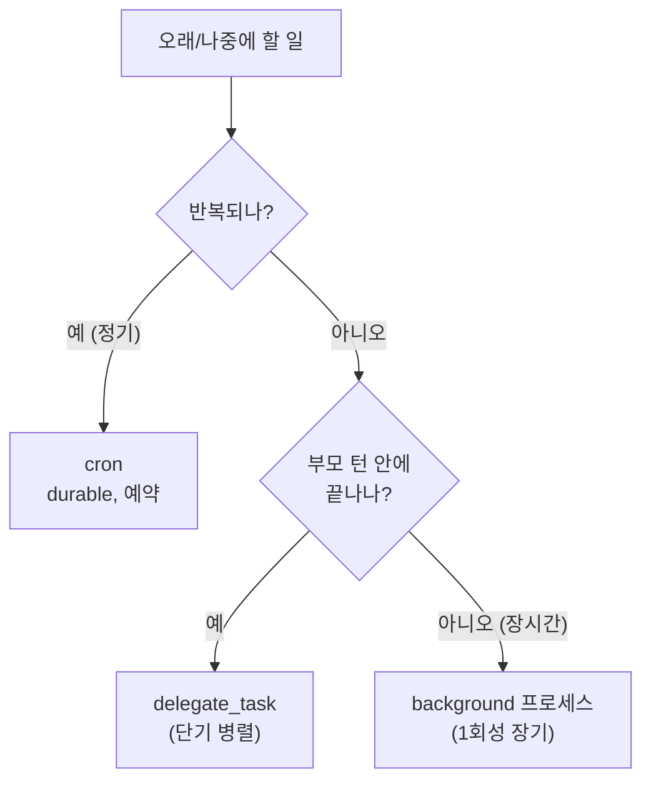

| 도구 | 수명 | 용도 |
|------|------|------|
| `delegate_task` | 부모 턴 (단기) | 병렬 하위 작업 |
| `cron` | durable, 반복 | 정기 자동화 |
| background 프로세스 | 1회성 장기 | 빌드·테스트 등 |

---

## 이번 편 정리

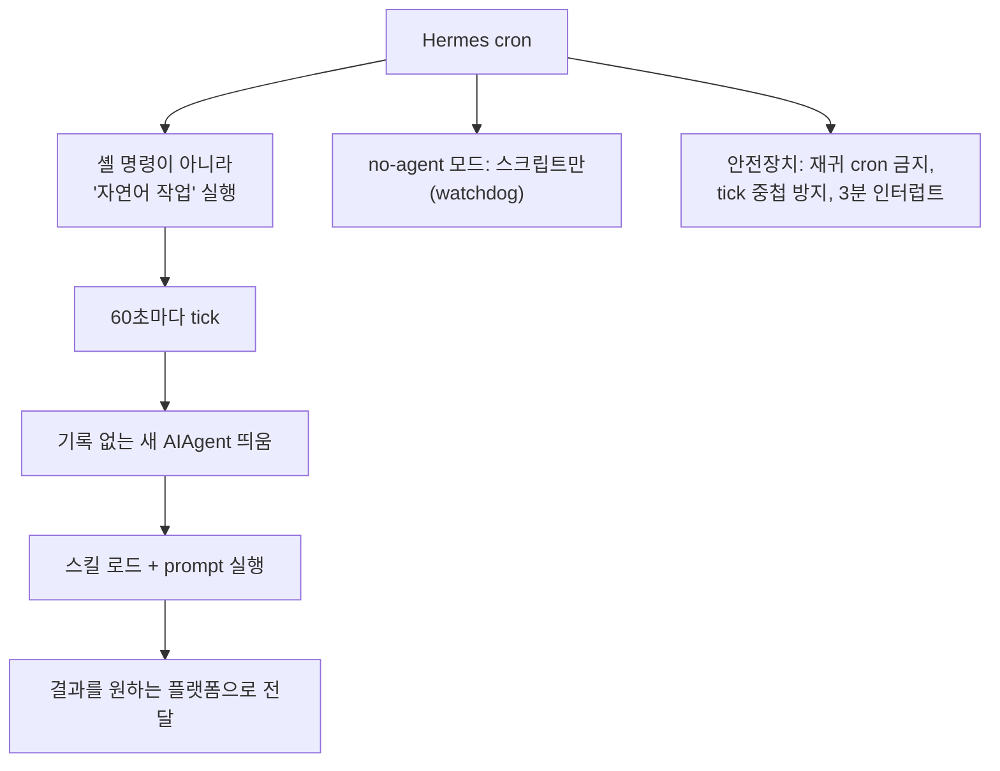

- Hermes cron은 셸 명령이 아니라 에이전트에게 시키는 자연어 작업을 예약 실행한다.
- 게이트웨이가 60초마다 tick하면 기록 없는 새 에이전트가 prompt를 수행하고 결과를 전달한다.
- cron 작업은 자기 완결적이어야 한다 (대화 맥락 없음).
- 스킬을 붙여 능력을 주입하고, deliver로 결과를 어디든 보낸다.
- no-agent 모드는 LLM 없이 스크립트만 돌린다 (watchdog 패턴).
- 단기 병렬은 위임, 정기 반복은 cron으로 처리한다.

---

## 다음 편 예고

#10 컨텍스트 압축 심화, dual compression + prompt caching

#5에서 예고한 "두 번째 압축"을 연다. 대화가 너무 길어지면 어떻게 중간을 요약해 줄이는지(50% / 85% 두 단계), 그리고 #3에서 본 prompt caching이 실제로 어떻게 비용을 줄이는지 구체적으로 본다.

관련 코드: `cron/jobs.py`, `cron/scheduler.py`, `tools/cronjob_tools.py` · 관련 문서: `developer-guide/cron-internals.md`, `user-guide/features/cron.md`
