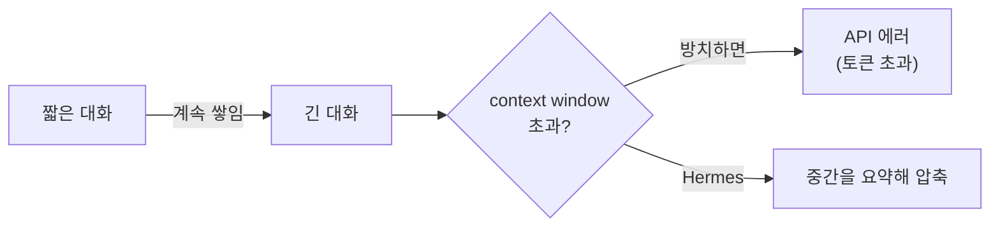
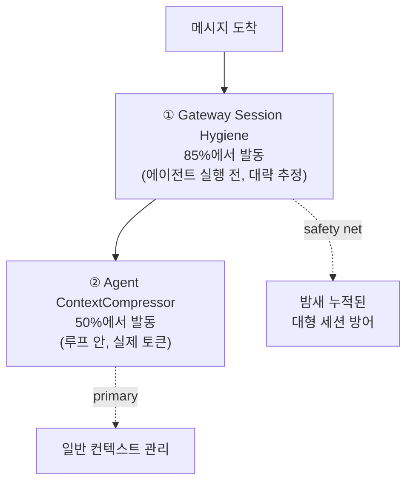
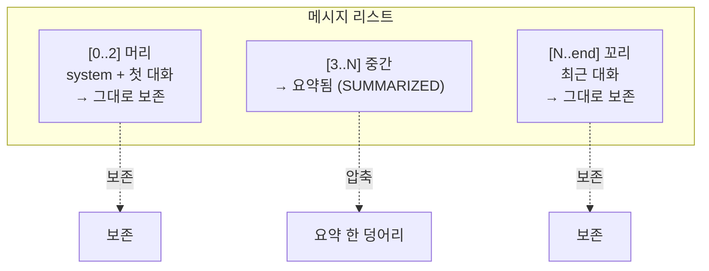
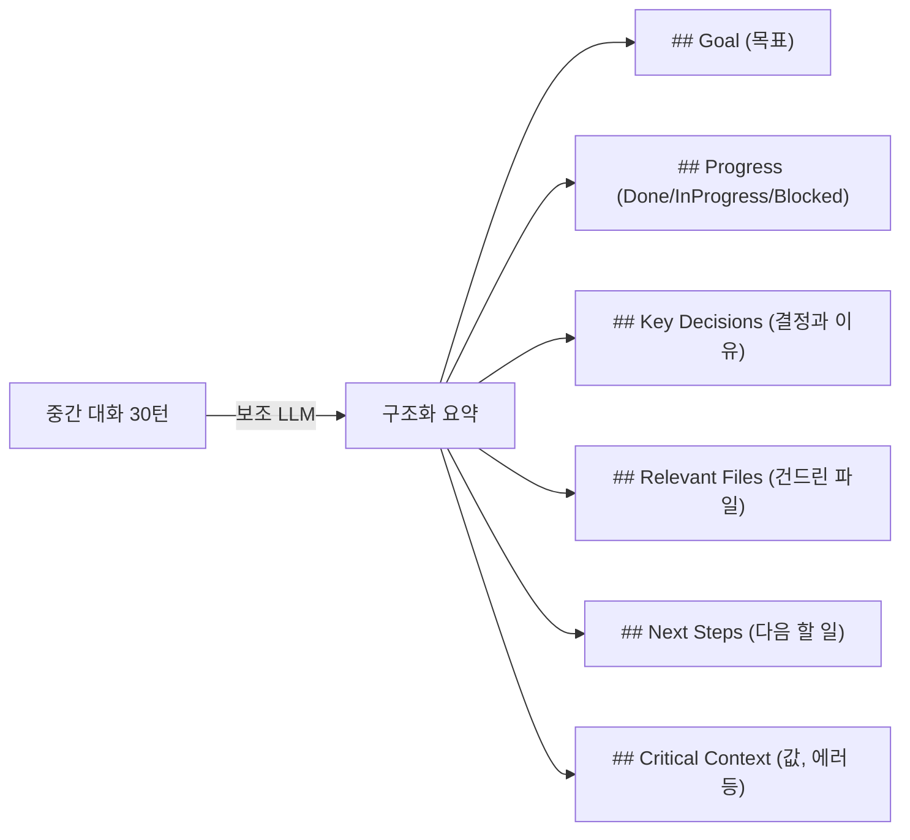
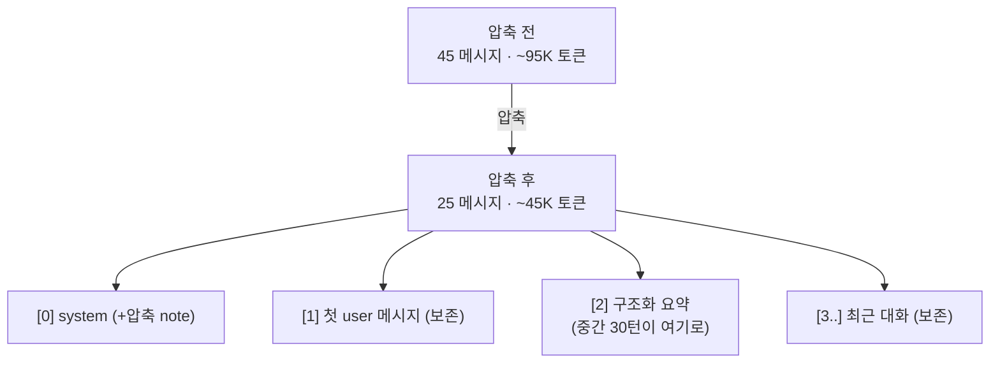
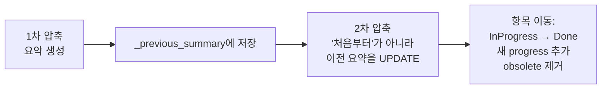
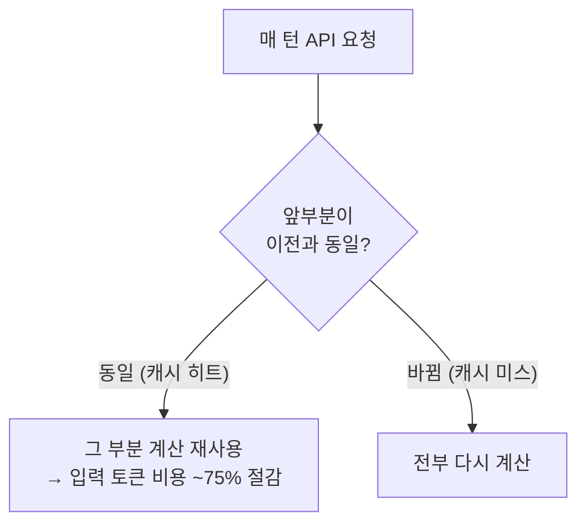
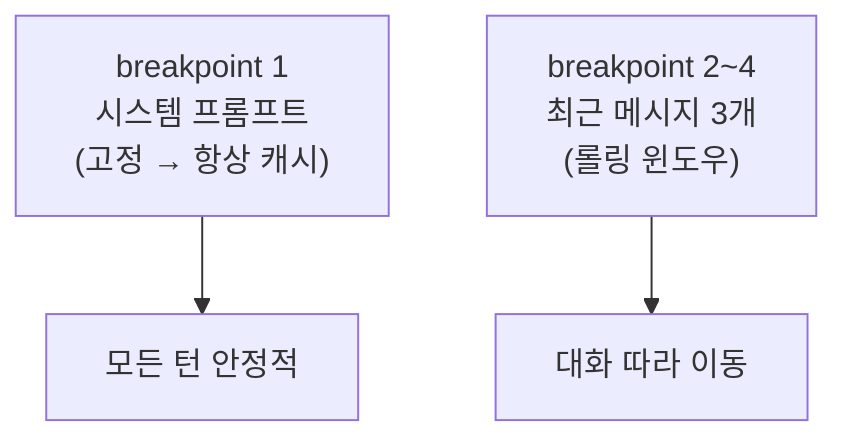
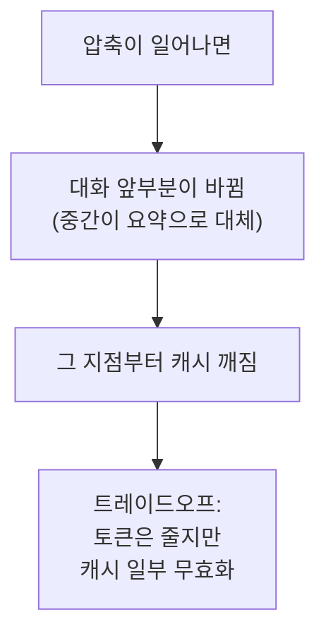
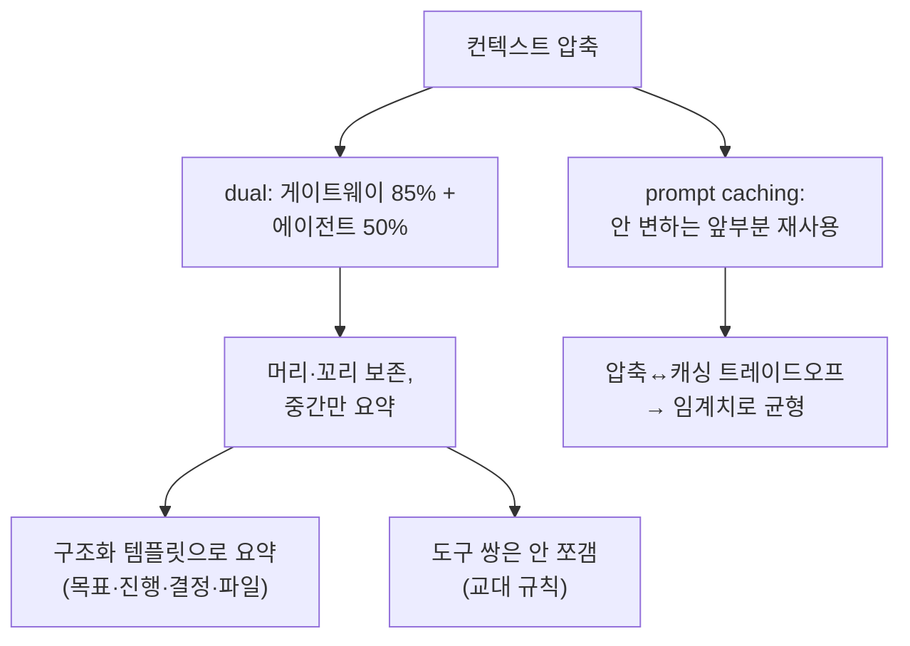

이 글에서 다루는 내용: 대화가 모델의 context window를 넘칠 만큼 길어지면 어떻게 되는가. Hermes는 중간 대화를 요약해서 줄인다(dual compression). 무엇을 보존하고 무엇을 버리는지, 그리고 #3에서 본 prompt caching이 어떻게 맞물리는지 살펴본다.

[#5](./05-memory-and-sessions)에서 "압축은 두 종류, 하나는 메모리(영구 기억), 하나는 컨텍스트(현재 대화창)"라고 했다. 이번 편은 그 두 번째 압축이다.

---

## 들어가며: 무한히 길어지는 대화의 문제

LLM에는 context window(한 번에 볼 수 있는 토큰 한도)가 있다. 대화가 길어지면 결국 이 한도에 부딪힌다.



#5의 메모리 압축이 "영구 기억을 작게 유지"였다면, 이번 건 "지금 진행 중인 대화창이 터지지 않게 줄이는 것"이다. 둘은 다른 대상을 다룬다.

컨텍스트 압축은 대화를 통째로 버리는 게 아니라, 중간 부분만 요약하고 시작과 끝은 살린다.

---

## Dual Compression: 두 겹의 안전망

Hermes는 압축 layer가 두 개 있고, 독립적으로 동작한다.



| | Gateway Hygiene | Agent Compressor |
|---|---|---|
| 발동 | context의 85% | context의 50% (기본) |
| 시점 | 에이전트 실행 전 | 도구 루프 안 |
| 토큰 | 대략 추정 | API가 보고한 실제 토큰 |
| 역할 | safety net | 주력 압축 |

둘로 나눈 이유는 다음과 같다. Gateway hygiene는 "에이전트가 메시지를 처리하기도 전에 이미 너무 커서 API가 실패할" 극단적 상황(예: 텔레그램에서 밤새 메시지 누적)을 막는 안전망이다. 임계치를 85%로 높게 잡은 것은, 50%로 하면 긴 게이트웨이 세션에서 매 턴 조기 압축이 발생하기 때문이다.

관련 코드: Gateway hygiene는 `gateway/run.py`("Session hygiene: auto-compress"), Agent compressor는 `agent/context_compressor.py`. 둘 다 `ContextEngine` ABC 위에 구현돼서 플러그인으로 교체할 수 있다.

---

## 압축의 핵심 원칙: 머리와 꼬리는 살린다

압축이라고 대화를 무작정 버리지 않는다. 무엇을 보존하고 무엇을 요약할지 경계를 정한다.



- 머리(head): 시스템 프롬프트 + 첫 대화. 작업의 출발점이라 보존한다.
- 중간(middle): 가장 오래된 대화들. 여기를 요약한다.
- 꼬리(tail): 최근 대화. 지금 맥락이라 보존한다.

꼬리 보호는 토큰 예산 기반이다. 끝에서부터 거꾸로 걸으며 예산이 찰 때까지 메시지를 보존한다. (최소 `protect_last_n`개, 기본 20개는 무조건 보존)

한 가지 중요한 디테일은, 경계를 자를 때 도구 호출/결과 쌍을 분리하지 않는다는 점이다. #2에서 본 "메시지 교대 규칙" 때문이다. assistant의 tool_call과 그에 대한 tool result가 따로 떨어지면 프로바이더가 거부하므로, 경계를 뒤로 밀어 쌍을 통째로 유지한다.

---

## 중간은 그냥 버리는 게 아니라 "구조화 요약"된다

중간 대화를 날리는 게 아니라, auxiliary LLM(보조 모델)이 구조화된 템플릿으로 요약한다.



그냥 "이전 대화 요약: ..."이 아니라, 목표·진행상황·결정·파일·다음단계·핵심값을 정해진 칸에 채우는 방식이다. 이렇게 해야 나중에 에이전트가 "어디까지 했는지"를 정확히 복원한다.

주의할 점: 요약하는 보조 모델의 context는 메인 모델만큼 커야 한다. 중간 섹션 전체가 한 번에 보조 모델로 가는데, 보조 모델 context가 더 작으면 에러가 나고 요약이 `None`이 되어 중간 대화가 요약 없이 사라진다. 문서는 이를 압축 품질 저하의 흔한 원인으로 안내한다.

---

## 실제 before/after

문서의 예시를 보면 동작이 분명해진다.



95K에서 45K로 절반 이상 줄었지만, "FastAPI 프로젝트 셋업 → 테스트 → 디버깅"이라는 작업 맥락은 요약으로 보존된다. 토큰은 줄이되 기억은 지키는 구조다.

---

## 반복 압축: 요약을 또 요약하지 않는다

대화가 계속 길어지면 압축이 여러 번 일어난다. 이때 매번 처음부터 다시 요약하면 정보가 점점 뭉개진다. Hermes는 다른 방식을 쓴다.



이전 요약을 LLM에 주고 "갱신하라"고 지시한다. 그래서 "In Progress"였던 항목이 "Done"으로 옮겨가고, 오래된 정보는 빠진다. 요약의 요약으로 정보가 손실되는 것을 막는 방식이다.

이는 #4의 메모리 압축과 닮았다. "지능이 필요한 일(요약 갱신)은 LLM에게" 맡긴다. 코드는 언제 압축할지 결정하고, 실제 요약은 LLM이 한다.

---

## 다른 한 축: Prompt Caching

압축이 "토큰 수를 줄이는" 것이라면, prompt caching은 "같은 토큰을 재계산하지 않는" 것이다. #1, #3에서 계속 나온 그 캐싱이다.



Anthropic은 요청당 캐시 지점(breakpoint)을 4개까지 허용하는데, Hermes는 `system_and_3` 전략을 쓴다.



- 시스템 프롬프트는 breakpoint 1로, #3에서 본 "byte-stable" 덕분에 항상 캐시 히트가 된다.
- 최근 3개 메시지는 롤링으로 따라가며 캐시된다.

#3의 "프롬프트를 byte-stable하게"가 여기서 효과를 낸다. 시스템 프롬프트가 변하지 않으니 매 턴 그 큰 덩어리를 캐시에서 재사용해 비용이 크게 줄어든다.

---

## 압축과 캐싱의 미묘한 관계

둘은 서로 충돌할 수 있다.



압축은 대화 중간을 바꾸니까 그 지점부터 캐시가 깨진다. 다만 다음과 같은 차이가 있다.
- 압축하지 않으면 토큰 초과로 실패하거나 매 턴 거대한 입력을 보내게 된다.
- 압축하면 일시적 캐시 미스가 생기지만, 이후 작아진 대화로 계속 진행할 수 있다.

그래서 압축은 자주 일어나서는 안 된다. 50% 임계치, 20개 꼬리 보호 같은 설정이 "필요할 때만, 최소한으로" 압축하도록 조율하는 장치다.

에이전트를 만들 때의 교훈은, 압축과 캐싱이 둘 다 비용 최적화지만 방향이 반대라는 점이다(하나는 내용을 바꿔 줄이고, 하나는 안 바뀜에 의존한다). 임계치를 적절히 잡아 "압축 빈도 최소화 + 캐시 최대 활용"의 균형을 찾아야 한다.

---

## 설정으로 조절하기

압축 동작은 `config.yaml`로 조절한다.

```yaml
compression:
  enabled: true          # 압축 켜기/끄기
  threshold: 0.50         # context의 몇 %에서 발동 (기본 50%)
  target_ratio: 0.20      # 꼬리로 얼마나 남길지
  protect_last_n: 20      # 최소 보존 꼬리 메시지 수
```

요약 모델은 `auxiliary.compression`에서 따로 지정한다. 앞서 본 "보조 모델 context가 메인보다 작으면 안 된다"는 문제 때문에 이 설정을 신경 써야 한다.

---

## 이번 편 정리



- 대화가 길어지면 중간을 구조화 요약해 줄인다 (머리·꼬리는 보존).
- dual compression: 게이트웨이 85% 안전망 + 에이전트 50% 주력.
- 요약은 보조 LLM이 정해진 템플릿(목표·진행·결정·파일·다음단계)으로 수행한다.
- 도구 호출/결과 쌍은 분리하지 않는다 (#2 교대 규칙).
- prompt caching은 안 변하는 앞부분을 재사용해 입력 비용을 약 75% 절감한다.
- 압축과 캐싱은 방향이 반대라, 임계치로 균형을 잡는다.

---

## 다음 편 예고

#11 확장하기 — plugin / MCP로 내 기능 붙이기

시리즈의 마지막이다. 지금까지 "Hermes가 어떻게 생겼나"를 봤다면, 이제 "여기에 내 것을 어떻게 추가하나"다. core를 건드리지 않고 plugin·MCP로 도구·플랫폼·메모리 백엔드를 붙이는 법, 그리고 "core는 좁게 유지한다"는 Hermes의 확장 철학(Footprint Ladder)을 본다.

관련 코드: `agent/context_compressor.py`, `agent/context_engine.py`, `agent/prompt_caching.py`, `gateway/run.py` · 관련 문서: `developer-guide/context-compression-and-caching.md`
