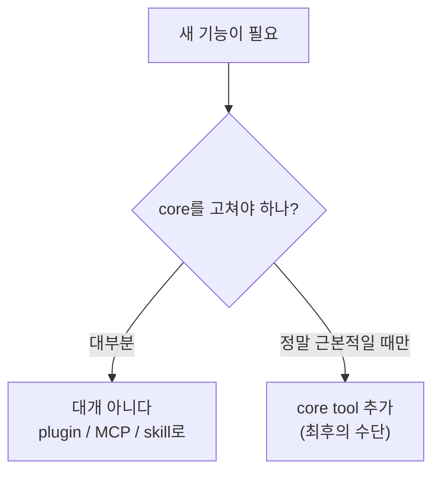
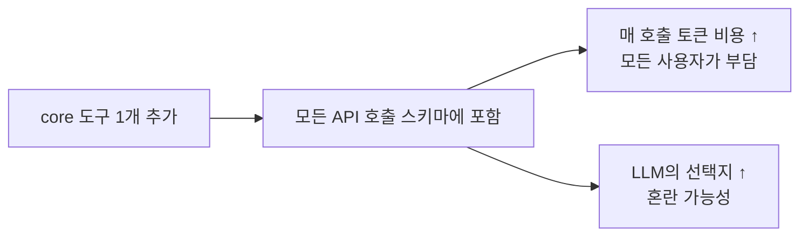
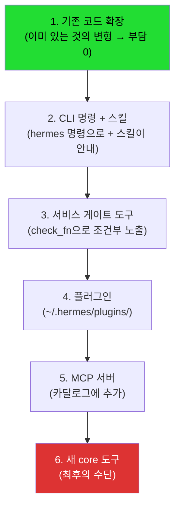
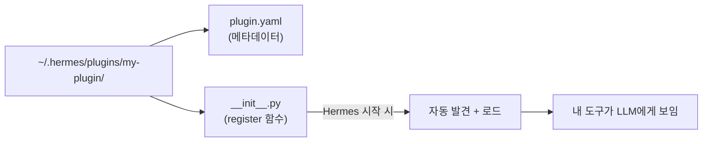
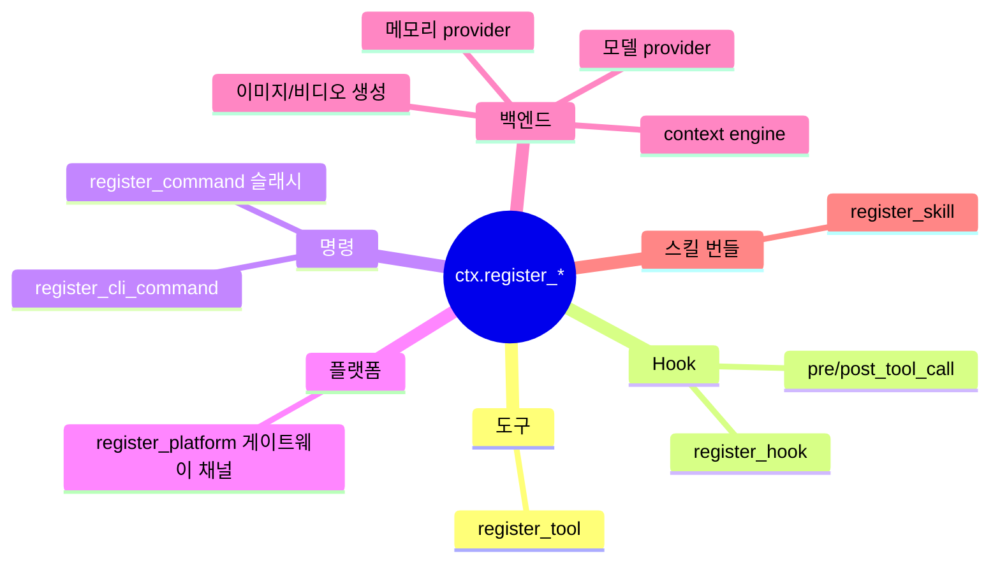
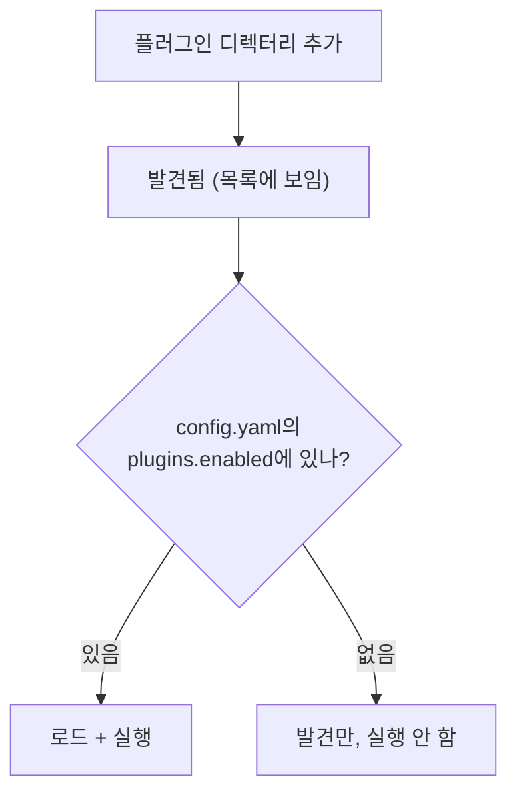
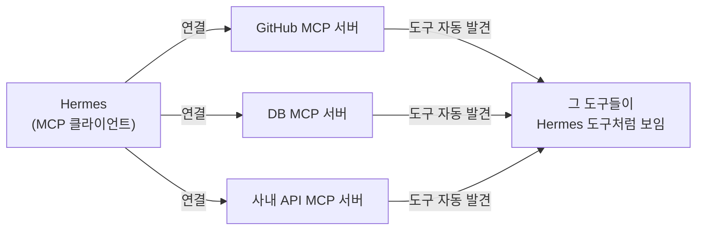
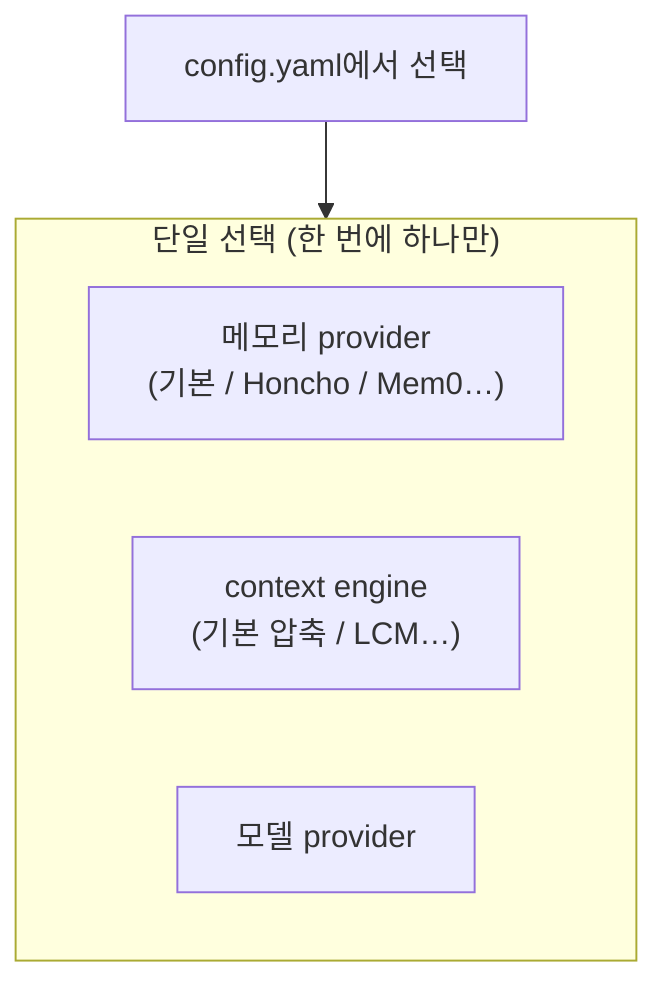
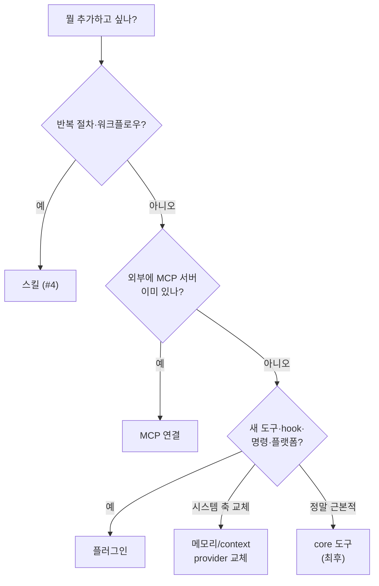
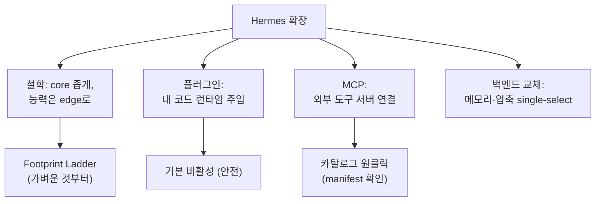

이 글에서 다루는 내용: 핵심·운영 시리즈(#1~#10)의 마무리 편이다. 지금까지 "Hermes가 어떻게 생겼나"를 봤다면, 이제 "여기에 내 것을 어떻게 추가하나"다. core를 건드리지 않고 도구·플랫폼·백엔드를 붙이는 법, 그리고 "core는 좁게 유지한다"는 Hermes의 확장 철학을 본다. (이후 #12~#14에서 실행 환경·인증/비용·스킬 수명 같은 운영 뒤편을 추가로 다룬다.)

시리즈 #1~#10을 다 봤다면, 이제 Hermes를 확장할 준비가 됐다. 이 편은 그 지도다.

---

## 들어가며: "내 도구를 추가하고 싶은데 core를 고쳐야 하나?"

Hermes를 쓰다 보면 "내 사내 API를 부르는 도구가 있으면 좋겠다"거나 "우리 회사 메신저에 붙이고 싶다"는 요구가 생긴다. 이때 `run_agent.py`나 `model_tools.py`를 직접 고쳐야 할까?

대부분의 경우 그럴 필요는 없다. Hermes는 core를 건드리지 않고 확장하는 길을 여러 개 열어뒀고, 거기엔 분명한 철학이 있다.



Hermes의 확장 철학은 "core는 좁게, 능력은 가장자리(edge)로"다. 새 기능은 가능한 한 바깥쪽(plugin/MCP)에서 해결한다.

---

## 왜 core를 좁게 유지하나?

이는 #3에서 본 내용과 연결된다. 모든 core 도구는 매 API 호출의 스키마에 들어간다.



도구가 1개 늘면 그 스키마가 모든 사용자의 모든 호출에 실린다. 그래서 core 도구 추가의 기준은 높다. "거의 모든 사용자에게 근본적으로 유용하고, 터미널+파일로는 해결하기 어려운" 것만 core에 들어간다.

---

## Footprint Ladder: 확장 결정 사다리

Hermes 개발 가이드에는 새 기능을 어디에 넣을지 정하는 사다리가 있다. 위쪽일수록 footprint(영구적 부담)가 적다. 가장 위(부담이 적은) 단계부터 시도한다.



| 단계 | 무엇 | footprint |
|------|------|-----------|
| 1 | 기존 코드 확장 | 0 (새 표면 없음) |
| 2 | CLI 명령 + 스킬 | 0 (도구 스키마 없음) |
| 3 | 서비스 게이트 도구 (`check_fn`) | 조건부 (켜질 때만) |
| 4 | 플러그인 | 런타임 발견 |
| 5 | MCP 서버 | core 스키마 0 |
| 6 | 새 core 도구 | 영구 (모든 호출) |

여기서 얻을 수 있는 교훈은, "기능 추가 = 일단 core에 박기"가 능사가 아니라는 점이다. 가장 가벼운 방법부터 시도하는 사다리를 두면, 시스템이 비대해지지 않는다. 이는 확장 가능한 시스템 일반에 적용되는 원칙이다.

---

## 길 1: 플러그인 — 내 코드를 런타임에 끼우기

가장 흔한 확장이다. `~/.hermes/plugins/`에 디렉터리를 하나 두면 된다. core 코드 수정은 없다.



최소 예시 (`__init__.py`):

```python
def register(ctx):
    schema = {
        "name": "hello_world",
        "description": "Returns a friendly greeting.",
        "parameters": {
            "type": "object",
            "properties": {"name": {"type": "string"}},
            "required": ["name"],
        },
    }
    def handle_hello(params, **kwargs):
        return json.dumps({"greeting": f"Hello, {params['name']}!"})

    ctx.register_tool(
        name="hello_world", toolset="hello_world",
        schema=schema, handler=handle_hello,
    )
```

#4에서 본 `registry.register`와 같은 패턴이다. 플러그인은 `ctx.register_tool`로 같은 등록 시스템에 끼어든다.

### 플러그인이 할 수 있는 것

도구만이 아니다.



관련 코드: 플러그인 발견은 `hermes_cli/plugins.py`. 세 곳에서 찾는다. `~/.hermes/plugins/`(개인), `.hermes/plugins/`(프로젝트), pip 패키지(entry points).

### 안전: 플러그인은 기본 비활성

남의 코드를 자동 실행하면 위험하다. 그래서 일반 플러그인은 기본적으로 꺼져 있다.



`hermes plugins enable <이름>`으로 켜야 실제로 동작한다. "제3자 코드가 사용자 동의 없이 동작하지 않는다"는 안전 기본값이다.

---

## 길 2: MCP — 이미 있는 외부 도구 서버에 연결

도구를 새로 짜지 않고, 이미 존재하는 외부 도구 생태계를 붙이고 싶을 때 쓴다. MCP(Model Context Protocol)다.



설정은 `config.yaml`에 서버를 적기만 하면 된다.

```yaml
mcp_servers:
  filesystem:
    command: "npx"
    args: ["-y", "@modelcontextprotocol/server-filesystem", "/home/user/projects"]
```

두 종류가 있다.
- stdio 서버: 로컬 서브프로세스로 실행 (`command` + `args`)
- HTTP 서버: 원격 엔드포인트에 연결 (`url`), OAuth도 지원

플러그인과 MCP의 선택 기준은 다음과 같다. 직접 짜는 Hermes 전용 기능은 플러그인, 이미 MCP 서버가 있거나 여러 AI 호스트에서 재사용할 도구는 MCP가 적합하다. MCP는 "Hermes만을 위한 코드"를 덜 써도 되어 재사용성이 높다.

### MCP 카탈로그: 검증된 것 원클릭 설치

Hermes는 Nous가 리뷰한 MCP 서버 카탈로그를 제공한다.

```bash
hermes mcp              # 대화형 선택기
hermes mcp install n8n  # 카탈로그에서 설치
```

주의: 설치하면 그 서버의 코드가 실행되므로, 카탈로그 항목이라도 manifest(source, bootstrap 명령)를 확인하라는 것이 문서의 안내다. 신뢰 모델을 잊지 않아야 한다.

---

## 길 3: 특수 백엔드 — 단일 선택 교체

도구가 아니라 시스템의 한 축을 통째로 교체하고 싶을 때도 있다. 메모리 저장 방식, 컨텍스트 압축 방식 같은 것이다.



- 메모리 provider: #5에서 본 기본 메모리 대신 Honcho 같은 외부 백엔드로 교체한다.
- context engine: #10에서 본 기본 압축 대신 무손실 컨텍스트 관리(LCM) 등으로 교체한다.
- 둘 다 single-select다. 한 번에 하나만 활성화하며 `config.yaml`로 선택한다.

이는 #10에서 "ContextCompressor는 ABC 위에 구현돼 플러그인으로 교체 가능"이라고 한 부분이다. 핵심 부품도 인터페이스(ABC)로 추상화돼 있어 교체할 수 있다.

---

## 확장 방법 한눈에 고르기



| 추가하려는 것 | 방법 |
|--------------|------|
| 반복 절차·노하우 | 스킬 |
| 기존 외부 도구 | MCP |
| 내 전용 도구·hook·명령·채널 | 플러그인 |
| 메모리/압축 방식 교체 | provider 플러그인 (single-select) |
| 근본적·범용 도구 | core (최후의 수단) |

---

## 이번 편 정리



- Hermes 확장 철학은 "core는 좁게, 능력은 가장자리로"다. 모든 core 도구는 매 호출 비용이기 때문이다.
- Footprint Ladder: 기존확장 → CLI+스킬 → 게이트도구 → 플러그인 → MCP → core 순으로, 가벼운 것부터 시도한다.
- 플러그인: `~/.hermes/plugins/`에 두면 자동 발견된다. 도구·hook·명령·플랫폼·백엔드까지 다룬다. 기본 비활성(안전)이다.
- MCP: 이미 있는 외부 도구 서버에 연결한다. 카탈로그 원클릭이며, manifest를 확인한다.
- 메모리·압축 같은 핵심 축도 ABC 추상화로 교체할 수 있다.

---

## 시리즈를 마치며


이 시리즈를 통해 Hermes를 이해(#1~#5)하고, 거기서 설계 교훈을 뽑고(#6), 운영 시스템을 보고(#7~#10), 마지막으로 확장하는 법(#11)까지 왔다.

처음 "이거 그냥 ChatGPT 아닌가"에서 시작해, 이제는 Hermes를 한 줄로 이렇게 정리할 수 있다.

여러 진입점이 하나의 AIAgent로 모이고, 그 엔진이 프롬프트를 조립하고 도구를 돌리며 기억하고, 필요하면 일을 위임·예약·압축하고, 가장자리에서 확장되는 에이전트 런타임이다.

직접 에이전트를 만든다면, 이 시리즈에서 본 결정들(캐시 보호, 도구 게이팅, 2층 기억, LLM 위임, 완결 강제, 컨텍스트 보호, 좁은 core)이 좋은 출발점이 될 것이다.

관련 코드: `hermes_cli/plugins.py`, `tools/mcp_tool.py`, `plugins/` · 관련 문서: `user-guide/features/plugins.md`, `user-guide/features/mcp.md`, `AGENTS.md`(Footprint Ladder)
