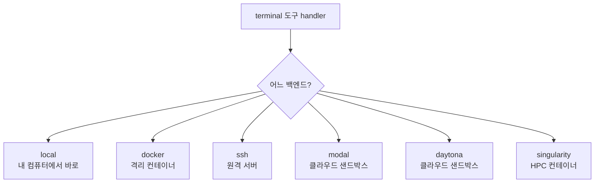
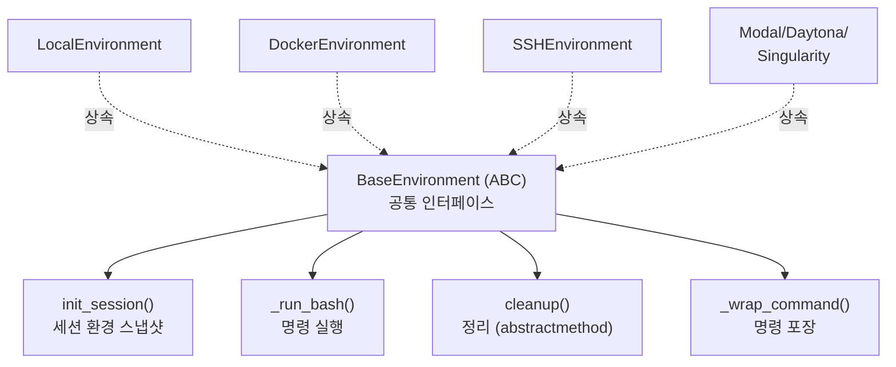
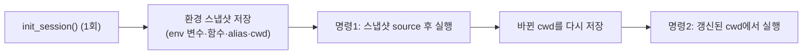
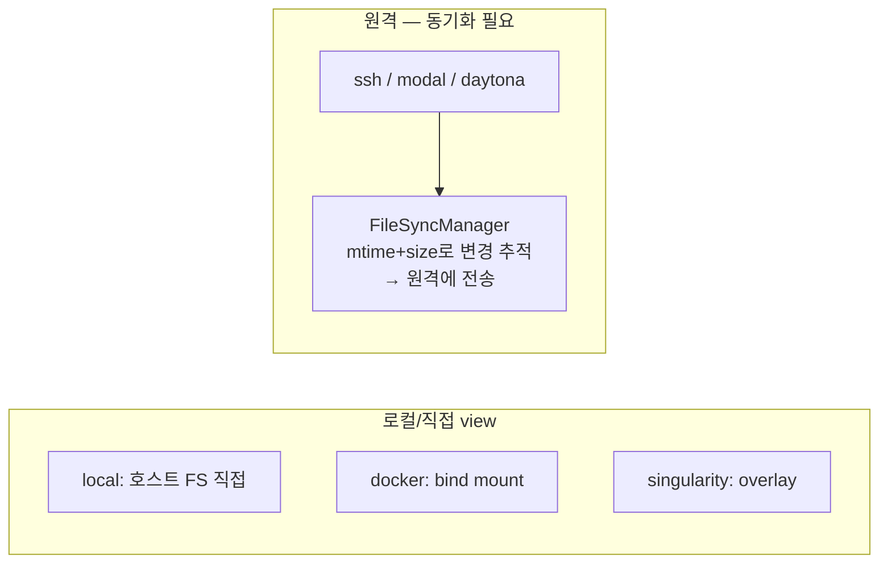
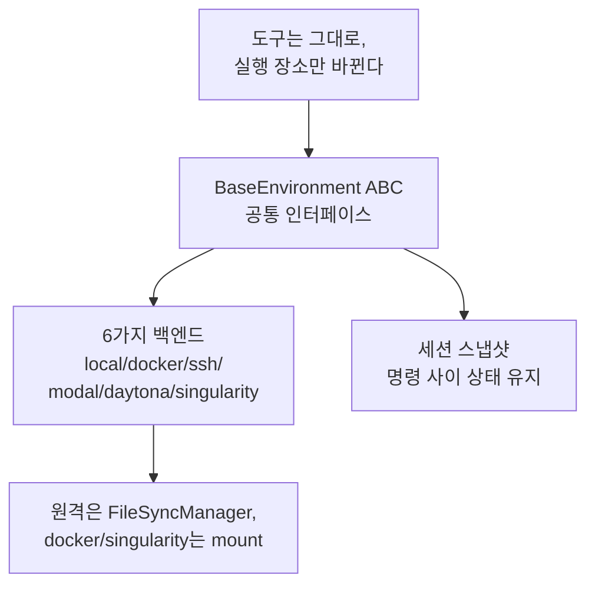

이 글에서 다루는 내용: [#4](./04-tools-system)에서 `terminal` 도구의 정체가 `handle_terminal()`이라는 함수라는 점을 봤다. 그런데 그 명령이 "어디서" 실행되는가는 또 다른 문제다. 내 노트북에서 바로 실행할 수도 있고, Docker 컨테이너 안에서, 또는 원격 SSH 서버나 클라우드 샌드박스에서 실행될 수도 있다. Hermes는 이 "실행 장소"를 6가지 백엔드로 추상화한다.

---

## 같은 도구, 다른 실행 장소

[#4](./04-tools-system)에서 도구는 그냥 함수라고 했다. `terminal` 도구의 handler가 `ls`를 실행한다. 그런데 그 `ls`가 도는 곳은 설정에 따라 다르다.

도구 코드는 그대로다. 바뀌는 것은 "그 명령을 어디로 보내 실행하느냐"뿐이다. 이게 가능한 이유는 모든 백엔드가 같은 인터페이스를 구현하기 때문이다.

---

## 공통 인터페이스: BaseEnvironment

6개 백엔드는 전부 `tools/environments/base.py`의 `BaseEnvironment`라는 추상 클래스(ABC)를 상속한다. [#11](./11-extending)에서 본 "ABC로 추상화하면 갈아끼울 수 있다"는 패턴이 여기서도 쓰인다.

도구 코드 입장에서는 "BaseEnvironment 하나"만 알면 된다. 실제로 local이 붙든 docker가 붙든 호출하는 메서드는 동일하다. 어떤 백엔드를 만들지는 `tools/terminal_tool.py`의 `_create_environment()` 팩토리가 설정값을 보고 정한다.

관련 코드: `tools/environments/base.py`(`BaseEnvironment`), `tools/terminal_tool.py`(`_create_environment` 팩토리)

---

## 세션 스냅샷: 명령 사이에 상태를 유지하는 법

여기서 한 가지 문제가 있다. 에이전트가 `cd /project`를 실행한 다음 `ls`를 실행하면, 두 번째 `ls`는 `/project`에서 돌아야 한다. 그런데 명령마다 새 셸을 띄우면 `cd`가 기억되지 않는다.

Hermes는 이걸 세션 스냅샷으로 해결한다. `init_session()`이 백엔드 생성 직후 한 번 로그인 셸의 환경을 통째로 파일에 저장한다.

스냅샷에 담기는 것: 환경 변수(`export -p`), 셸 함수, alias, 그리고 현재 작업 디렉터리. 각 명령은 이 스냅샷을 먼저 불러온 뒤 실행되므로, 이전 명령에서 바뀐 `cd`나 환경 변수가 다음 명령에 이어진다. 명령이 cwd를 바꾸면 그 결과를 다시 저장해 다음 명령에 반영한다.

스냅샷 생성이 실패하면 명령마다 `bash -l`(로그인 셸)로 실행하는 방식으로 후퇴한다. 상태 유지는 안 되지만 명령 자체는 돈다.

관련 코드: `tools/environments/base.py`의 `init_session()`

---

## 6가지 백엔드 비교

각 백엔드의 실제 특성이다. 코드의 docstring과 구현에서 확인한 것이다.

| 백엔드 | 실행 장소 | 격리 | 파일 동기화 방식 | 용도 |
|--------|----------|------|----------------|------|
| local | 내 컴퓨터 | 없음 | 직접 (호스트 FS) | 기본, 개인 작업 |
| docker | 로컬 컨테이너 | 높음 | bind mount | 격리 실행 |
| ssh | 원격 서버 | 서버에 위임 | FileSyncManager | 원격 머신 작업 |
| modal | 클라우드 샌드박스 | 높음 | FileSyncManager | 클라우드 확장 |
| daytona | 클라우드 샌드박스 | 높음 | FileSyncManager | 클라우드 확장 |
| singularity | HPC 컨테이너 | 높음 | writable overlay | HPC/연구 환경 |

### local — 가장 단순

내 컴퓨터에서 명령마다 프로세스를 띄운다(spawn-per-call). 격리가 없으므로 [#2의 위험 명령 승인](./02-agent-loop)이 특히 중요해지는 환경이다.

### docker — 보안 강화 격리

로컬 Docker 컨테이너에서 실행한다. docstring에 적힌 보안 설정이 구체적이다: 모든 capability 제거(cap-drop ALL), 권한 상승 금지(no-new-privileges), PID 수 제한. CPU·메모리·디스크 한도도 설정할 수 있다. 호스트 파일은 bind mount로 컨테이너에 직접 보여준다.

### ssh — 원격 서버, 연결 재사용

원격 서버에서 실행한다. SSH의 ControlMaster 기능으로 연결을 유지해서, 명령마다 새로 SSH 핸드셰이크를 하지 않는다.

### modal / daytona — 클라우드 샌드박스

클라우드 SDK로 샌드박스를 만들어 실행한다. 두 백엔드 모두 지속 샌드박스를 지원해서, cleanup 시 샌드박스를 정지하고 다음에 재개하면 파일시스템이 세션을 넘어 유지된다.

### singularity — HPC/연구 환경

Apptainer/Singularity 컨테이너에서 실행한다. `--containall`, `--no-home`, capability 제거로 보안을 강화한다. writable overlay 디렉터리로 파일시스템을 세션 사이에 유지한다.

---

## 파일 동기화: 원격 백엔드의 숨은 문제

local이나 docker는 파일이 호스트에 있거나 bind mount로 바로 보이니 문제가 없다. 그런데 ssh·modal·daytona는 실행이 다른 머신에서 일어난다. 에이전트가 로컬에서 수정한 파일을 원격이 어떻게 볼까?

ssh·modal·daytona는 `FileSyncManager`를 쓴다. 로컬 파일의 변경을 mtime과 크기로 추적하고, 삭제도 감지해서, 원격 환경에 트랜잭션 방식으로 동기화한다. 반면 docker와 singularity는 bind mount나 overlay로 호스트 파일시스템을 직접 보기 때문에 이 동기화가 필요 없다.

관련 코드: `tools/environments/file_sync.py`(`FileSyncManager`)

---

## 에이전트를 직접 만든다면

이 설계에서 가져갈 만한 것:

- 실행 환경을 ABC로 추상화하라. 도구 코드가 "어디서 실행되는지"를 몰라도 되게 만들면, 나중에 격리(컨테이너)나 원격 실행을 도구를 안 고치고 추가할 수 있다.
- 명령 사이의 상태 유지를 설계에 넣어라. 에이전트는 `cd` → `다음 명령`처럼 연속 작업을 한다. 매번 새 셸이면 상태가 끊긴다. 스냅샷이든 영속 세션이든 방법이 필요하다.
- 격리 수준은 선택지로 둬라. 개인 로컬 작업은 격리 없이 빠르게, 신뢰할 수 없는 작업은 컨테이너로. 하나만 강제하지 않는다.

---

## 이번 편 정리

- `terminal` 도구의 명령이 실행되는 장소는 6가지 백엔드 중 하나로, 전부 `BaseEnvironment` ABC를 구현한다.
- 명령 사이의 상태(cwd·환경 변수)는 세션 스냅샷으로 유지한다.
- 원격 백엔드(ssh/modal/daytona)는 FileSyncManager로 파일을 동기화하고, docker/singularity는 mount로 호스트 파일을 직접 본다.
- 어떤 백엔드를 쓸지는 `_create_environment` 팩토리가 설정을 보고 정한다.

---

## 다음 편 예고

#13 인증·크레덴셜·비용 — 여러 모델을 쓰면서 토큰을 갱신하고 비용을 추적하는 법

관련 코드: `tools/environments/`(base, local, docker, ssh, modal, daytona, singularity, file_sync), `tools/terminal_tool.py`
