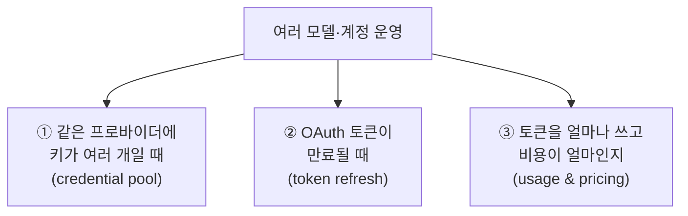
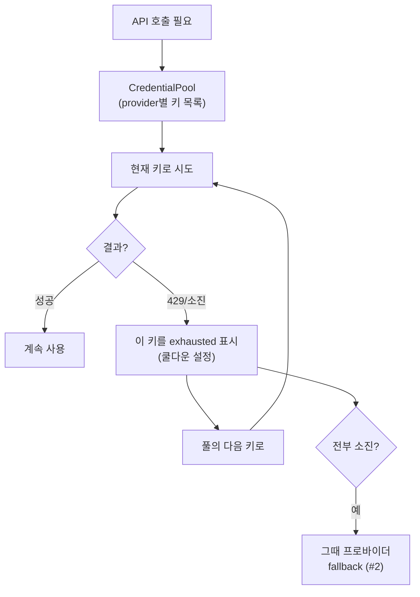
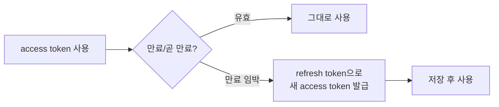
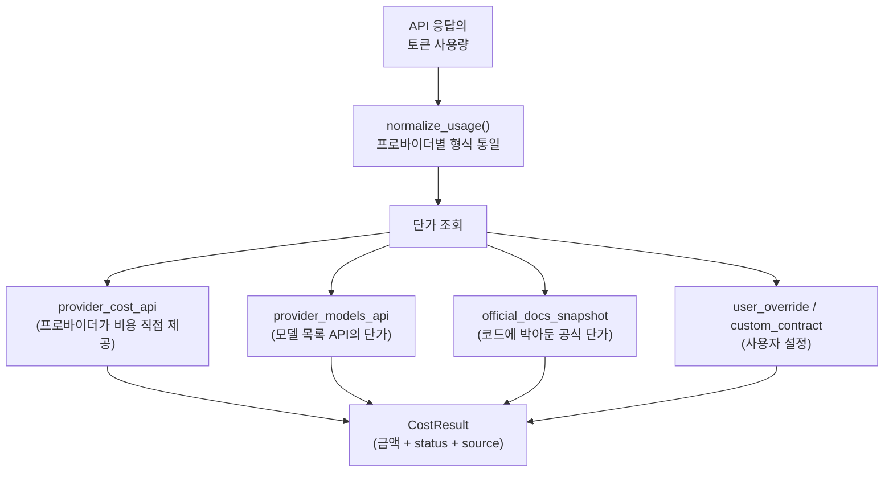
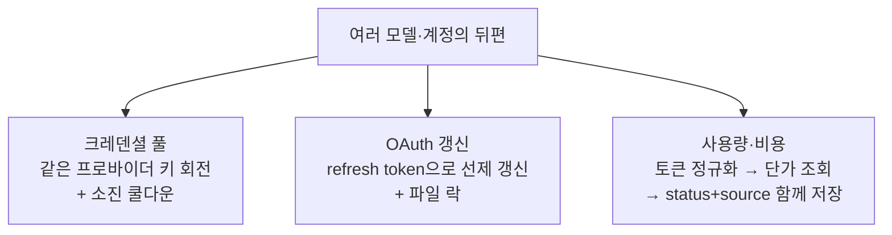

이 글에서 다루는 내용: [#2](./02-agent-loop)에서 "주 모델이 실패하면 fallback으로 갈아탄다"고 했고, [#5](./05-memory-and-sessions)에서 sessions 테이블에 `input_tokens`·`actual_cost_usd` 같은 비용 컬럼이 있다고 봤다. 그 뒤편에는 여러 크레덴셜을 돌려쓰고, OAuth 토큰을 갱신하고, 토큰당 비용을 계산하는 시스템이 있다. 에이전트가 여러 모델·여러 계정을 다룰 때 필요한 부분이다.

---

## 세 가지 문제

여러 LLM 프로바이더를 쓰는 에이전트는 운영상 세 가지를 풀어야 한다.

각각을 보자.

---

## ① 크레덴셜 풀 — 같은 프로바이더의 여러 키

[#2](./02-agent-loop)의 fallback은 "다른 프로바이더로" 갈아타는 것이었다. 그런데 그 전에, 같은 프로바이더에 키가 여러 개라면 그것부터 돌려쓰는 게 낫다. 예를 들어 OpenAI 키가 3개 있는데 하나가 429(rate limit)에 걸리면, 다른 OpenAI 키로 먼저 시도하는 것이다.

이걸 `agent/credential_pool.py`의 `CredentialPool`이 담당한다.

핵심 동작:

- 키가 소진(exhausted)되면 바로 버리지 않고 쿨다운 시간을 설정한다. 일정 시간(에러 코드에 따라 TTL이 다름)이 지나면 다시 시도 대상이 된다. 429는 영구 차단이 아니라 일시적 throttling이기 때문이다.
- 풀 안에서 키를 고르는 전략(strategy)이 설정 가능하다. 기본은 `fill_first`(우선순위 순으로 한 키를 끝까지 쓰고 다음으로), 다른 옵션은 `round_robin`(키를 번갈아). `config.yaml`의 `credential_pool_strategies`로 프로바이더별로 정한다.
- 풀의 모든 키가 소진된 뒤에야 [#2의 프로바이더 fallback](./02-agent-loop)으로 넘어간다.

즉 실패 시 대응은 2단계다: 같은 프로바이더의 다른 키 → 그것도 다 떨어지면 다른 프로바이더.

관련 코드: `agent/credential_pool.py`(`CredentialPool`, `get_pool_strategy`, `_mark_exhausted`)

---

## ② OAuth 토큰 갱신 — 만료되는 인증

API 키는 보통 만료가 없지만, OAuth 기반 인증(Google/Gemini, Anthropic 구독, OpenAI Codex 등)은 access token이 짧은 수명을 갖는다. [#2](./02-agent-loop)에서 "401/403이면 갈아타기 전에 credential 갱신부터 시도한다"고 한 게 이 부분이다.

`agent/google_oauth.py`를 예로 보면, OAuth 갱신에 들어가는 실제 요소들이 보인다.

- refresh token으로 새 access token을 받아온다. access token은 만료되지만 refresh token은 오래 유지되므로, 재로그인 없이 토큰을 갱신할 수 있다.
- 만료 시각을 unix 밀리초로 저장하고, 만료 임박(skew) 시 미리 갱신한다. 정확히 만료된 순간에 실패로 알게 되는 대신, 여유를 두고 갱신한다.
- 토큰 저장소에 파일 락을 건다. 여러 Hermes 프로세스가 동시에 토큰을 갱신하면 충돌하므로([#5의 동시성 처리](./05-memory-and-sessions)와 같은 문제), 락으로 직렬화한다.
- 로그인 흐름은 PKCE를 쓴다(code verifier/challenge 쌍 생성). 공개 클라이언트에서 인증 코드 가로채기를 막는 표준 방식이다.

이 갱신이 fallback보다 먼저 일어나는 이유는 명확하다. 토큰이 만료된 것뿐이면 모델을 바꿀 이유가 없다. 갱신하면 같은 모델을 계속 쓸 수 있다.

관련 코드: `agent/google_oauth.py`, `agent/credential_pool.py`(토큰 만료/갱신 연계)

---

## ③ 사용량과 비용 — 토큰을 돈으로 환산

[#5](./05-memory-and-sessions)에서 sessions 테이블에 `input_tokens`, `output_tokens`, `cache_read_tokens`, `actual_cost_usd`, `estimated_cost_usd` 컬럼이 있었다. 이 값을 채우는 게 `agent/usage_pricing.py`다.

비용 계산이 단순히 "토큰 수 × 단가"가 아닌 이유는, 단가를 어디서 알아내느냐가 경우마다 다르기 때문이다.

여기서 두 가지 개념이 비용의 신뢰도를 나타낸다.

비용 status (얼마나 확실한가):

| status | 의미 |
|--------|------|
| actual | 프로바이더가 실제 청구액을 알려줌 (가장 정확) |
| estimated | 토큰 × 단가로 추정 |
| included | 구독/포함제라 추가 과금 없음 |
| unknown | 단가를 모름 |

비용 source (단가를 어디서 얻었나): `provider_cost_api`, `provider_generation_api`, `provider_models_api`, `official_docs_snapshot`, `user_override`, `custom_contract` 등.

[#5의 sessions 테이블](./05-memory-and-sessions)에 `cost_status`와 `cost_source` 컬럼이 따로 있던 이유가 이것이다. "$0.014"라는 숫자만 저장하는 게 아니라, 그게 실제 청구액인지 추정치인지(status), 어디서 나온 단가인지(source)까지 함께 저장한다. 추정치를 실제값처럼 다루지 않기 위한 설계다.

캐시 토큰을 따로 추적하는 것도 [#10의 prompt caching](./10-context-compression)과 연결된다. 캐시 읽기(cache_read)와 캐시 쓰기(cache_write)는 일반 입력 토큰과 단가가 다르므로 별도 컬럼으로 계산한다.

관련 코드: `agent/usage_pricing.py`(`normalize_usage`, `get_pricing_entry`, `estimate_usage_cost`, `CostResult`), `agent/model_metadata.py`(단가 메타데이터 조회)

---

## 에이전트를 직접 만든다면

- 실패 대응을 계층화하라. 같은 프로바이더의 다른 키 → 다른 프로바이더 순으로. 모든 실패를 곧장 "다른 모델로"로 처리하면 멀쩡한 키를 낭비한다.
- 소진된 키는 버리지 말고 쿨다운을 줘라. rate limit은 일시적이다. 영구 차단하면 가용 자원이 계속 줄어든다.
- OAuth는 만료 임박 시 미리 갱신하라. 만료된 순간 실패로 알게 되는 것보다, skew를 두고 선제 갱신하는 게 안정적이다. 갱신은 락으로 직렬화한다.
- 비용은 숫자만 저장하지 말고 신뢰도(status)와 출처(source)를 함께 저장하라. 추정치와 실제 청구액을 구분하지 못하면 비용 분석이 어긋난다.

---

## 이번 편 정리

- 실패 시 대응은 2단계다: 크레덴셜 풀에서 같은 프로바이더의 다른 키 → 전부 소진되면 프로바이더 fallback(#2).
- 소진된 키는 쿨다운 후 복귀하고, 풀 선택 전략(fill_first/round_robin)은 설정 가능하다.
- OAuth 토큰은 refresh token으로 만료 전에 선제 갱신하며, 파일 락으로 동시 갱신 충돌을 막는다.
- 비용은 토큰을 정규화하고 단가를 여러 출처에서 조회해 계산하며, 금액과 함께 status(actual/estimated/included/unknown)와 source를 저장한다.

---

## 다음 편 예고

#14 스킬 수명 관리 — 스킬이 스스로 활성/비활성/보관되는 curator 시스템

관련 코드: `agent/credential_pool.py`, `agent/google_oauth.py`, `agent/usage_pricing.py`, `agent/model_metadata.py`
