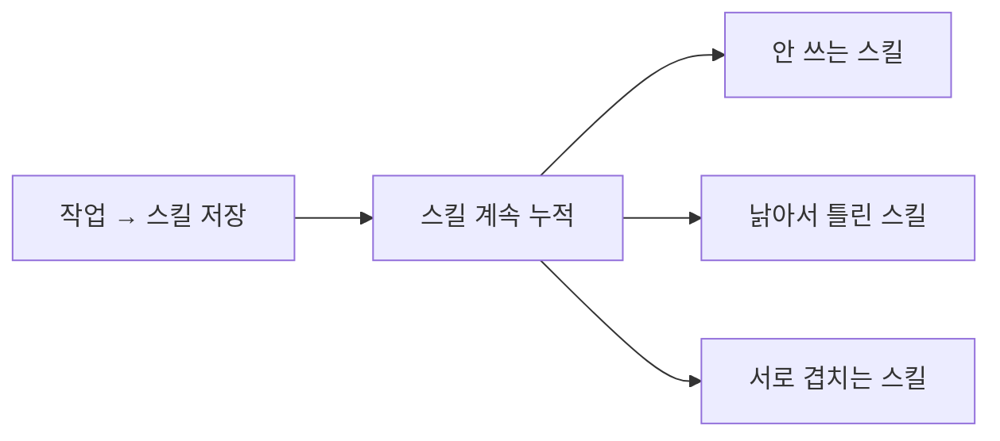
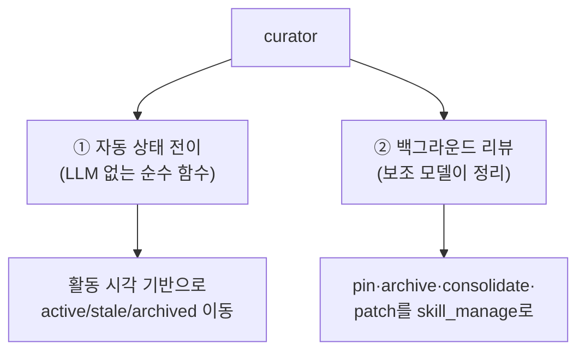
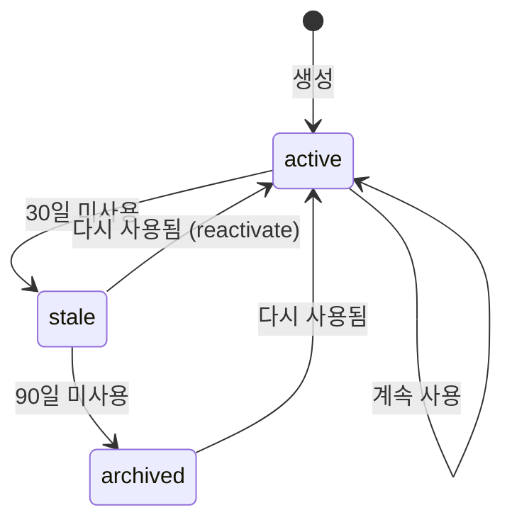
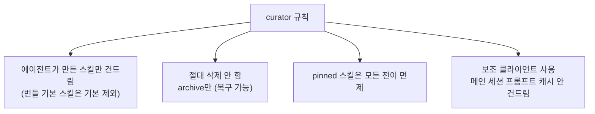
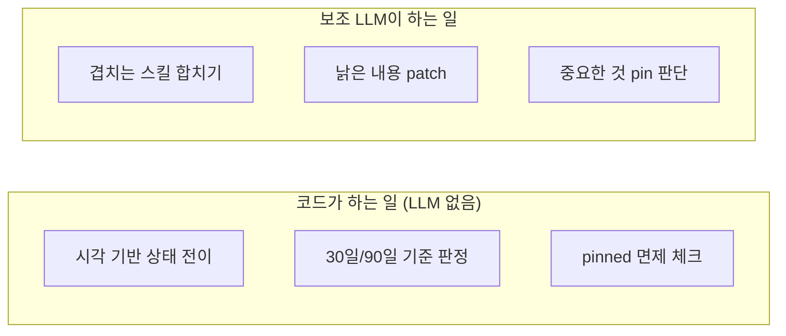
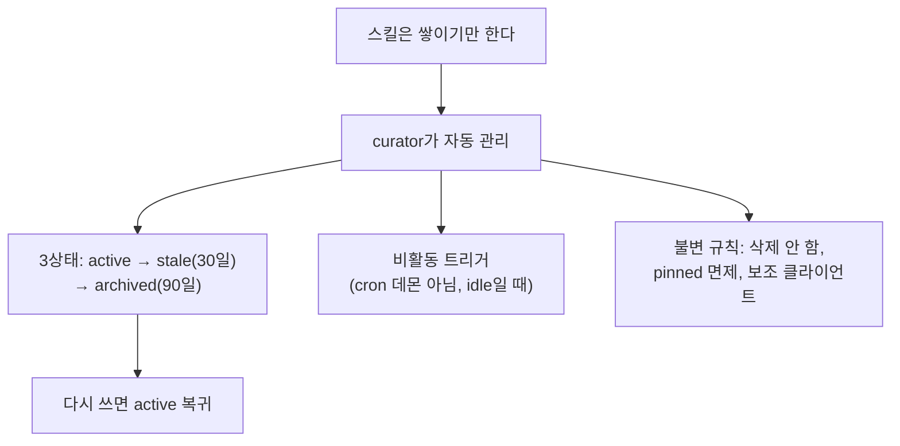
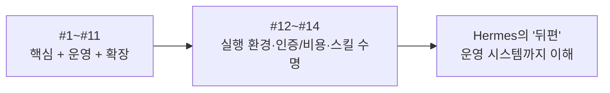

[#4](./04-tools-system)에서는 스킬을 "재사용 가능한 절차"로 봤다. 에이전트가 직접 저장한다는 점도 봤다. 문제는 그다음이다. 계속 만들기만 하면 안 쓰는 스킬, 낡은 스킬, 겹치는 스킬이 쌓인다. Hermes는 이 정리를 curator에게 맡긴다. [#5](./05-memory-and-sessions)에서 본 "삭제 대신 비활성화" 철학도 여기서 다시 나온다.

---

## 쌓이기만 하는 스킬 문제

[#4](./04-tools-system)에서 에이전트는 복잡한 작업을 끝내면 그 절차를 스킬로 저장한다고 했다. 좋은 기능이지만 부작용이 있다. 시간이 지나면 스킬이 쌓인다.

[#3](./03-system-prompt)에서 스킬 인덱스가 시스템 프롬프트에 들어간다고 했다. 스킬이 많아지면 그 인덱스도 커지고, 에이전트가 골라 쓸 선택지도 늘어난다. 누군가는 이 컬렉션을 관리해야 한다. Hermes는 그 일을 자동화했다.

---

## curator: 백그라운드 스킬 관리자

`agent/curator.py`의 curator가 이 일을 한다. 두 가지 방식으로 동작한다.

언제 도느냐가 특이하다. cron 데몬이 따로 도는 게 아니라 비활동 트리거(inactivity-triggered) 방식이다. 에이전트가 한가하고(idle), 마지막 curator 실행이 설정된 간격(기본 7일)보다 오래전이면, `maybe_run_curator()`가 리뷰 에이전트를 띄운다. 사용자가 작업 중일 때 끼어들지 않는다.

---

## 세 가지 수명 상태

스킬은 세 가지 상태를 가진다(`tools/skill_usage.py`).

| 상태 | 의미 | 기본 전이 기준 |
|------|------|---------------|
| active | 활성, 정상 사용 가능 | 기본값 |
| stale | 오래 안 씀, 곧 보관 후보 | 30일 미사용 |
| archived | 보관됨, 인덱스에서 빠짐 | 90일 미사용 |

전이는 `apply_automatic_transitions()`가 처리하는데, 이건 LLM을 쓰지 않는 순수 함수다. 각 스킬의 마지막 활동 시각을 보고 기계적으로 상태를 옮긴다. [#2의 위험 명령 탐지](./02-agent-loop)나 [#5의 메모리 한도](./05-memory-and-sessions)처럼, 규칙으로 처리할 수 있는 것은 코드가 하고 LLM을 부르지 않는다.

stale로 갔던 스킬이 다시 사용되면 active로 복귀(reactivate)한다. 일시적으로 안 썼다고 영구히 묻히지 않는다.

---

## 엄격한 불변 규칙

curator의 docstring에는 "strict invariants"로 명시된 규칙들이 있다. 자동으로 도는 시스템이라 안전장치가 분명하다.

각각의 의미:

- 에이전트가 만든 스킬만 관리한다. 번들로 제공되는 기본 스킬은 기본적으로 건드리지 않는다(`prune_builtins` 설정을 켜면 포함 가능하되, 같은 비활동 기간을 적용하고 `hermes update` 재설치 시에도 보관 상태를 유지하는 억제 목록을 둔다).
- 절대 삭제하지 않는다. archived는 인덱스에서 빠질 뿐 파일은 남아 복구 가능하다. [#5의 "삭제 대신 비활성화"](./05-memory-and-sessions)와 정확히 같은 철학이다.
- pinned(고정) 스킬은 모든 자동 전이에서 면제된다. 중요한 스킬은 핀으로 보호한다.
- 보조 클라이언트(auxiliary client)를 쓴다. 리뷰 작업이 메인 세션의 프롬프트 캐시를 건드리지 않게 하기 위해서다. [#3](./03-system-prompt)·[#10](./10-context-compression)에서 본 "프롬프트는 byte-stable하게 유지해 캐시를 살린다"는 원칙을, 백그라운드 작업도 깨지 않도록 분리한 것이다.

---

## 자동 전이 vs 리뷰: 역할 분담

curator의 두 동작은 [#6 교훈 4](./06-lessons-for-builders)("지능은 LLM, 강제는 코드")의 또 다른 사례다.

"안 쓴 지 30일 됐으니 stale로" 같은 기계적 판정은 코드가 한다. 반면 "이 두 스킬은 내용이 겹치니 하나로 합쳐야겠다", "이건 낡아서 고쳐야겠다" 같은 판단은 보조 LLM이 리뷰에서 한다. 둘을 나눈 이유는 명확하다. 날짜 비교에 LLM을 부를 이유가 없고, 의미 판단을 날짜 규칙으로 할 수는 없다.

관련 코드: `agent/curator.py`(`maybe_run_curator`, `apply_automatic_transitions`, `get_stale_after_days`/`get_archive_after_days`), `tools/skill_usage.py`(`STATE_ACTIVE`/`STATE_STALE`/`STATE_ARCHIVED`, `archive_skill`, `set_state`)

---

## 스킬은 닫힌 포맷이 아니다: agentskills.io 표준

curator가 정리하는 이 스킬들은 Hermes 고유의 것처럼 보이지만, 실은 개방 표준을 따른다. 이 사실이 curator의 동작과도 맞물리므로 마지막으로 짚는다. SKILL.md 포맷은 [agentskills.io](https://agentskills.io) 표준과 호환된다. `tools/skills_tool.py`의 포맷 정의가 이를 명시한다. "SKILL.md Format (YAML Frontmatter, agentskills.io compatible)".

구체적으로 표준이 정의하는 것들.

- **디렉터리 구조**: 스킬은 `SKILL.md` 외에 `references/`, `templates/`, `scripts/`, 그리고 `assets/`(표준의 보충 파일 디렉터리)를 가질 수 있다.
- **프론트매터 필드**: `license`, `compatibility`, `metadata` 같은 필드가 표준의 선택 항목이다. Hermes 고유 설정은 `metadata.hermes.*` 아래에 두는 게 표준 관례이고, 코드도 그 위치를 먼저 보고 없으면 최상위로 폴백한다.

왜 이게 중요한가. 스킬이 개방 표준이라는 건, Hermes에서 만든 스킬을 다른 호환 에이전트가 쓸 수 있고, [Skills Hub](https://agentskills.io)에서 받은 스킬을 Hermes가 그대로 쓸 수 있다는 뜻이다. 스킬이 벤더 종속이 아니라 이식 가능한 자산이 된다. 앞에서 본 curator의 "에이전트가 만든 스킬만 건드린다"는 규칙도 이 맥락에서 보면 자연스럽다. 허브에서 설치한(외부에서 온) 스킬은 내 에이전트의 자산이 아니므로 자동 정리 대상에서 빠진다.

---

## 에이전트를 직접 만든다면

- 자기증식하는 자산에는 수명 관리를 붙여라. 에이전트가 스킬·메모리·문서를 스스로 만들 수 있다면, 그것을 정리하는 메커니즘도 함께 설계해야 한다. 안 그러면 쌓이기만 한다.
- 정리도 삭제가 아니라 보관으로. 잘못 보관해도 복구 가능하지만, 잘못 삭제하면 끝이다. 자동 시스템일수록 비가역적 동작을 피한다.
- 사용자 보호 장치(pin)를 둬라. 자동 정리는 편하지만 가끔 틀린다. 사용자가 "이건 건드리지 마"라고 표시할 방법이 있어야 한다.
- 백그라운드 작업은 메인 경로와 분리하라. curator가 보조 클라이언트를 쓰듯, 정리 작업이 사용자의 진행 중인 작업(과 그 캐시)에 영향을 주지 않게 한다.
- 기계적 판정과 의미 판단을 나눠라. 날짜·횟수 기반 전이는 코드로, 내용 통합·갱신은 LLM으로.

---

## 이번 편 정리

- 에이전트가 스스로 만든 스킬은 쌓이므로, curator가 수명을 자동 관리한다.
- 상태는 active → stale(30일 미사용) → archived(90일 미사용)로 전이하고, 다시 쓰면 active로 복귀한다.
- curator는 비활동 트리거로 돌고(사용자 작업을 방해하지 않음), 절대 삭제하지 않으며(archive만), pinned는 면제하고, 보조 클라이언트로 메인 캐시를 보호한다.
- 날짜 기반 전이는 코드가, 통합·갱신 판단은 보조 LLM이 한다.

---

## 시리즈를 마치며 (2부 확장)

[#11](./11-extending)에서 1차로 시리즈를 마쳤지만, 코드를 더 깊이 보며 핵심 아키텍처 바깥의 운영 시스템을 추가로 다뤘다.

#12~#14는 평소 잘 안 보이지만 에이전트를 실제로 운영할 때 중요한 부분이다. 도구가 어디서 실행되는지(#12), 여러 모델의 인증과 비용을 어떻게 다루는지(#13), 자기증식하는 스킬을 어떻게 정리하는지(#14). 직접 에이전트를 만든다면 이 "운영 뒤편"의 설계가 결국 안정성을 좌우한다.

관련 코드: `agent/curator.py`, `tools/skill_usage.py`
