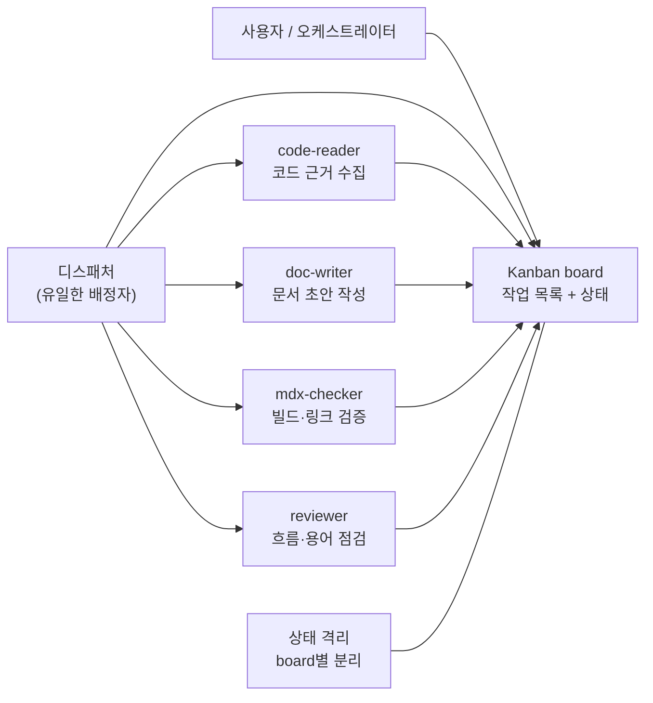
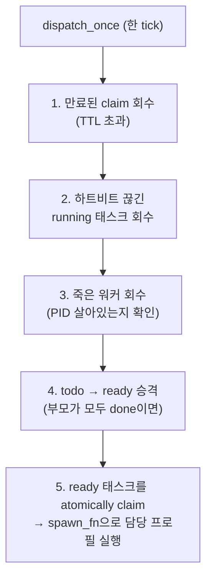
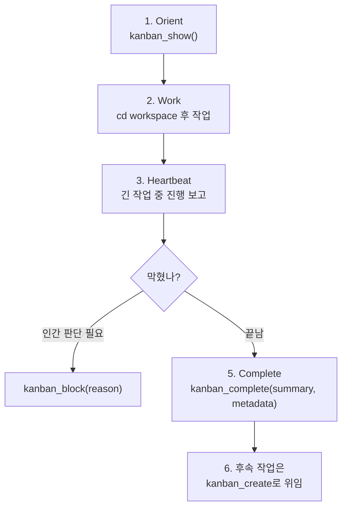
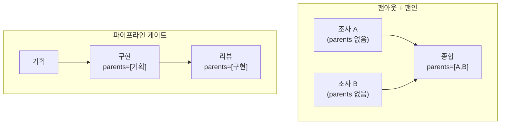
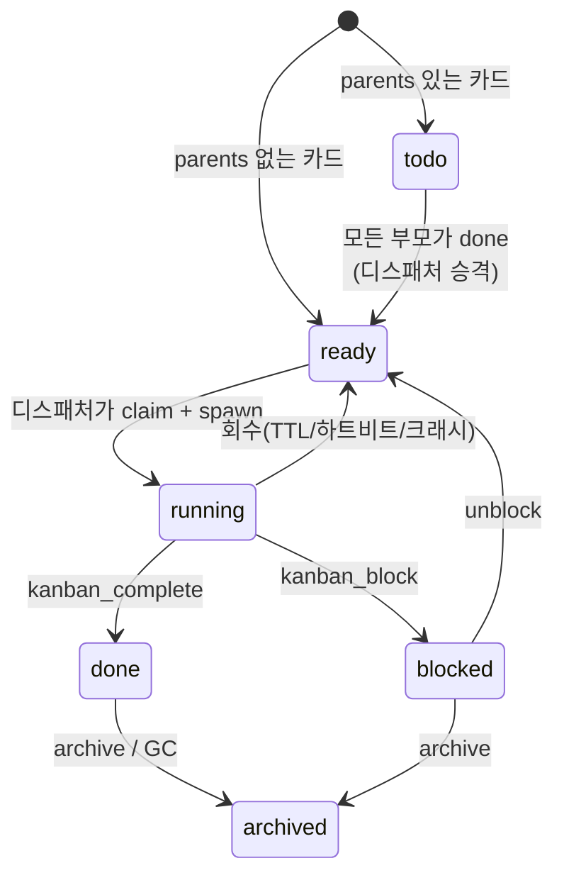
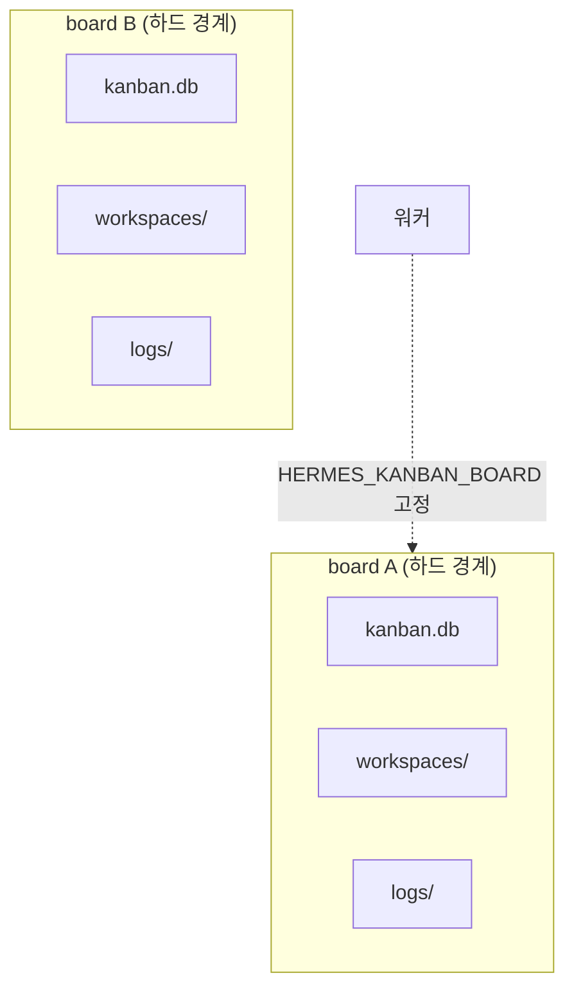
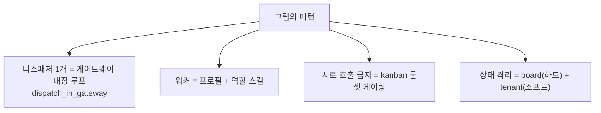

이번 편은 [#7 위임 & 멀티에이전트](./07-delegation-and-multiagent)에서 미뤄둔 Kanban 심화다. 단일 디스패처가 여러 독립 워커를 어떻게 굴리는지, 워커끼리 서로 호출하지 못하게 만드는 격리가 코드 어디에서 강제되는지 본다.

[#7](./07-delegation-and-multiagent)은 `delegate_task` 기반의 단기 위임을 다뤘다. 그 편 마지막에서 "여러 세션·프로필을 넘나드는 지속적 협업은 Kanban"이라고만 했고 구체적인 구성은 미뤘다. 이번 편이 그 빈자리를 채운다.

---

## 그리려는 구조

예를 들어 Hermes 문서 시리즈를 여러 에이전트가 나눠서 정비한다고 해보자. 한 에이전트는 코드 근거를 찾고, 다른 에이전트는 초안을 쓰고, 또 다른 에이전트는 MDX 빌드와 링크를 검증한다. 이때 중요한 것은 워커들이 서로를 직접 부르는 게 아니라, 하나의 보드에 작업 상태를 남기고 디스패처가 다음 워커를 띄운다는 점이다.



핵심 원칙은 세 가지다.

1. 디스패처는 하나뿐이고, 일감 배정은 디스패처만 한다.
2. 워커는 서로를 직접 호출하지 않는다. 소통은 보드를 거친다.
3. 프로젝트별 상태는 보드 단위로 분리된다.

Hermes에는 이 세 원칙이 그대로 들어맞는 시스템이 있다. Kanban이다.

> 참고(inference): 위 그림의 `code-reader`, `doc-writer`, `mdx-checker`, `reviewer`는 Hermes에 기성품으로 내장된 워커 이름이 아니다. Hermes가 제공하는 것은 워커를 만들 재료(Kanban 보드 + 프로필 + 디스패처)이고, 각 워커의 역할 정의는 사용자가 직접 작성한다. 이 글은 그 재료가 코드에서 어떻게 동작하는지를 다룬다.

---

## delegate_task와 Kanban의 경계

먼저 [#7](./07-delegation-and-multiagent)에서 다룬 `delegate_task`와의 차이를 명확히 한다. `AGENTS.md`는 Kanban을 "장기·durable 멀티에이전트 협업"으로 분류한다.

| | `delegate_task` | Kanban |
| --- | --- | --- |
| 수명 | 부모 턴 안에서 끝남 (단기) | 보드에 영구 저장 (장기) |
| 부모 중단 시 | 자식도 취소됨 | 보드에 남아 다음 tick에 재개 |
| 협업 단위 | 부모-자식 한 세션 | 여러 프로필·세션이 공유 보드에서 |
| 상태 저장소 | 메모리 (휘발) | SQLite 보드 (`kanban.db`) |

그림의 패턴은 cron으로 계속 도는 상주 디스패처가 전제다. 따라서 휘발성인 `delegate_task`가 아니라 durable한 Kanban이 맞는 도구다.

---

## 디스패처: "한 tick = 한 결정"

그림에서 "유일한 디스패처, 한 tick = 한 결정"으로 표현되는 부분은 Kanban 디스패처 루프다. 기본값으로 게이트웨이 안에서 돈다.

`gateway/kanban_watchers.py`의 `_kanban_dispatcher_watcher`가 그 루프다. 주석은 이렇게 설명한다.

> Embedded kanban dispatcher, one tick every `dispatch_interval_seconds`. Gated by `kanban.dispatch_in_gateway` in config.yaml (default True). When true, the gateway hosts the single dispatcher for this profile.

즉 별도 프로세스 없이 게이트웨이가 디스패처를 품는다. 끄려면 설정을 바꾼다.

```bash
hermes config set kanban.dispatch_in_gateway false
```

이 값이 `false`면 루프는 즉시 종료되고, 외부 데몬(`hermes kanban daemon`)이 디스패처를 맡는 것으로 간주된다. tick 간격의 기본값은 60초다(`dispatch_interval_seconds`).

### tick 한 번에 일어나는 일

"한 tick = 한 결정"이 실제로 무엇을 하는지는 `hermes_cli/kanban_db.py`의 `dispatch_once`에 적혀 있다. docstring이 단계를 직접 나열한다.



코드의 단계 설명을 그대로 옮기면 다음과 같다.

> 1. Reclaim stale running tasks (TTL expired). 2. Reclaim stale running tasks (no recent heartbeat). 3. Reclaim crashed running tasks (host-local PID no longer alive). 4. Promote todo -> ready where all parents are done. 5. For each ready task with an assignee, atomically claim and call `spawn_fn(task, workspace_path, board)`.

여기서 5번이 그림의 "디스패처가 워커를 선택한다"에 해당한다. ready 상태이고 담당자(assignee)가 지정된 태스크를 우선순위 순으로 골라(`ORDER BY priority DESC, created_at ASC`), 원자적으로 claim한 뒤 그 담당 프로필을 워커로 띄운다.

### 폭주 방지 장치

디스패처는 무한정 워커를 띄우지 않는다. `dispatch_once`와 watcher가 읽는 설정값으로 동시 실행을 제어한다.

| 설정 키 | 역할 |
| --- | --- |
| `max_in_progress` | 보드 전체에서 동시에 running인 태스크 수 상한 |
| `max_in_progress_per_profile` | 프로필 하나가 동시에 가질 수 있는 워커 수 상한 |
| `max_spawn` | 동시 실행 워커의 라이브 상한(per-tick 예산이 아니라 동시성 한도) |
| `failure_limit` | 같은 태스크가 연속 실패하면 자동 block (기본 2) |

`failure_limit`은 그림에 없지만 중요한 안전장치다. `AGENTS.md`는 "같은 태스크에 연속 N회(기본 2) 비성공 시 디스패처가 자동으로 block 처리해 스핀 루프를 막는다"고 적는다. 존재하지 않는 프로필에 태스크를 배정하면 spawn이 조용히 실패하므로, 이 장치가 없으면 디스패처가 매 tick마다 헛돈다.

---

## 워커는 왜 서로를 호출하지 못하는가

그림의 "워커는 서로를 호출하지 않는다. 디스패처만 선택한다"는 규칙은 사용자가 지켜야 하는 약속이 아니다. Hermes가 도구 수준에서 구조적으로 강제한다.

근거는 두 곳이다.

첫째, 디스패처가 워커를 띄울 때 `HERMES_KANBAN_TASK` 환경변수를 설정한다. `toolsets.py`의 `kanban` 툴셋 설명은 이 툴셋이 "오직 에이전트가 kanban 디스패처에 의해 스폰되었을 때(HERMES_KANBAN_TASK env set)만 활성화된다"고 적는다.

둘째, 이 환경변수가 있으면 워커가 받는 도구가 `kanban` 툴셋으로 제한된다. `model_tools.py`를 보면 다음과 같다.

> Dispatcher-spawned workers are scoped by `HERMES_KANBAN_TASK` ... (`kanban` 툴셋으로 좁혀짐)

`kanban` 툴셋이 워커에게 주는 도구는 다음이 전부다(`toolsets.py`).

```text
kanban_show, kanban_complete, kanban_block,
kanban_heartbeat, kanban_comment,
kanban_create, kanban_link, kanban_unblock
```

이 목록 어디에도 "다른 워커를 호출하는 도구"는 없다. 워커가 할 수 있는 일은 자기 태스크를 보고(show), 완료(complete), 막힘 신고(block), 하트비트, 코멘트, 새 태스크 생성(create), 의존성 연결(link)뿐이다. 다른 워커에게 말을 걸 수단 자체가 없으므로, 모든 협업은 보드(태스크와 코멘트)를 거치게 된다. 그림의 "서로 호출하지 않는다"는 이렇게 코드로 보장된다.

> 참고: 디스패처가 직접 스폰하지 않고 사용자가 `kanban` 툴셋을 명시적으로 켠 오케스트레이터 프로필은 추가로 `kanban_list`와 `kanban_unblock`을 받는다(보드 라우팅용). 일반 워커와 오케스트레이터의 권한이 다르다.

---

## "각 역할 = 하나의 스킬": 프로필로 워커 만들기

그림의 "각 역할 = 하나의 책임 = 하나의 스킬(계약)"은 Hermes의 프로필(profile) 개념과 맞물린다. [#1 개요](./01-hermes-overview)에서 봤듯 프로필은 config·skills·memory가 격리된 독립 인스턴스다.

### 프로필이 디스크에 사는 방식

`hermes_cli/profiles.py`의 모듈 주석은 프로필 위치를 이렇게 적는다.

> Profiles live under `~/.hermes/profiles/<name>/` by default.

프로필 이름에는 규칙이 있다. 코드의 정규식은 `^[a-z0-9][a-z0-9_-]{0,63}$`다. 즉 소문자·숫자로 시작하고, 소문자·숫자·하이픈·언더스코어만, 최대 64자다. 대문자가 섞인 이름은 `normalize_profile_name`이 소문자로 변환한다(`issue-Finder` → `issue-finder`). 또 `hermes`, `test`, `tmp`, `root`, `sudo`는 예약어라 프로필 이름으로 쓸 수 없다(`_RESERVED_NAMES`). 시스템 바이너리나 Hermes 설치 자체와 충돌하기 때문이다.

`default`는 특별한 별칭으로, `~/.hermes` 루트 프로필 자체를 가리킨다.

### 워커 = 프로필 + 역할 스킬

워커 하나를 프로필 하나로 만들고, 그 프로필에 역할을 정의한 스킬을 둔다. 디스패처는 태스크의 assignee에 적힌 프로필 이름을 보고 그 프로필을 워커로 띄운다.

```bash
# 보드 초기화
hermes kanban init

# 워커 = 프로필. 역할마다 하나씩
hermes profile create issue-finder
hermes profile create issue-to-pr
hermes profile create code-reviewer
# ... 필요한 역할만큼

# 일감을 보드에 올리며 담당 프로필 지정
hermes kanban create "이슈 #42를 PR로 구현" --assign issue-to-pr
```

각 프로필 안에 그 역할의 책임만 적은 스킬을 두면, 그것이 그림에서 말하는 "계약"이 된다. 디스패처가 `issue-to-pr` 프로필을 띄우면, 그 워커는 자기 프로필의 스킬·메모리만 들고 일한다. `code-reviewer`의 메모리가 `issue-finder`로 새지 않는다. 프로필 디렉터리가 분리되어 있기 때문이다.

> 함정(`skills/devops/kanban-orchestrator/SKILL.md` 근거): 존재하지 않는 프로필 이름을 assignee로 주면 "디스패처가 조용히 spawn에 실패하고 카드는 영원히 ready에 머문다." 반드시 실제로 존재하는 프로필에 배정해야 한다. tick마다 `profile_exists`로 검증되며, 없는 프로필이면 spawn이 안 되고 카드만 쌓인다.

---

## 워커는 보드 안에서 무엇을, 어떻게 하는가

디스패처가 워커를 띄우면, 그 워커는 빈 채로 시작하지 않는다. `agent/prompt_builder.py`의 `KANBAN_GUIDANCE` 블록이 시스템 프롬프트에 자동으로 주입된다. 이것이 워커가 받는 "작업 규약"이고, 보드를 어떻게 쓰는지의 정본이다.

규약의 첫 문장은 이렇다.

> You have been assigned ONE task from the shared board at `~/.hermes/kanban.db`. Your task id is in `$HERMES_KANBAN_TASK`; your workspace is `$HERMES_KANBAN_WORKSPACE`. The `kanban_*` tools in your schema are your primary coordination surface.

즉 워커는 자기 task id, 자기 작업공간, 그리고 `kanban_*` 도구만 들고 시작한다. 이 세 가지가 워커가 세상과 소통하는 전부다.

### 6단계 라이프사이클

`KANBAN_GUIDANCE`가 정의하는 워커의 생애주기는 다음과 같다.



1. **Orient, `kanban_show()`로 시작.** 인자 없이 부르면 자기 태스크가 기본값이다. 응답에는 제목, 본문, 부모 태스크의 핸드오프(summary + metadata), 재시도라면 이전 시도 기록, 전체 코멘트 스레드, 그리고 "ground truth로 취급해도 되는" `worker_context`가 들어 있다.

2. **Work, 작업공간 안에서.** 파일 작업 전에 `cd $HERMES_KANBAN_WORKSPACE`를 한다. 작업공간 밖의 파일은 태스크가 명시적으로 요구하지 않는 한 건드리지 않는다.

3. **Heartbeat, 긴 작업이면 살아있음을 알린다.** `kanban_heartbeat(note=...)`를 몇 분마다 부른다. 규약은 강한 조건을 단다. 1시간 넘게 돌 수 있는 작업이면 최소 한 시간에 한 번은 하트비트를 보내야 한다. 이유가 코드에 적혀 있다. 디스패처는 하트비트가 한 시간 동안 없으면 `dispatch_stale_timeout_seconds`(기본 4시간)를 넘긴 태스크를 회수한다. 회수는 실패 카운터를 올리지 않고 태스크를 다시 ready로 돌리지만, 현재 run의 진행 상황은 잃는다.

4. **Block, 진짜 애매할 때만 멈춘다.** 인간의 판단이 필요한데 추론으로 메울 수 없으면(자격증명 누락, UX 선택, 유료 소스, 먼저 필요한 다른 워커의 산출물) `kanban_block(reason="...")`을 부르고 멈춘다. 추측하지 않는다. 사용자가 맥락과 함께 unblock하면 디스패처가 다시 띄운다.

5. **Complete, 구조화된 핸드오프로 끝낸다.** `kanban_complete(summary=..., metadata=...)`를 부른다. `summary`는 구체적 산출물을 짚는 1~3문장이고, `metadata`는 기계가 읽을 사실(`{changed_files: [...], tests_run: N, decisions: [...]}`)이다. 다음 워커가 자기 `kanban_show`로 둘 다 읽는다. 비밀·토큰·원본 PII는 어느 필드에도 넣지 않는다. run 기록은 영구 저장된다.

6. **후속 작업이 생기면, 직접 하지 말고 만든다.** `kanban_create(title=..., assignee=<적절한-프로필>, parents=[자기-task-id])`로 적절한 전문가 프로필에게 자식 태스크를 만들어 넘긴다. 스코프를 넘어 다음 일까지 직접 하지 않는다.

### 코드 변경에는 complete 대신 block

규약에는 직관과 어긋나는 규칙이 하나 있다. 코드를 바꾸는 작업은 대부분 `kanban_complete`가 아니라 `kanban_block`으로 끝내는 게 더 정직하다는 것이다.

`kanban-worker` 스킬은 이렇게 적는다. 코드 변경 태스크는 인간 리뷰어가 보기 전까지는 진짜로 done이 아니다. 그래서 변경 파일·테스트 수·diff 경로 같은 구조화된 정보를 먼저 `kanban_comment`로 남기고(블록 사유는 사람이 읽을 한 줄만 담기 때문), `kanban_block(reason="review-required: ...")`으로 끝낸다. 리뷰어가 승인하고 `hermes kanban unblock <id>`를 하면 워커가 코멘트 스레드와 함께 다시 띄워진다.

```python
kanban_comment(
    body="review-required handoff:\n" + json.dumps({
        "changed_files": ["rate_limiter.py", "tests/test_rate_limiter.py"],
        "tests_run": 14,
        "tests_passed": 14,
        "diff_path": "/path/to/worktree",
    }, indent=2),
)
kanban_block(
    reason="review-required: rate limiter 적용, 14/14 테스트 통과 — 머지 전 검토 필요",
)
```

### 워커가 해서는 안 되는 것

`KANBAN_GUIDANCE`의 "Do NOT" 절은 워커 격리를 다시 한번 못 박는다.

- **`hermes kanban <verb>` CLI를 쓰지 않는다.** `kanban_*` 도구를 쓴다. 도구는 모든 터미널 백엔드(local/docker/modal/ssh)에서 작동하지만, CLI는 컨테이너 백엔드에 설치돼 있지 않아 실패한다.
- **안 끝낸 태스크를 complete하지 않는다.** block한다.
- **`clarify`로 질문하지 않는다.** 워커는 헤드리스로 돈다. 답할 사용자가 실시간으로 없다. `clarify`는 타임아웃되고 태스크는 신호 없이 running에 묶인다. 대신 `kanban_comment`(맥락) + `kanban_block`(결정 필요)을 쓴다.
- **후속 작업을 자기 자신에게 배정하지 않는다.** 맞는 전문가 프로필에게 넘긴다.
- **`delegate_task`를 보드 대용으로 쓰지 않는다.** `delegate_task`는 자기 run 안의 짧은 추론 하위작업용이고, 보드 태스크는 한 API 루프를 넘어 사는 크로스 에이전트 핸드오프용이다.

이 규칙들이 그림의 "워커는 서로 호출하지 않고 보드만 거친다"를 행동 수준에서 구현한다. 워커는 다른 워커를 부를 도구도 없고(앞 절의 툴셋 게이팅), 부르려 시도하지도 않도록(규약의 Do NOT) 이중으로 묶여 있다.

### 작업공간의 세 종류

워커가 일하는 `$HERMES_KANBAN_WORKSPACE`는 한 종류가 아니다. `kanban-worker` 스킬이 정리한 세 가지다.

| 종류 | 무엇인가 | 어떻게 일하나 |
| --- | --- | --- |
| `scratch` | 워커 전용 임시 디렉터리 | 자유롭게 읽고 쓴다. 태스크가 archive되면 GC된다. |
| `dir:<path>` | 공유 영속 디렉터리 | 다른 run이 읽는다. 장기 상태처럼 다룬다. |
| `worktree` | git worktree | 여기서 커밋한다. `.git`이 없으면 `git worktree add`를 먼저 한다. |

`scratch`는 일회성, `dir:`과 `worktree`는 다음 run에 흔적이 남는다. 그래서 스킬은 "특히 `dir:`·`worktree`는 이전 run의 파일이 남아 있을 수 있으니, 코멘트 스레드를 읽어 왜 다시 도는지 파악하라"고 경고한다.

---

## 핵심 질문: 서로 호출 못 하면 어떻게 협업하나

여기까지 보면 모순처럼 들린다. 워커가 다른 워커를 부를 수 없다면, "조사 → 종합 → 작성" 같은 순차 파이프라인은 어떻게 성립할까. 답은 호출이 아니라 의존성 그래프다.

`kanban_create`는 `parents=[...]` 인자를 받는다. 부모 태스크를 지정하면 그 자식은 `ready`가 아니라 `todo` 상태로 생성된다. 그리고 [디스패처 tick](#디스패처-한-tick--한-결정)의 4단계를 다시 보자.

> Promote todo -> ready where all parents are done.

즉 자식은 부모가 전부 `done`이 될 때까지 `todo`에 머물고, 부모가 다 끝나면 디스패처가 자동으로 `ready`로 승격시킨다. 워커끼리 신호를 주고받는 게 아니라, 디스패처가 의존성을 보고 순서를 강제하는 것이다. 협업의 단위는 "호출"이 아니라 "의존성 + 핸드오프"다. 앞 워커가 `kanban_complete`에 남긴 summary와 metadata를, 뒤 워커가 자기 `kanban_show`로 읽는다.

`kanban-orchestrator` 스킬은 이걸 몇 가지 정형 패턴으로 정리해 둔다.



- **팬아웃 + 팬인:** 부모 없는 조사 카드 N개 + 그것들을 모두 부모로 갖는 종합 카드 1개. 조사들은 디스패처가 병렬로 띄우고, 종합은 전부 끝난 뒤 자동 승격된다.
- **파이프라인 게이트:** `기획 → 구현 → 리뷰`. 각 단계가 앞 단계를 `parents`로 가리킨다.
- **같은 프로필 큐:** 의존성 없이 같은 프로필에 N개 배정. 디스패처가 우선순위 순으로 직렬 처리하고, 그 프로필 메모리에 경험이 쌓인다.

스킬이 경고하는 함정도 코드 동작과 직결된다. 의존 관계가 있는 카드를 독립 `ready` 카드로 만들어 나중에 link하면, "디스패처가 입력이 존재하기 전에 자식을 claim해버리는 창(window)"이 생긴다. 그래서 부모를 먼저 만들어 id를 받고, 자식 `kanban_create` 호출 때 그 id를 `parents`에 넘기는 순서를 지켜야 한다. 또 `kanban_link(parent_id=..., child_id=...)`는 부모가 먼저다. 순서를 바꾸면 엉뚱한 태스크가 `todo`로 강등된다.

---

## 그림의 "PM"은 사실 둘이다

이미지는 project-manager를 하나의 상자로 그렸지만, Hermes에서는 두 개의 다른 것이 합쳐진 개념이다. 이 구분을 하면 그림이 훨씬 정확해진다.

| | 시스템 디스패처 | 오케스트레이터 프로필 |
| --- | --- | --- |
| 정체 | 게이트웨이 내장 루프(`_kanban_dispatcher_watcher`) | 하나의 워커 프로필 |
| 하는 일 | claim → spawn, 회수, 승격 | 목표를 받아 태스크로 쪼개고 라우팅 |
| 판단 | 없음 (기계적) | 있음 (LLM이 분해) |
| 도구 | 코드, LLM 아님 | 보통 terminal/file/web 없음 |


`kanban-orchestrator` 스킬의 첫 규칙은 "route, don't execute"(분해하고 라우팅하되, 직접 실행하지 마라)다. 스킬은 이렇게 적는다.

> Your restricted toolset usually doesn't even include terminal/file/code/web for implementation. If you find yourself "just fixing this quickly", stop and create a task for the right specialist.

즉 오케스트레이터 프로필은 도구 수준에서 구현을 못 하도록 묶여 있다. 할 수 있는 건 분해·라우팅·요약뿐이다. 디스패처는 그 분해 결과(보드의 태스크)를 기계적으로 집어 실제 워커를 띄운다. 이미지의 PM = 오케스트레이터(판단) + 디스패처(실행)의 합성이다.

또 하나 중요한 사실: 오케스트레이터 스킬은 "Hermes에는 고정된 전문가 명단이 없다"고 못 박는다. 어떤 사용자는 프로필 하나로 다 하고, 어떤 사용자는 직접 명명한 전문가 팀을 운영한다. 그래서 오케스트레이터의 첫 단계(Step 0)는 "분해 전에 `hermes profile list`로 실제 존재하는 프로필을 확인하라"다. 이것이 [앞서 본](#각-역할--하나의-스킬-프로필로-워커-만들기) "존재하지 않는 프로필에 배정하면 카드가 영원히 ready에 묶인다"는 함정과 짝을 이룬다.

---

## 태스크 상태 머신

지금까지 `todo`, `ready`, `running`, `done`, `blocked`, `archived` 같은 상태가 흩어져 나왔다. 전체 전이를 한 장으로 모으면 다음과 같다.



- `todo` → `ready`: 부모 의존성이 모두 풀렸을 때 디스패처가 승격.
- `ready` → `running`: 디스패처가 원자적으로 claim하고 워커를 spawn.
- `running` → `done`/`blocked`: 워커가 `kanban_complete`/`kanban_block` 호출.
- `running` → `ready`: 하트비트가 끊기거나(stale), 워커 프로세스가 죽거나(crashed), claim TTL이 만료되면 디스패처가 회수해 다시 큐에 넣음. 회수는 실패 카운터를 올리지 않는다.
- `blocked` → `ready`: 사람이 `hermes kanban unblock`으로 풀면 코멘트 스레드와 함께 재스폰.

연속 실패가 `failure_limit`(기본 2)에 도달하면 디스패처가 태스크를 자동 `blocked`로 보내 스핀 루프를 끊는다. 즉 `blocked`는 사람이 막은 것일 수도, 디스패처가 회로차단기로 막은 것일 수도 있다.

---

## goal_mode: 1회성 워커 vs 지속 워커

기본 워커는 한 번 돌고 끝난다. `kanban_complete`나 `kanban_block`을 부르고 프로세스가 종료된다. 그런데 "문서 사이트 전체를 번역하라" 같은 한 턴에 끝나지 않는 카드는 어떻게 할까. `kanban_create(goal_mode=True)`가 답이다.

`kanban-orchestrator` 스킬에 따르면 goal_mode는 워커를 Ralph 스타일 목표 루프로 감싼다. `/goal` 슬래시 명령과 같은 엔진이다.

```python
kanban_create(
    title="문서 사이트 전체를 프랑스어로 번역",
    body="합격 기준: 모든 페이지 번역 완료, 영어 잔존 없음, 링크 정상.",
    assignee="<translator-profile>",
    goal_mode=True,        # 매 턴 후 판정자가 카드를 재확인
    goal_max_turns=15,     # 선택 예산 (기본 20)
)["task_id"]
```

동작은 이렇다.

- 매 워커 턴 후, 보조 판정자(judge)가 워커의 응답을 카드의 제목 + 본문(합격 기준으로 취급)과 대조한다.
- 미완 + 예산 남음 → 워커가 같은 세션에서 계속한다(새 스폰이 아니라 전체 컨텍스트 유지).
- 워커가 스스로 `kanban_complete`/`kanban_block` 호출 → 루프 종료, 정상 라이프사이클.
- 예산 소진했는데 미완 → 카드를 사람 검토용으로 block(조용한 종료가 아니라 sticky block).

스킬은 "본문을 명시적 합격 기준으로 쓰라"고 강조한다. 판정자는 목표 텍스트만큼만 똑똑하기 때문이다. "README 번역"보다 "README의 모든 섹션을 프랑스어로 번역하고 영어 문장이 하나도 남지 않게"가 낫다. 반대로 한 줄 수정 같은 값싼 1회성 카드에는 판정자 오버헤드가 아까우니 쓰지 않는다.

---

## 멀티 게이트웨이에서 "유일한 디스패처" 지키기

이미지의 "유일한 디스패처"는 단일 프로필에서는 자명하다. 그런데 프로필마다 게이트웨이를 따로 띄우면(default, writer, admin, coder...) 디스패처가 여럿이 될 위험이 있다. `docs/kanban/multi-gateway.md`는 이를 명시적으로 막는다.

> Only one gateway owns the kanban dispatcher. The owning gateway keeps `kanban.dispatch_in_gateway: true` (the default); every other gateway sets it to `false`.

이유는 SQLite 동시성이다. `dispatch_in_gateway: true`인 게이트웨이는 디스패처와 notifier 양쪽에서 보드마다 SQLite 연결을 연다. 여러 게이트웨이가 동시에 이러면 각 `kanban.db`의 열린 파일 디스크립터가 배수로 늘고 WAL `-shm` 리더 경합이 커진다. 그래서 두 경로를 같은 플래그로 게이팅해, 정확히 한 프로세스만 보드 DB를 만지게 한다.

| 게이트웨이 역할 | dispatch_in_gateway | 보드 DB 여나 | 디스패처+notifier 도나 |
| --- | --- | --- | --- |
| default (디스패처 소유) | true (기본) | 예 | 예 |
| writer, admin, coder 등 | false | 아니오 | 아니오 |

디스패처를 소유하지 않는 게이트웨이도 자기 플랫폼 어댑터(Telegram, Discord 등)로 메시지는 전달한다. 단지 보드를 폴링하지 않을 뿐이다.

---

## 멈춘 워커 복구하기

워커 프로필이 계속 크래시하거나 환각하거나 자기 실수로 막히면(보통 잘못된 모델, 누락된 스킬, 깨진 자격증명), 대시보드가 태스크에 ⚠ 배지를 띄우고 복구(Recovery) 영역을 연다. `kanban-orchestrator` 스킬의 세 가지 주요 조치다.

1. **Reclaim** (`hermes kanban reclaim <task_id>`), 돌고 있는 워커를 즉시 중단하고 태스크를 `ready`로 리셋. claim TTL이 약 15분이라, 이게 빠른 탈출구다.
2. **Reassign** (`hermes kanban reassign <task_id> <new-profile> --reclaim`), 태스크를 다른(존재하는) 프로필로 바꾸고 디스패처가 새 워커로 집게 한다.
3. **모델 변경**, 프로필 config는 디스크에 있으므로 `hermes -p <profile> model`로 모델을 바꾼 뒤 Reclaim으로 재시도.

환각 방지 장치도 코드에 박혀 있다. 워커가 `kanban_complete(created_cards=[...])`에 존재하지 않거나 자기 프로필이 만들지 않은 카드 id를 주장하면, 커널의 게이트가 그 completion을 거부한다. 자유서술 summary에 해소되지 않는 `t_<hex>` id가 있으면 비차단 경고(advisory)로 표시된다. 둘 다 복구 조치 후에도 남는 감사(audit) 이벤트를 만든다. 디버깅을 위해 흔적이 보존된다.

---

## 상태 격리: board가 하드 경계

그림 오른쪽의 "상태 격리: 프로젝트별 상태는 레포가 아니라 분리된 경로 아래에"는 Kanban의 격리 모델과 대응한다. `AGENTS.md`는 격리를 두 층위로 정의한다.



- **Board는 하드 경계다.** 워커는 `HERMES_KANBAN_BOARD` 환경변수가 고정된 채로 스폰되어 다른 보드를 볼 수 없다(`AGENTS.md`: "workers are spawned with `HERMES_KANBAN_BOARD` pinned in their env so they can't see other boards").
- **Tenant는 보드 안의 소프트 네임스페이스다.** 하나의 전문가 워커 묶음이 여러 사업을 담당할 때, workspace 경로와 memory 키를 분리한다.

`kanban_db.py` 모듈 주석은 보드마다 자체 `kanban.db`, `workspaces/`, `logs/`를 가진다고 적는다. 디스패처는 워커를 띄울 때 `HERMES_KANBAN_DB`, `HERMES_KANBAN_WORKSPACES_ROOT`, `HERMES_KANBAN_BOARD`를 주입한다. 그래서 워커는 자기 보드의 DB와 작업공간만 만지고, 다른 프로젝트의 상태와 섞이지 않는다. 그림의 "프로젝트별 상태 분리"가 이 board 단위 격리에 해당한다.

> 개념 차이(inference): 그림은 격리를 한 박스로 그렸지만, Hermes에서는 두 축으로 나뉜다. 워커별 격리는 프로필 경로(`~/.hermes/profiles/<name>/`)가, 프로젝트별 격리는 board가 담당한다. 그림의 한 상자를 Hermes에서는 프로필 축과 board 축으로 분해해서 봐야 한다.

---

## 정리



- 디스패처는 게이트웨이 안의 `_kanban_dispatcher_watcher` 루프이고, 한 tick에서 회수 → 승격 → claim → spawn을 수행한다(`dispatch_once`).
- 워커끼리 직접 호출이 불가능한 이유는 규율이 아니라, 디스패처가 스폰한 워커가 `HERMES_KANBAN_TASK`로 `kanban` 툴셋만 받기 때문이다. 그 툴셋에는 다른 워커를 부르는 도구가 없다.
- 그래서 협업은 호출이 아니라 의존성 그래프로 한다. `kanban_create(parents=[...])`로 자식을 `todo`에 두면, 부모가 모두 `done`일 때 디스패처가 `ready`로 승격한다. 팬아웃/팬인·파이프라인·같은-프로필 큐가 정형 패턴이다.
- 이미지의 "PM"은 둘의 합성이다. 판단해서 분해·라우팅하는 오케스트레이터 프로필(route, don't execute) + 기계적으로 claim·spawn하는 시스템 디스패처.
- 워커는 프로필로 만들고, 프로필 안 스킬이 그 역할의 계약이 된다. 프로필은 `~/.hermes/profiles/<name>/`에 살고 이름은 소문자·숫자·하이픈만 허용된다. 존재하지 않는 프로필에 배정하면 카드가 ready에 묶인다.
- 워커는 시스템 프롬프트에 자동 주입되는 `KANBAN_GUIDANCE` 규약을 따른다. orient(`kanban_show`) → work → heartbeat → block/complete → 후속은 `kanban_create`로 위임의 6단계다. 코드 변경은 complete 대신 review-required block으로 끝내는 게 규약상 권장된다.
- 태스크는 todo→ready→running→done/blocked의 상태 머신을 돈다. 하트비트·TTL·크래시로 회수되면 ready로 복귀하고, 연속 실패가 `failure_limit`(기본 2)에 닿으면 자동 block된다. `goal_mode=True`면 1회성 대신 판정자 루프로 "X가 참일 때까지" 돈다.
- 멀티 게이트웨이에서는 한 게이트웨이만 `dispatch_in_gateway: true`로 디스패처를 소유한다(SQLite 경합 방지). 멈춘 워커는 reclaim/reassign으로 복구하고, 환각한 `created_cards`는 커널 게이트가 거부한다.
- 상태 격리는 board(하드 경계)와 tenant(소프트 네임스페이스) 두 층으로 구현된다. 워커는 `HERMES_KANBAN_BOARD`가 고정된 채 스폰된다.
- `delegate_task`는 단기 위임, Kanban은 durable 협업이다. cron으로 계속 도는 디스패처 패턴에는 Kanban이 맞는다.
