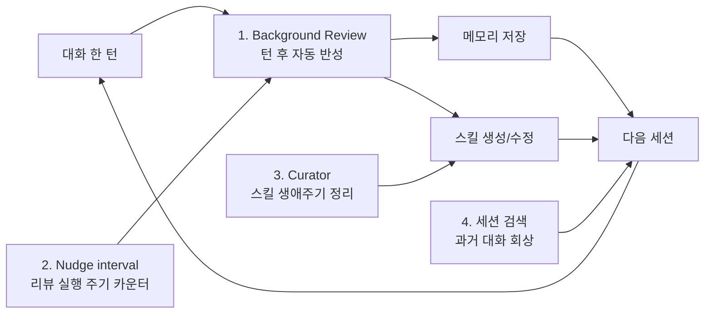
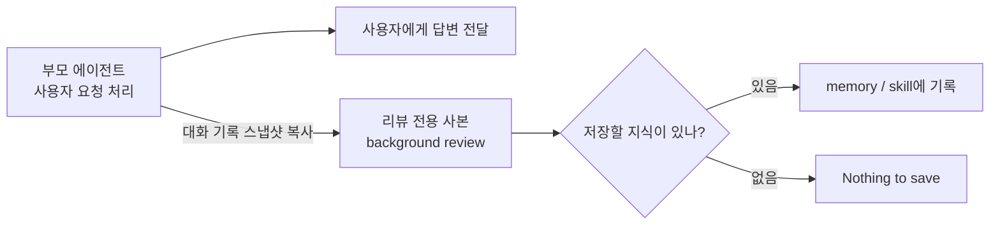
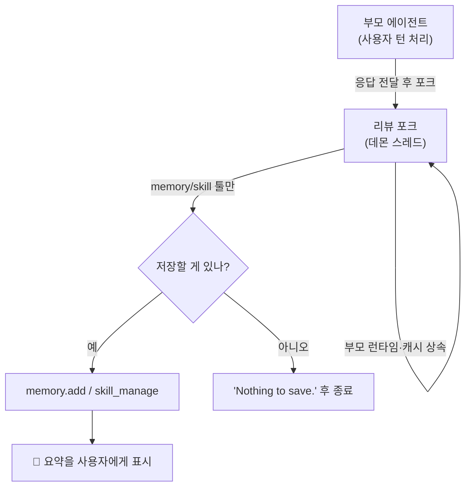
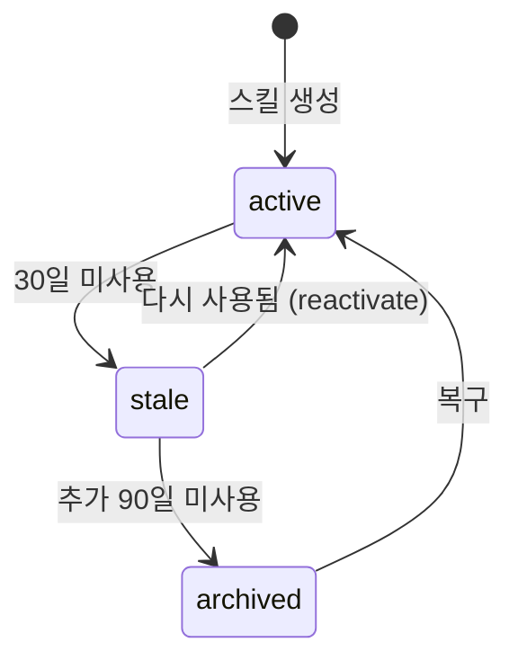
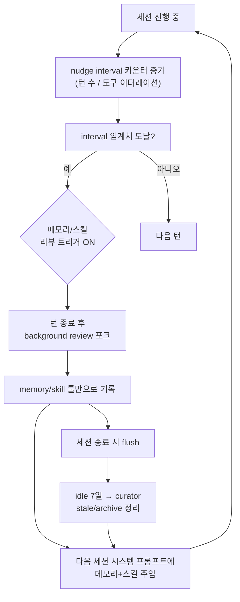

이 글에서 다루는 내용: Hermes를 "self-improving agent"라고 부르게 만드는 실제 메커니즘이다. README는 Hermes를 "내장 학습 루프를 가진 유일한 에이전트"라고 소개한다. 그 학습 루프가 코드에서 어떻게 닫히는지 — 턴이 끝날 때 무엇이 자동으로 일어나고, 그 결과가 어떻게 다음 세션으로 넘어가는지 — 를 파일과 함수 단위로 따라간다.

[#5 메모리와 세션](./05-memory-and-sessions)과 [#14 스킬 생애주기](./14-skill-lifecycle)에서 학습 루프의 조각들을 봤다. 이 편은 그 조각들이 하나의 닫힌 고리로 어떻게 맞물리는지, 그리고 아직 다루지 않은 핵심 부품인 background review를 코드로 해부한다.

---

## "학습 루프"란 무엇인가

`README.md`의 표현을 그대로 옮기면 이렇다.

> A closed learning loop. Agent-curated memory with periodic nudges. Autonomous skill creation after complex tasks. Skills self-improve during use. FTS5 session search with LLM summarization for cross-session recall.

이 한 문장에 네 개의 부품이 들어 있다.



루프가 "닫힌다"는 말의 의미는 이렇다. 이번 세션에서 일어난 일이 — 사용자의 교정, 새로 발견한 기법, 드러난 선호 — 메모리와 스킬에 적히고, 그것이 다음 세션의 시스템 프롬프트로 다시 주입된다. 사람이 "이거 기억해둬"라고 매번 시키지 않아도 에이전트가 스스로 자기 지식을 갱신한다. 네 부품을 차례로 해부한다.

---

## 1. Background Review — 턴이 끝나면 스스로 돌아본다

가장 핵심이면서 가장 덜 알려진 부품이다. 대화 한 턴이 끝나면, Hermes는 별도 스레드에서 방금 대화를 다시 읽고 "메모리에 저장할 게 있나 / 스킬을 갱신할 게 있나"를 자문한다. 구현은 `agent/background_review.py`에 있다.

### 언제 발동하는가

트리거는 두 갈래이고, 서로 다른 카운터를 쓴다. 이 구분이 중요하다.

메모리 리뷰는 사용자 턴 수로 센다. `agent/turn_context.py`를 보면 턴 시작 시 이렇게 판정한다.

```python
if (agent._memory_nudge_interval > 0
        and "memory" in agent.valid_tool_names
        and agent._memory_store):
    agent._turns_since_memory += 1
    if agent._turns_since_memory >= agent._memory_nudge_interval:
        should_review_memory = True
        agent._turns_since_memory = 0
```

즉 `nudge_interval`(기본 10) 사용자 턴마다 메모리 리뷰가 예약된다.

스킬 리뷰는 도구 사용 횟수로 센다. `agent/turn_finalizer.py`의 턴 종료 지점이다.

```python
_should_review_skills = False
if (agent._skill_nudge_interval > 0
        and agent._iters_since_skill >= agent._skill_nudge_interval
        and "skill_manage" in agent.valid_tool_names):
    _should_review_skills = True
    agent._iters_since_skill = 0
```

`_iters_since_skill`은 도구 호출 반복(iteration) 수다. 다만 두 가지를 정확히 짚어야 오해가 없다. 첫째, 이 카운터는 한 턴 안에서만 세는 게 아니라 **턴을 가로질러 누적**된다. 둘째, **skill_manage가 실제로 호출되면 0으로 리셋**된다(`agent/tool_executor.py`). 즉 카운터의 의미는 "스킬을 마지막으로 저장한 뒤(또는 세션 시작 후) 스킬 저장 없이 쌓인 도구 작업량"이다.

그래서 발동 조건을 직관적으로 풀면 이렇다 — "스킬을 한 번도 저장하지 않은 채 도구 작업이 N 이터레이션만큼 누적되면, 저장할 만한 게 있지 않은지 자문하라". "스킬을 많이 썼을 때"가 아니라 오히려 그 반대다. 스킬을 쓰면 카운터가 리셋되므로 발동이 미뤄진다. 기본 임계값은 `creation_nudge_interval`(기본 10)이다. 복잡한 작업일수록 스킬 저장 없이 도구 반복이 쌓이고, 그래서 "복잡한 작업 후 자동 스킬 생성"이라는 README의 표현이 성립한다.

두 트리거는 독립적이라 같은 턴에 동시에 켜질 수 있다(사용자 턴 10회째이면서 도구 이터레이션도 10에 도달한 경우). 이때 메모리 리뷰와 스킬 리뷰를 각각 따로 한 번씩, 총 두 번 포크하면 LLM 호출이 두 번 든다. 그래서 둘이 겹치면 메모리·스킬 지시를 하나로 합친 **결합 프롬프트(`_COMBINED_REVIEW_PROMPT`)**로 단일 리뷰만 돌린다. 어느 프롬프트가 쓰이는지는 켜진 트리거 조합으로 갈린다(`spawn_background_review_thread`).

```python
if review_memory and review_skills:
    prompt = _COMBINED_REVIEW_PROMPT   # 둘 다 켜짐 → 하나로 합쳐 1회
elif review_memory:
    prompt = _MEMORY_REVIEW_PROMPT     # 메모리만
else:
    prompt = _SKILL_REVIEW_PROMPT      # 스킬만
```

세 프롬프트의 전문과 차이는 [모든 프롬프트 (2) — Background Review](./18-2-all-prompts)에서 다룬다. 핵심만 말하면, 결합 프롬프트는 두 리뷰를 단순히 이어 붙인 게 아니라 "메모리=사용자가 누구인가 / 스킬=작업을 어떻게 하는가"라는 역할 분담을 명시해, 같은 교정이라도 올바른 저장소로 가게 라우팅한다.

### 응답이 나간 뒤에 돈다

리뷰는 사용자 응답이 전달된 다음에 실행된다. `turn_finalizer.py`의 주석이 이유를 밝힌다.

> Background memory/skill review — runs AFTER the response is delivered so it never competes with the user's task for model attention.

```python
if final_response and not interrupted and (_should_review_memory or _should_review_skills):
    try:
        agent._spawn_background_review(
            messages_snapshot=list(messages),
            review_memory=_should_review_memory,
            review_skills=_should_review_skills,
        )
    except Exception:
        pass  # Background review is best-effort
```

세 가지를 읽을 수 있다. 첫째, 응답이 실제로 나갔고(`final_response`) 중단되지 않았을 때만(`not interrupted`) 돈다. 둘째, 메시지 스냅샷을 복사해서 넘긴다 — 리뷰는 그 시점의 대화를 본다. 셋째, `except: pass`로 감싸 best-effort다. 리뷰가 실패해도 사용자 턴은 영향받지 않는다.

### 리뷰 전용 에이전트를 하나 더 만든다

background review는 사용자의 요청에 답하던 원래 에이전트가 직접 수행하지 않는다. 대신 그 원래 에이전트를 **부모 에이전트**로 보고, 부모의 대화 상태를 복사한 **리뷰 전용 에이전트 사본**을 하나 더 만든다. 코드 주석이나 개발자 문맥에서는 이런 방식을 "부모를 포크한다"고 부를 수 있지만, 여기서 중요한 뜻은 "원래 작업 흐름을 건드리지 않고, 같은 대화 기록을 읽는 별도 리뷰 담당을 만든다"는 것이다. 이 사본은 사용자에게 답을 새로 쓰는 역할이 아니다. 방금 끝난 대화를 조용히 다시 읽고 "메모리에 저장할 게 있나 / 스킬로 남길 게 있나"만 판단한다.

비유하면 이렇다.



중요한 점은 이 사본이 완전히 새로 태어나는 에이전트는 아니라는 것이다. 부모의 실행 환경을 최대한 그대로 물려받는다. 그래야 같은 모델·같은 인증·같은 시스템 프롬프트 조건에서 리뷰가 돈다. 동시에 작업용 도구는 막아 둔다. 즉 "일을 계속하는 두 번째 에이전트"가 아니라, **부모의 대화 상태를 빌려 온 기록 담당자**에 가깝다.

여기서 자연스럽게 드는 질문이 있다. "그럼 왜 부모 에이전트가 직접 판단해서 메모리나 스킬에 저장하지 않을까?" 아래는 코드가 명시한 사실이라기보다, 위 구조를 보고 정리한 내 해석이다.

내 의견으로는, 이 설계의 핵심은 **사용자 작업 경로와 자기개선 경로를 분리하는 것**이다. 부모 에이전트가 사용자 요청을 처리하는 같은 흐름 안에서 메모리·스킬 저장까지 판단하면, 사용자 응답이 늦어지고 본 작업과 자기반성이 섞인다. 반면 리뷰 전용 사본을 뒤에서 돌리면, 사용자는 먼저 답을 받고, 자기개선은 별도 스레드에서 조용히 처리된다.

또 하나의 장점은 권한을 줄일 수 있다는 점이다. 부모 에이전트는 터미널, 파일, 웹 같은 작업 도구를 가질 수 있지만, 리뷰 사본은 memory/skill 도구만 보게 제한된다. 그래서 리뷰가 "작업을 더 하는" 방향으로 새지 않고, 지식을 기록하는 역할에만 머문다. 리뷰가 실패해도 본 작업은 이미 사용자에게 전달됐으므로 영향이 작다. 반대로 단점도 있다. LLM 호출이 하나 더 들고, 부모/사본/스레드/도구 제한/캐시 상속 같은 구조가 복잡해진다.

즉 내 해석은 이렇다. 부모가 직접 저장 판단을 할 수도 있지만, Hermes는 응답 지연·권한 과다·실패 전파를 줄이기 위해 부모의 대화 상태를 복사한 리뷰 전용 사본을 뒤에서 돌리는 쪽을 택한 것으로 보인다. 단, 이것은 코드 구조를 바탕으로 한 해석이고, 코드가 명시적으로 "이 설계 의도는 이것이다"라고 선언한 것은 아니다.

`_run_review_in_thread`(같은 파일)가 데몬 스레드에서 도는 실제 워커다. 코드에서 직접 확인되는 설계 결정들을 짚으면 이 구조가 더 분명해진다.

첫째, 부모의 런타임을 그대로 물려받는다. provider, model, base_url, api_key, api_mode를 부모에서 가져온다. 주석은 이유를 명시한다 — 그렇게 안 하면 `AIAgent.__init__`이 환경변수에서 인증을 재해석하는데, OAuth 전용 provider나 크레덴셜 풀에서는 재구성이 실패해 "No LLM provider configured" 경고가 뜬다.

둘째, 부모의 시스템 프롬프트를 그대로 재사용한다. 이게 비용 측면에서 결정적이다.

```python
review_agent._cached_system_prompt = agent._cached_system_prompt
```

주석에 측정치까지 적혀 있다.

> Inherit the parent's cached system prompt verbatim so the review fork's outbound HTTP request hits the same Anthropic/OpenRouter prefix cache the parent warmed. ... ~26% end-to-end cost reduction on Sonnet 4.5.

리뷰 포크가 시스템 프롬프트를 처음부터 다시 만들면(새 타임스탬프, 새 session_id, 좁아진 toolset) 프리픽스 캐시 키가 어긋나 캐시 미스가 난다. 그래서 부모가 데운 캐시를 그대로 쓴다. self-improvement가 비싸지 않게 도는 이유다.

셋째, 도구는 메모리·스킬로만 제한된다. 화이트리스트를 건다.

```python
review_whitelist = {
    t["function"]["name"]
    for t in get_tool_definitions(
        enabled_toolsets=["memory", "skills"],
        quiet_mode=True,
    )
}
set_thread_tool_whitelist(
    review_whitelist,
    deny_msg_fmt=(
        "Background review denied non-whitelisted tool: "
        "{tool_name}. Only memory/skill tools are allowed."
    ),
)
```

리뷰 에이전트는 터미널도, 파일 쓰기도, 웹도 못 만진다. 오직 `memory`와 `skill_manage`만 호출할 수 있다. 반성은 지식을 적는 행위지 작업을 하는 행위가 아니기 때문이다. 위험한 명령을 만나면 `_bg_review_auto_deny`가 자동으로 거부해서, 헤드리스 스레드가 사용자 입력을 기다리며 데드락에 빠지지 않게 한다.

넷째, 압축을 막고, 외부 메모리를 건드리지 않는다. `compression_enabled = False`로 두고(부모와 session_id를 공유하므로 압축 경쟁이 나면 부모 세션이 깨진다), `skip_memory=True`로 외부 메모리 플러그인(Honcho, Mem0 등)을 우회한다. 단 내장 MEMORY.md/USER.md 저장은 부모에서 재바인딩해 디스크 기록은 정상 작동한다.



### 무엇을 저장하라고 지시받는가

리뷰 에이전트가 받는 프롬프트(`_SKILL_REVIEW_PROMPT`, `_MEMORY_REVIEW_PROMPT`, `_COMBINED_REVIEW_PROMPT`)는 단순한 "기억해둬"가 아니다. 정교한 판단 규칙이 박혀 있다. 스킬 리뷰 프롬프트의 핵심을 보자.

기본 태도는 ACTIVE다.

> Be ACTIVE — most sessions produce at least one skill update, even if small. A pass that does nothing is a missed learning opportunity, not a neutral outcome.

아무것도 안 하는 패스를 "중립"이 아니라 "놓친 기회"로 규정한다. 다만 'Nothing to save.'도 진짜 선택지로 남겨, 매끄럽게 흐른 세션은 그냥 넘어가게 한다.

사용자의 불만을 일급 신호로 취급한다.

> Frustration signals like 'stop doing X', 'this is too verbose', 'don't format like this', 'just give me the answer', 'you always do Y and I hate it' ... are FIRST-CLASS skill signals, not just memory signals.

사용자가 짜증을 내면, 그 교정을 스킬 본문에 박아 "다음 세션이 이미 알고 시작"하게 만들라고 지시한다.

갱신 우선순위가 정해져 있다.

여기서 말하는 **우산(umbrella) 스킬**은 Hermes curator 프롬프트가 쓰는 용어다. 여러 개의 좁은 스킬을 하나의 넓은 클래스 레벨 스킬 아래로 흡수하고, 세부 사례는 하위 섹션이나 `references/`, `templates/`, `scripts/` 파일로 정리하는 형태를 뜻한다. 즉 "특정 에러 하나당 스킬 하나"가 아니라 "비슷한 문제들을 덮는 큰 스킬 하나"에 가깝다.

1. 현재 로드된 스킬을 패치 (이번 세션에서 쓰인 스킬이 맞는 위치)
2. 기존 우산(umbrella) 스킬을 패치
3. 기존 우산 아래 지원 파일 추가 (`references/`, `templates/`, `scripts/`)
4. 새 클래스 레벨 우산 스킬 생성

핵심은 "클래스 레벨" 원칙이다. 프롬프트는 PR 번호, 에러 문자열, 코드명, 라이브러리 이름만, "fix-X / debug-Y / audit-Z-today" 같은 세션 부산물을 스킬 이름으로 쓰지 말라고 못 박는다. 이름이 오늘 작업에만 들어맞으면 잘못된 것이고, 1~3번으로 후퇴해야 한다. 이게 스킬 라이브러리가 "좁은 일회성 항목의 긴 평면 목록"이 아니라 "풍부한 SKILL.md를 가진 클래스 레벨 스킬"의 형태를 유지하는 장치다.

### 무엇을 저장하지 말라고 지시받는가

저장 금지 목록이 더 흥미롭다. 이건 self-improvement가 자기 발등을 찍지 않게 하는 안전장치다.

> Do NOT capture (these become persistent self-imposed constraints that bite you later when the environment changes):
> - Environment-dependent failures: missing binaries, fresh-install errors ... The user can fix these — they are not durable rules.
> - Negative claims about tools or features ('browser tools do not work', 'X tool is broken') ... These harden into refusals the agent cites against itself for months after the actual problem was fixed.

즉 "환경 탓 실패"와 "도구가 안 된다는 부정 주장"을 스킬로 굳히지 말라는 것이다. 이유가 날카롭다. 한 번 "브라우저 도구는 작동 안 함"을 스킬에 박으면, 실제 문제가 고쳐진 뒤에도 몇 달간 에이전트가 그 문장을 근거로 자기 자신에게 거부를 인용한다. 도구가 셋업 문제로 실패했다면 "이 도구는 안 됨"이 아니라 그 고침(설치 명령, 설정 단계)을 troubleshooting 스킬에 적으라고 지시한다.

이건 [#14](./14-skill-lifecycle)에서 다룬 "스킬이 부채가 될 수 있다"는 주제와 직결된다. 학습 루프는 무엇을 배우느냐만큼 무엇을 안 배우느냐로 건강을 유지한다.

---

## 2. Nudge interval — 리뷰를 언제 돌릴지 정하는 카운터

여기서 말하는 nudge는 메인 에이전트에게 별도 메시지를 주입한다는 뜻이 아니다. 코드 기준으로는 background review를 언제 실행할지 정하는 내부 카운터/임계값에 가깝다. `agent/turn_context.py`에도 원래 사용자 메시지를 보존한다는 주석이 있고, 바로 뒤에서 카운터만 갱신한다.

```python
# Preserve the original user message (no nudge injection).
original_user_message = persist_user_message if persist_user_message is not None else user_message

# Track memory nudge trigger (turn-based, checked here).
if (agent._memory_nudge_interval > 0
        and "memory" in agent.valid_tool_names
        and agent._memory_store):
    agent._turns_since_memory += 1
    if agent._turns_since_memory >= agent._memory_nudge_interval:
        should_review_memory = True
        agent._turns_since_memory = 0
```

간격 값은 `agent/agent_init.py`에서 설정된다.

```python
agent._memory_nudge_interval = 10       # 기본값
# config의 memory.nudge_interval로 덮어씀
agent._skill_nudge_interval = 10        # 기본값
# config의 skills.creation_nudge_interval로 덮어씀
```

즉 흐름은 단순하다. 카운터가 증가하다가 interval에 도달하면 `should_review_memory` 또는 `should_review_skills`가 켜지고, 응답이 사용자에게 전달된 뒤 background review가 실행된다. memory/skill 도구를 실제로 쓰면 해당 카운터는 0으로 리셋된다. 따라서 이 절의 nudge는 "저장하라"는 메시지라기보다, "이제 한 번 리뷰를 돌릴 시점"을 나타내는 주기 신호다.

`cli-config.yaml.example`의 "remind the agent"라는 표현은 사용자에게 보이는 메시지 주입이 아니라, 이런 주기적 리뷰 트리거를 설명하는 말로 이해하는 편이 코드와 맞다.

여기에 메모리 플러시가 더해진다.

```yaml
flush_min_turns: 6   # exit/reset 시 메모리 저장을 트리거할 최소 사용자 턴 수
```

컨텍스트가 사라지기 직전(압축, `/new`, `/reset`, 종료)에도 저장 기회가 있다. 단 세션이 최소 `flush_min_turns`(기본 6) 턴은 진행됐어야 발동한다 — 짧은 세션은 저장할 게 별로 없으니 건너뛴다. 즉 학습 루프는 정기 interval과 종료 직전 flush, 두 시점에서 메모리를 붙잡는다.

---

## 3. Curator — 스킬 창고를 오래 건강하게 유지한다

Background review가 "이번 대화에서 배운 것을 스킬로 남길까?"를 판단한다면, curator는 그 다음 문제를 맡는다. 시간이 지나면 스킬은 계속 쌓이고, 일부는 더 이상 안 쓰이거나 다른 스킬과 겹친다. 그냥 두면 스킬 목록이 길고 지저분해져서, 정작 필요한 스킬을 찾기 어려워진다.

그래서 curator의 역할은 스킬을 새로 만드는 것이라기보다 **스킬 창고를 정리하는 것**에 가깝다. 새로 배운 것을 적는 담당이 background review라면, 오래된 스킬을 살펴보고 stale/archive 상태로 옮기는 담당이 curator다. [#14](./14-skill-lifecycle)에서 다룬 그 시스템을, 여기서는 self-improvement 루프의 일부로 본다.

먼저 둘의 차이를 분리하면 이해가 쉽다.

| 구분 | Background review | Curator |
|---|---|---|
| 언제 보나 | 방금 끝난 대화 | 오래 쌓인 스킬 컬렉션 전체 |
| 주 관심사 | 새로 저장할 기억/스킬이 있나 | 낡거나 안 쓰는 스킬이 있나 |
| 실행 시점 | 턴 종료 후 interval 조건 | 에이전트가 idle이고 마지막 실행 후 충분한 시간이 지났을 때 |
| 할 수 있는 일 | memory 저장, skill 생성/패치 | stale 표시, archive, reactivate, 통합 검토 |
| 안전 장치 | memory/skill 도구만 허용 | 에이전트 생성 스킬만 건드림, 삭제 대신 archive |

`agent/curator.py`의 모듈 docstring도 이 역할을 요약한다.

> The curator is an auxiliary-model task that periodically reviews agent-created skills and maintains the collection. It runs inactivity-triggered (no cron daemon): when the agent is idle and the last curator run was longer than `interval_hours` ago, `maybe_run_curator()` spawns a forked AIAgent to do the review.

여기서 중요한 말은 두 가지다. 첫째, curator는 **agent-created skills**, 즉 에이전트가 만든 스킬만 본다. 번들 스킬이나 허브에서 설치한 스킬까지 마음대로 정리하지 않는다. 둘째, cron처럼 정해진 시각에 무조건 도는 게 아니라 **비활성 상태일 때만** 돈다. 사용자가 한창 작업 중일 때 스킬 정리 작업이 끼어들지 않게 하려는 구조다.

### 비활성 트리거

발동 조건은 "시간이 지났는가"와 "지금 조용한가"를 함께 본다. 에이전트가 idle이고 마지막 실행이 `interval_hours`(기본 `DEFAULT_INTERVAL_HOURS = 24 * 7`, 즉 7일) 전이면 후보가 된다. 여기에 `min_idle_hours`(기본 2시간) 동안 활동이 없어야 한다는 조건이 붙는다. 즉 사용자가 쓰는 중간이 아니라, 충분히 조용할 때 스킬 창고를 정리한다.

### 안전 경계

curator는 스킬을 정리하지만, 마음대로 지우지는 않는다. docstring의 "Strict invariants"가 안전 경계를 정의한다.

> - Only touches agent-created skills
> - Never auto-deletes — only archives. Archive is recoverable.
> - Pinned skills bypass all auto-transitions
> - Uses the auxiliary client; never touches the main session's prompt cache

네 가지를 풀면 이렇다. 첫째, 에이전트가 만든 스킬만 건드린다 — 번들 스킬(`hermes-agent` 등)과 허브 설치 스킬은 손대지 않는다. 둘째, 절대 삭제하지 않고 archive만 한다. archive는 복구 가능하다. 셋째, pin된 스킬은 모든 자동 전이를 우회한다. 넷째, 보조 클라이언트를 써서 메인 세션의 프롬프트 캐시를 깨지 않는다 — background review와 같은 비용 의식이다.

### 생애주기 전이

curator가 가장 기본적으로 하는 일은 스킬 상태를 시간에 따라 옮기는 것이다. `curator.py`의 상태 전이 코드는 다음 두 기준일을 계산한다.

```python
stale_cutoff = now - timedelta(days=get_stale_after_days())     # 기본 30일
archive_cutoff = now - timedelta(days=get_archive_after_days()) # 기본 90일
```



코드의 분기를 그대로 읽으면.

```python
if anchor <= archive_cutoff and current != STATE_ARCHIVED:
    archive_skill(name)          # 90일 미사용 → archive
elif anchor <= stale_cutoff and current == STATE_ACTIVE:
    # 30일 미사용 → stale 표시
elif anchor > stale_cutoff and current == STATE_STALE:
    # stale였는데 다시 쓰임 → reactivate
```

여기서 `anchor`는 스킬의 마지막 활동 타임스탬프다. 사용량 추적이 이를 받친다 — `tools/skill_usage`가 `use_count`, `view_count`, `patch_count`, `last_activity_at`를 기록한다. cron 스케줄러조차 "이 스킬을 actively used로 curator가 보도록 사용량을 올린다"는 주석을 단다. 즉 스킬을 쓰면 타임스탬프가 갱신되고, 안 쓰면 stale→archive로 가라앉는다. 학습 루프가 만든 스킬이 무한정 쌓이지 않고 자연 감쇠하는 구조다.

stale로 표시된 스킬이 다시 쓰이면 reactivate된다. 학습이 일방향이 아니라는 뜻이다 — 한동안 안 쓰다가 다시 필요해진 지식은 되살아난다.

---

## 4. 메모리와 세션 검색 — 누적되는 컨텍스트

루프의 네 번째 부품은 저장된 지식이 어떻게 다음 세션으로 넘어가느냐다. [#5](./05-memory-and-sessions)에서 자세히 다뤘으므로 여기서는 self-improvement 관점의 두 사실만 짚는다.

메모리에는 용량 한도가 있다. `cli-config.yaml.example`을 보면.

```yaml
memory_char_limit: 2200   # ~800 tokens
user_char_limit: 1375     # ~500 tokens
```

한도가 있다는 건 메모리가 무한 누적이 아니라는 뜻이다. 새 사실이 들어오면 오래되고 덜 중요한 것을 밀어내야 한다. 그래서 background review 프롬프트가 "무엇을 저장하지 말라"에 그토록 까다로운 것이다 — 한정된 예산을 환경 탓 실패나 일회성 서사로 낭비하면 정작 중요한 선호가 들어갈 자리가 없다.

세션 검색은 압축을 보완한다. 메모리가 "압축된 영속 사실"이라면, FTS5 세션 검색은 "원본 대화의 회상"이다. 과거 세션 전체가 SQLite에 남아 있어, 메모리에 안 적힌 디테일도 키워드로 되찾을 수 있다. 학습 루프에서 메모리는 "always-on 요약", 세션 검색은 "on-demand 정밀 회상"으로 역할이 갈린다.

---

## 닫힌 루프, 다시 보기

네 부품이 어떻게 한 고리로 맞물리는지 시간 순으로 정리한다.



핵심을 다시 정리하면.

- **Background review**는 턴이 끝나면 부모의 대화 상태를 복사한 리뷰 전용 에이전트를 별도 스레드에서 만들고, 그 사본이 대화를 다시 읽어 memory/skill 도구만으로 지식을 기록한다. 메모리 리뷰는 사용자 턴 수로, 스킬 리뷰는 skill_manage 없이 누적된 도구 이터레이션 수로 트리거된다. 부모의 캐시된 시스템 프롬프트를 상속해 약 26% 비용을 아낀다.
- 리뷰 프롬프트는 ACTIVE를 기본 태도로 하되, 환경 탓 실패와 "도구가 안 된다"는 부정 주장은 저장 금지한다 — 자기 발등을 찍지 않기 위해서다.
- **Nudge interval**은 메인 에이전트에게 별도 메시지를 주입하는 장치가 아니라, background review를 언제 실행할지 정하는 카운터/임계값이다. flush는 컨텍스트 소실 직전에 저장 기회를 준다.
- **Curator**는 비활성 7일 트리거로 돌며, 에이전트가 만든 스킬만, 절대 삭제 없이 archive까지만 정리한다. 30일 미사용 → stale, 90일 → archive, 다시 쓰면 reactivate.
- **메모리(한도 있는 영속 요약) + 세션 검색(원본 회상)**이 기록된 지식을 다음 세션으로 운반한다.

이 네 부품이 함께 돌기 때문에, 사용자가 같은 교정을 두 번 하지 않아도 되고, 한 번 발견한 기법이 다음 세션에 이미 준비돼 있다. 그게 "self-improving agent"라는 말의 코드 수준 의미다.
