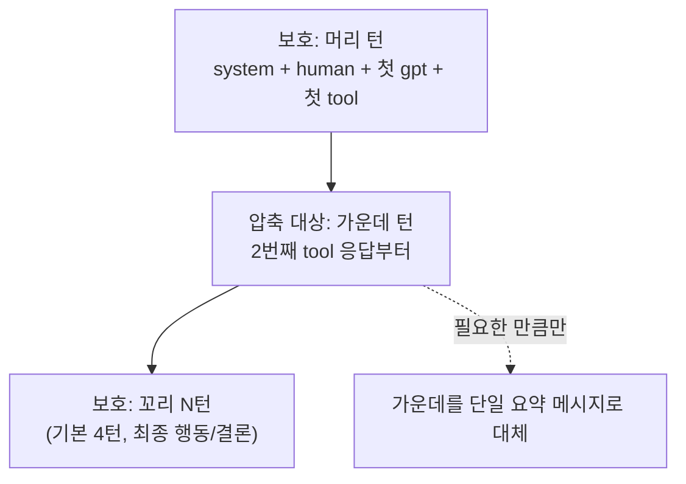
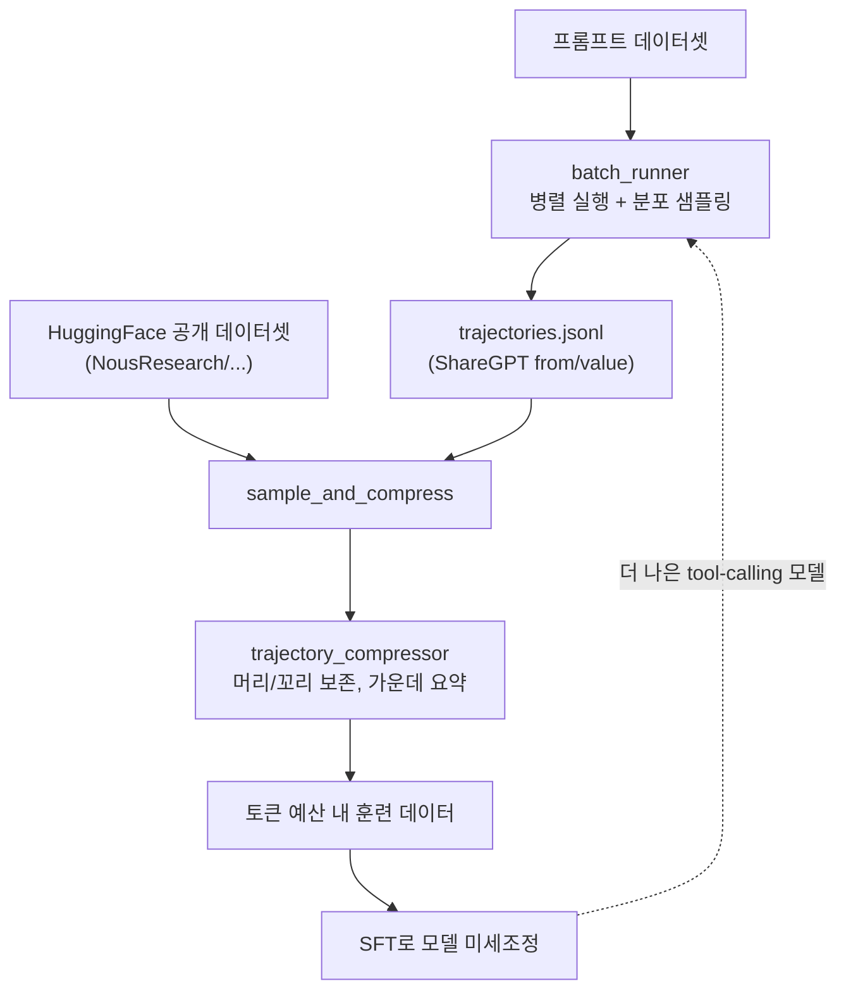

이 글에서 다루는 내용: Hermes의 가장 덜 알려진, 그러나 정체성에 가까운 기능이다. Hermes는 단지 에이전트를 "실행"하는 도구가 아니라, 자기 실행 기록을 다음 세대 tool-calling 모델을 훈련시킬 데이터로 가공하는 파이프라인을 내장하고 있다. README가 "Research-ready: 궤적 일괄 생성, 훈련용 궤적 압축"이라고 한 줄로 적은 그 기능을, 배경 개념부터 도구 내부까지 코드를 직접 보지 않아도 이해되도록 풀어 쓴다.

[#10 컨텍스트 압축](./10-context-compression)에서 "대화가 길어지면 압축한다"를 다뤘다. 이 편의 압축은 그것과 목적이 다르다. #10은 런타임에 토큰을 아끼려는 압축이고, 이 편은 훈련 데이터를 만들기 위한 압축이다. 둘을 혼동하지 않도록 차이를 분명히 한다.

---

## 배경: 왜 "궤적"이 필요한가

먼저 용어부터. 여기서 궤적(trajectory)이란 에이전트가 한 작업을 처음부터 끝까지 수행한 전체 기록이다. 사용자 요청 → 에이전트의 판단 → 도구 호출 → 도구 응답 → 다음 판단 → … → 최종 답변까지, 한 작업의 모든 단계가 시간 순으로 담긴 대화 로그다.

이게 왜 가치 있는가. tool-calling을 잘하는 LLM을 만들려면, 모델에게 "이런 상황에서 이 도구를 이렇게 부르고, 그 결과를 보고 다음에 이렇게 한다"는 예시를 대량으로 보여줘야 한다. 그런데 이런 데이터는 흔하지 않다. 일반 웹 텍스트에는 "도구를 부르고 결과를 받아 추론을 이어가는" 패턴이 거의 없다. 그래서 에이전트를 실제로 굴려서 그 기록을 모으는 것이 가장 자연스러운 데이터 출처가 된다.


Hermes는 이 흐름을 두 개의 독립 실행 도구로 구현한다. `batch_runner.py`(생성)와 `trajectory_compressor.py`(압축)다. 둘은 평소 채팅과 무관한 별도 스크립트로, 연구·데이터 생성 목적으로만 돌린다. 하나씩 본다.

---

## 1부: batch_runner — 궤적을 대량 생성한다

먼저 오해하기 쉬운 점부터 짚는다. `batch_runner.py`는 평소 Hermes 대화 중 자동으로 호출되는 내부 부품이 아니다. 연구자나 데이터 생성자가 터미널에서 직접 실행하는 오프라인 배치 스크립트다. 일반 채팅에서는 `AIAgent`가 한 세션을 처리하지만, batch_runner는 그런 agent 실행을 데이터셋의 프롬프트 수만큼 반복해서 돌린다.

`batch_runner.py`의 역할은 "프롬프트 데이터셋을 받아 에이전트를 수천 번 병렬로 돌리고, 그 궤적을 저장하는 것"이다. 모듈 docstring이 책임을 네 가지로 나열한다.

> - Dataset loading and batching
> - Parallel batch processing with multiprocessing
> - Checkpointing for fault tolerance and resumption
> - Trajectory saving in the proper format (from/value pairs)

기본 사용법은 이렇다.

```bash
python batch_runner.py --dataset_file=data.jsonl --batch_size=10 --run_name=my_run
```

`data.jsonl`은 작업 프롬프트들의 목록이고, 각 프롬프트마다 에이전트가 한 번씩 돌면서 궤적 하나를 만든다. 핵심 설계 요소를 짚는다.

### 병렬 처리와 체크포인트

수천 개 작업을 순차로 돌리면 며칠이 걸린다. 그래서 `multiprocessing.Pool`로 여러 워커 프로세스가 동시에 작업을 처리한다. `batch_size`가 한 번에 묶는 작업 수다.

대량 실행은 중간에 깨질 수 있다(네트워크, API 한도, 정전). 그래서 체크포인트가 있다. 실행 디렉터리에 `checkpoint.json`을 두고, 완료된 작업을 기록한다. 깨진 실행은 이렇게 이어서 한다.

```bash
python batch_runner.py --dataset_file=data.jsonl --batch_size=10 --run_name=my_run --resume
```

`--resume`을 붙이면 체크포인트를 읽어 이미 끝난 작업은 건너뛰고 남은 것만 처리한다. 체크포인트 저장은 원자적 쓰기(`atomic_json_write`)로 이뤄져, 저장 도중 깨져도 파일이 손상되지 않는다.

### Toolset Distribution — 다양성을 위한 도구 분포

여기가 batch_runner의 영리한 부분이다. 모든 작업에 똑같은 도구 묶음을 주면, 생성되는 궤적이 단조로워진다. 좋은 훈련 데이터는 다양해야 한다 — 어떤 작업은 웹 검색을, 어떤 작업은 이미지 생성을, 어떤 작업은 터미널을 쓰는 식으로.

이를 위해 `toolset_distributions.py`가 "분포(distribution)"를 정의한다. 분포란 각 toolset이 선택될 확률(%)의 묶음이다. 코드에 정의된 예를 그대로 보자.

```python
DISTRIBUTIONS = {
    "default": {
        "description": "All available tools, all the time",
        "toolsets": {
            "web": 100, "vision": 100, "image_gen": 100,
            "terminal": 100, "file": 100, "moa": 100, "browser": 100
        }
    },
    "image_gen": {
        "description": "Heavy focus on image generation with vision and web support",
        "toolsets": {
            "image_gen": 90,  "vision": 90, "web": 55,
            "terminal": 45,   "moa": 10
        }
    },
}
```

`default` 분포는 모든 도구를 100% 항상 준다. 반면 `image_gen` 분포는 이미지 생성 작업에 치우친 데이터를 만들고 싶을 때 쓴다 — 작업마다 90% 확률로 image_gen, 90%로 vision, 55%로 web을 준다. 실행 시 `--distribution=image_gen`으로 고른다.

```bash
python batch_runner.py --dataset_file=data.jsonl --batch_size=10 --run_name=my_run --distribution=image_gen
```

각 프롬프트를 처리할 때 `sample_toolsets_from_distribution`이 이 확률에 따라 도구 묶음을 무작위로 뽑는다. 그래서 같은 데이터셋이라도 작업마다 다른 도구 조합으로 풀려, 결과 궤적에 자연스러운 다양성이 생긴다.

### 저장 포맷: ShareGPT의 from/value

생성된 궤적은 어떤 모양으로 저장될까. docstring이 말한 "from/value pairs"는 ShareGPT 포맷이라 불리는 대화 표현 방식이다. LLM 훈련 데이터셋의 사실상 표준 중 하나다.

각 메시지는 두 필드를 가진다. `from`은 화자(누가 말했나), `value`는 내용이다. 화자는 네 종류다.

| `from` 값 | 의미 |
| --- | --- |
| `system` | 시스템 프롬프트 (에이전트의 규칙) |
| `human` | 사용자 발화 / 도구 응답 |
| `gpt` | 에이전트의 응답 (추론 + 도구 호출) |
| `tool` | 도구 실행 결과 |

한 궤적은 이 메시지들의 배열이고, JSONL 파일에 `{"conversations": [...]}` 형태로 한 줄에 하나씩 저장된다. 실행이 끝나면 모든 배치 파일(`batch_0.jsonl`, `batch_1.jsonl`, …)이 하나의 `trajectories.jsonl`로 합쳐진다.

### 부수 효과: 도구 사용 통계

batch_runner는 궤적을 저장하면서 동시에 도구 사용 통계도 집계한다. 각 도구가 몇 번 호출됐고(`count`), 몇 번 성공/실패했는지(`success`/`failure`)를 센다. 성공 판정은 도구 응답의 JSON에 `error` 필드가 비어 있는지로 한다(터미널 도구처럼 응답을 `content`로 감싸는 경우는 안쪽까지 들여다본다). 이 통계로 "이 데이터셋에서 어떤 도구가 얼마나 쓰였나, 어떤 도구가 자주 실패하나"를 한눈에 본다.

---

## 2부: trajectory_compressor — 훈련 신호를 지키며 줄인다

생성된 궤적에는 문제가 하나 있다. 너무 길다. 에이전트가 터미널 명령을 50번 부르며 긴 로그를 받아오면, 궤적 하나가 수만 토큰이 된다. 모델 훈련에는 컨텍스트 길이 예산이 있어서, 이 긴 궤적을 예산 안으로 줄여야 한다. 그런데 무작정 자르면 훈련 신호가 망가진다. 그래서 `trajectory_compressor.py`가 따로 있다.

이 도구의 목표를 docstring이 한 줄로 요약한다.

> Post-processes completed agent trajectories to compress them within a target token budget while preserving training signal quality.

핵심은 "훈련 신호 품질을 보존하면서"다. 단순 절단이 아니라, 무엇을 지키고 무엇을 줄일지 구조적으로 판단한다.

### 압축 전략: 머리와 꼬리는 지키고 가운데만 줄인다

전략은 docstring에 6단계로 명시돼 있다.



왜 이렇게 나누는가. 각 영역이 훈련에서 다른 의미를 갖기 때문이다.

- **머리(보호)**: 시스템 프롬프트, 첫 사용자 요청, 에이전트의 첫 응답과 첫 도구 호출. 이건 "작업이 어떻게 시작되는가"를 담아서, 모델이 작업의 셋업을 배우는 데 필수다. 절대 안 줄인다.
- **꼬리(보호)**: 마지막 N턴(기본 4). 최종 행동과 결론이 여기 있다. "작업을 어떻게 마무리하는가"라서 역시 지킨다.
- **가운데(압축 대상)**: 2번째 도구 응답부터 시작하는 중간 구간. 여기에 긴 로그, 반복적인 중간 단계가 쌓인다. 이 영역만, 그것도 예산을 맞추는 데 필요한 만큼만 줄인다.

압축은 줄인 구간을 하나의 요약 메시지(human 화자)로 대체하는 방식이다. 즉 "도구 응답 30개"가 "이 구간에서 이런 일들이 있었다"는 요약 한 덩어리로 바뀐다. 그리고 중요한 점 — 요약 뒤의 남은 도구 호출들은 그대로 둔다. 그래서 모델은 요약을 읽고 나서도 도구를 이어서 부르는 패턴을 계속 학습한다. docstring의 표현으로 "model continues working after summary"다.

### 구체적 파라미터

`CompressionConfig`에 박힌 기본값들이 전략을 수치로 보여준다.

| 설정 | 기본값 | 의미 |
| --- | --- | --- |
| `target_max_tokens` | 15250 | 궤적 하나의 목표 토큰 상한 |
| `summary_target_tokens` | 750 | 압축 요약의 목표 길이 |
| `protect_last_n_turns` | 4 | 꼬리에서 보호할 턴 수 |
| `protect_first_system/human/gpt/tool` | True | 머리 4종 보호 여부 |

즉 기본 설정은 "궤적을 15,250 토큰 안으로 맞추되, 가운데를 750 토큰짜리 요약으로 대체하고, 머리 4종과 꼬리 4턴은 건드리지 않는다"는 뜻이다. 이 값들은 YAML 설정 파일로 덮어쓸 수 있다.

압축된 궤적에는 안내 문구가 붙는다(`summary_notice_text`).

> Some of your previous tool responses may be summarized to preserve context.

이 문장이 시스템 프롬프트에 추가돼, 모델이 "앞쪽 도구 응답 일부는 요약된 것"임을 인지하도록 한다. 런타임 압축([#10](./10-context-compression))과 같은 원리다 — 모델에게 컨텍스트가 손실됐음을 알려 혼란을 막는다.

### 요약은 누가 만드나, 토큰은 어떻게 세나

압축의 두 가지 외부 의존성이 있다.

토큰 세기는 HuggingFace 토크나이저로 한다. `AutoTokenizer.from_pretrained`로 대상 모델의 토크나이저를 불러와, 실제 모델이 셀 토큰 수와 정확히 같게 센다. 그래서 "15250 토큰"이 추정이 아니라 실측이다.

요약 생성은 LLM이 한다. 가운데 구간을 요약 메시지로 바꿀 때, 별도 요약 모델을 호출한다. provider 라우팅(`call_llm`)을 거쳐 OpenRouter 등 설정된 백엔드로 요약을 생성한다. 즉 압축 자체가 또 하나의 LLM 작업이다.

### 사용법

```bash
# 디렉터리 전체 압축
python trajectory_compressor.py --input=data/my_run

# 단일 파일을 15% 샘플만 압축
python trajectory_compressor.py --input=data/trajectories.jsonl --sample_percent=15

# 커스텀 토큰 목표
python trajectory_compressor.py --input=data/trajectories.jsonl --target_max_tokens=16000
```

`--sample_percent`은 큰 데이터셋에서 일부만 압축해 빠르게 확인할 때 쓴다.

---

## 3부: 둘을 잇는 실전 파이프라인

batch_runner와 compressor는 따로 도는 도구지만, 실제 데이터 생성은 둘을 잇는다. 게다가 출처가 꼭 자기 실행만은 아니다. `scripts/sample_and_compress.py`는 이미 공개된 HuggingFace 데이터셋에서 궤적을 받아 샘플링하고 압축한다.

이 스크립트의 기본 데이터셋 목록을 보면 Hermes가 실제로 무엇을 위해 이걸 쓰는지 드러난다.

```python
DEFAULT_DATASETS = [
    "NousResearch/swe-terminus-agent-glm-kimi-minimax",
    "NousResearch/hermes-agent-megascience-sft1",
    "NousResearch/Hermes-Agent-Thinking-GLM-4.7-SFT2",
    "NousResearch/Hermes-Agent-Thinking-GLM-4.7-SFT1",
    "NousResearch/terminal-tasks-glm-hermes-agent",
]
```

이름에서 읽히는 것들. `SFT`는 supervised fine-tuning(지도 미세조정), `GLM-4.7`은 베이스 모델, `terminal`·`swe`는 작업 도메인(터미널 작업, 소프트웨어 엔지니어링)이다. 즉 이 궤적들은 실제로 Nous Research가 tool-calling 모델을 미세조정하는 데 쓰는 데이터셋이다. README의 "다음 세대 tool-calling 모델 훈련"이 수사가 아니라 실제 워크플로임을 보여준다.



마지막 점선 화살표가 이 편의 핵심이다. 더 나은 모델로 훈련하면, 그 모델로 더 나은 궤적을 생성하고, 그게 다시 더 나은 훈련 데이터가 된다. [#16 self-improvement](./16-self-improvement-loop)가 한 사용자 안에서의 학습 루프였다면, 이 궤적 파이프라인은 모델 세대를 넘는 더 큰 학습 루프다.

---

## 런타임 압축과 혼동하지 않기

마지막으로 [#10](./10-context-compression)과의 차이를 분명히 한다. 두 압축은 이름이 같지만 목적도 시점도 다르다.

| | 런타임 압축 (#10) | 궤적 압축 (이 편) |
| --- | --- | --- |
| 시점 | 대화 중, 토큰 한도 근처에서 자동 | 작업 완료 후, 오프라인 배치로 |
| 목적 | 진행 중인 세션을 계속 굴리기 | 훈련 데이터를 예산에 맞추기 |
| 대상 | 살아있는 컨텍스트 | 저장된 궤적 파일 |
| 보존 기준 | 작업 연속성 | 훈련 신호 품질 |

공통점은 "머리를 지키고 가운데를 요약으로 대체하며, 모델에게 손실을 고지한다"는 전략의 형태다. 그래서 둘이 비슷해 보이지만, 하나는 비용을 아끼는 운영 기능이고 다른 하나는 데이터를 만드는 연구 기능이다.

---

## 정리

- 궤적(trajectory)은 에이전트가 한 작업을 수행한 전체 기록(도구 호출 + 응답 + 추론)이고, tool-calling 모델 훈련의 희귀하고 값진 데이터 출처다.
- `batch_runner.py`는 프롬프트 데이터셋을 받아 에이전트를 multiprocessing으로 병렬 실행하고, 체크포인트로 중단·재개를 지원하며, 궤적을 ShareGPT `from/value` 포맷으로 저장한다.
- toolset distribution(`toolset_distributions.py`)은 작업마다 확률적으로 도구 묶음을 뽑아, 생성 데이터에 다양성을 준다. `default`는 모든 도구를, `image_gen` 같은 분포는 특정 도메인에 치우친 데이터를 만든다.
- `trajectory_compressor.py`는 머리(system/human/첫 gpt+tool)와 꼬리(기본 4턴)를 보존하고 가운데만 단일 요약으로 대체해, 기본 15,250 토큰 예산에 맞춘다. 토큰은 HF 토크나이저로 실측하고, 요약은 LLM이 생성한다.
- `scripts/sample_and_compress.py`는 공개 HF 데이터셋(NousResearch SFT 데이터셋들)에서 궤적을 받아 압축한다 — 이 파이프라인이 실제 모델 미세조정에 쓰임을 보여준다.
- 이 편의 압축은 [#10](./10-context-compression)의 런타임 압축과 다르다. 전자는 훈련 데이터를 만드는 오프라인 작업, 후자는 세션을 굴리는 운영 기능이다.
