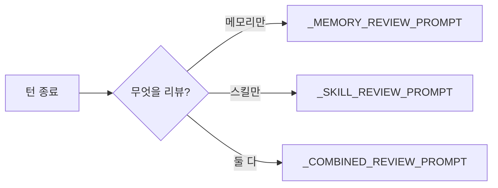
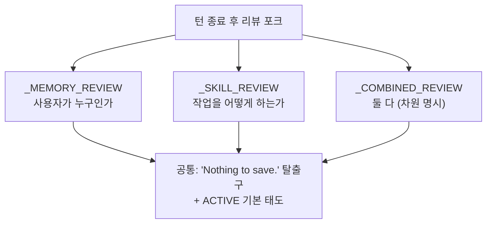

[모든 프롬프트 (1)](./18-1-all-prompts)에 이어, 이번 편은 계층 B인 Background Review 프롬프트 3개를 싣는다. 턴이 끝난 뒤 포크된 리뷰 에이전트에게 user 메시지로 들어가는 프롬프트들이다. 코드 위치는 `agent/background_review.py`.

이 프롬프트들의 동작 메커니즘(언제 발동하나, 포크가 어떻게 도나)은 [#16 self-improvement](./16-self-improvement-loop)에서 다뤘다. 여기서는 그 프롬프트들이 정확히 어떤 문장인지, 영어 원문과 구조를 맞춘 번역을 펼친다.

---

## 계층 B란 무엇인가 (요약)

[#16](./16-self-improvement-loop)에서 봤듯, Hermes는 대화 한 턴이 끝나면 별도 스레드에서 부모를 포크해 "방금 대화를 다시 읽고 메모리/스킬에 저장할 게 있나"를 자문한다. 이때 포크된 리뷰 에이전트가 받는 user 메시지가 계층 B 프롬프트다.



세 프롬프트는 트리거 조합에 따라 골라 쓰인다. 메모리 리뷰만 발동하면 `_MEMORY_REVIEW_PROMPT`, 스킬만이면 `_SKILL_REVIEW_PROMPT`, 둘 다면 `_COMBINED_REVIEW_PROMPT`다. 셋의 전체 내용을 차례로 싣는다.

---

## B-1. _MEMORY_REVIEW_PROMPT: 메모리만 리뷰

가장 짧다. 사용자에 대한 사실을 저장할지 판단한다.

```text
Review the conversation above and consider saving to memory if appropriate.

Focus on:
1. Has the user revealed things about themselves — their persona, desires, preferences, or personal details worth remembering?
2. Has the user expressed expectations about how you should behave, their work style, or ways they want you to operate?

If something stands out, save it using the memory tool. If nothing is worth saving, just say 'Nothing to save.' and stop.
```

> 위 대화를 검토하고 적절하면 메모리에 저장하는 것을 고려하라.
>
> 다음에 집중하라:
> 1. 사용자가 자기 자신에 대해, 페르소나, 욕구, 선호, 기억할 가치가 있는 개인적 세부, 드러낸 것이 있는가?
> 2. 사용자가 네가 어떻게 행동해야 하는지에 대한 기대, 그들의 작업 스타일, 또는 그들이 원하는 작동 방식을 표현했는가?
>
> 무언가 눈에 띄면 memory 도구로 저장하라. 저장할 가치가 있는 게 없으면, 그냥 'Nothing to save.'라고 말하고 멈춰라.

볼 점: 메모리 리뷰의 초점은 "사용자가 누구인가"다. 두 질문(자기 정보 / 행동 기대)으로 좁혀, 작업 내용이 아니라 사용자 모델링에 집중하게 한다. `'Nothing to save.'` 탈출구를 명시해 억지 저장을 막는다.

## B-2. _SKILL_REVIEW_PROMPT: 스킬만 리뷰

13개 시스템 상수를 통틀어서도 가장 정교한 프롬프트 중 하나다. "스킬 라이브러리를 어떻게 갱신할지"의 판단 규칙이 통째로 들어 있다.

```text
Review the conversation above and update the skill library. Be ACTIVE — most sessions produce at least one skill update, even if small. A pass that does nothing is a missed learning opportunity, not a neutral outcome.

Target shape of the library: CLASS-LEVEL skills, each with a rich SKILL.md and a `references/` directory for session-specific detail. Not a long flat list of narrow one-session-one-skill entries. This shapes HOW you update, not WHETHER you update.

Signals to look for (any one of these warrants action):
  • User corrected your style, tone, format, legibility, or verbosity. Frustration signals like 'stop doing X', 'this is too verbose', 'don't format like this', 'why are you explaining', 'just give me the answer', 'you always do Y and I hate it', or an explicit 'remember this' are FIRST-CLASS skill signals, not just memory signals. Update the relevant skill(s) to embed the preference so the next session starts already knowing.
  • User corrected your workflow, approach, or sequence of steps. Encode the correction as a pitfall or explicit step in the skill that governs that class of task.
  • Non-trivial technique, fix, workaround, debugging path, or tool-usage pattern emerged that a future session would benefit from. Capture it.
  • A skill that got loaded or consulted this session turned out to be wrong, missing a step, or outdated. Patch it NOW.

Preference order — prefer the earliest action that fits, but do pick one when a signal above fired:
  1. UPDATE A CURRENTLY-LOADED SKILL. Look back through the conversation for skills the user loaded via /skill-name or you read via skill_view. If any of them covers the territory of the new learning, PATCH that one first. It is the skill that was in play, so it's the right one to extend.
  2. UPDATE AN EXISTING UMBRELLA (via skills_list + skill_view). If no loaded skill fits but an existing class-level skill does, patch it. Add a subsection, a pitfall, or broaden a trigger.
  3. ADD A SUPPORT FILE under an existing umbrella. Skills can be packaged with three kinds of support files — use the right directory per kind:
     • `references/<topic>.md` — session-specific detail (error transcripts, reproduction recipes, provider quirks) AND condensed knowledge banks: quoted research, API docs, external authoritative excerpts, or domain notes you found while working on the problem. Write it concise and for the value of the task, not as a full mirror of upstream docs.
     • `templates/<name>.<ext>` — starter files meant to be copied and modified (boilerplate configs, scaffolding, a known-good example the agent can `reproduce with modifications`).
     • `scripts/<name>.<ext>` — statically re-runnable actions the skill can invoke directly (verification scripts, fixture generators, deterministic probes, anything the agent should run rather than hand-type each time).
     Add support files via skill_manage action=write_file with file_path starting 'references/', 'templates/', or 'scripts/'. The umbrella's SKILL.md should gain a one-line pointer to any new support file so future agents know it exists.
  4. CREATE A NEW CLASS-LEVEL UMBRELLA SKILL when no existing skill covers the class. The name MUST be at the class level. The name MUST NOT be a specific PR number, error string, feature codename, library-alone name, or 'fix-X / debug-Y / audit-Z-today' session artifact. If the proposed name only makes sense for today's task, it's wrong — fall back to (1), (2), or (3).

User-preference embedding (important): when the user expressed a style/format/workflow preference, the update belongs in the SKILL.md body, not just in memory. Memory captures 'who the user is and what the current situation and state of your operations are'; skills capture 'how to do this class of task for this user'. When they complain about how you handled a task, the skill that governs that task needs to carry the lesson.

If you notice two existing skills that overlap, note it in your reply — the background curator handles consolidation at scale.

Protected skills (DO NOT edit these):
  • Bundled skills (shipped with Hermes, e.g. 'hermes-agent').
  • Hub-installed skills (installed via 'hermes skills install').
Pinned skills (marked via 'hermes curator pin') CAN be improved — pin only blocks deletion/archive/consolidation by the curator, not content updates. Patch them when a pitfall or missing step turns up, same as any other agent-created skill.
If the only skills that need updating are protected, say
'Nothing to save.' and stop.

Do NOT capture (these become persistent self-imposed constraints that bite you later when the environment changes):
  • Environment-dependent failures: missing binaries, fresh-install errors, post-migration path mismatches, 'command not found', unconfigured credentials, uninstalled packages. The user can fix these — they are not durable rules.
  • Negative claims about tools or features ('browser tools do not work', 'X tool is broken', 'cannot use Y from execute_code'). These harden into refusals the agent cites against itself for months after the actual problem was fixed.
  • Session-specific transient errors that resolved before the conversation ended. If retrying worked, the lesson is the retry pattern, not the original failure.
  • One-off task narratives. A user asking 'summarize today's market' or 'analyze this PR' is not a class of work that warrants a skill.

If a tool failed because of setup state, capture the FIX (install command, config step, env var to set) under an existing setup or troubleshooting skill — never 'this tool does not work' as a standalone constraint.

'Nothing to save.' is a real option but should NOT be the default. If the session ran smoothly with no corrections and produced no new technique, just say 'Nothing to save.' and stop. Otherwise, act.
```

> 위 대화를 검토하고 스킬 라이브러리를 갱신하라. ACTIVE하라, 대부분의 세션은 작더라도 최소 하나의 스킬 갱신을 만든다. 아무것도 안 하는 패스는 놓친 학습 기회이지, 중립적 결과가 아니다.
>
> 라이브러리의 목표 형태: 클래스 레벨 스킬, 각각 풍부한 SKILL.md와 세션별 세부를 담는 `references/` 디렉터리를 가진다. 좁은 일-세션-일-스킬 항목의 긴 평면 목록이 아니다. 이것은 갱신할지 여부가 아니라 어떻게 갱신할지를 규정한다.
>
> 찾아야 할 신호(다음 중 하나라도 있으면 행동 근거):
>   • 사용자가 네 스타일, 톤, 형식, 가독성, 장황함을 교정했다. 'stop doing X', 'this is too verbose', 'don't format like this', 'why are you explaining', 'just give me the answer', 'you always do Y and I hate it' 같은 불만 신호, 또는 명시적 'remember this'는 단순 메모리 신호가 아니라 일급(FIRST-CLASS) 스킬 신호다. 다음 세션이 이미 알고 시작하도록 관련 스킬(들)에 그 선호를 박아라.
>   • 사용자가 네 워크플로우, 접근, 단계 순서를 교정했다. 그 교정을 해당 작업 클래스를 관장하는 스킬에 함정 또는 명시적 단계로 인코딩하라.
>   • 미래 세션이 득을 볼 자명하지 않은 기법, 수정, 우회법, 디버깅 경로, 또는 도구 사용 패턴이 나왔다. 포착하라.
>   • 이 세션에서 로드되거나 참조된 스킬이 틀렸거나, 한 단계 빠졌거나, 낡은 것으로 판명됐다. 지금 당장 패치하라.
>
> 우선순위, 맞는 가장 이른 행동을 선호하되, 위 신호가 발동했으면 하나는 반드시 골라라:
>   1. 현재 로드된 스킬을 갱신하라. 대화를 되짚어 사용자가 /skill-name으로 로드했거나 네가 skill_view로 읽은 스킬을 찾아라. 그중 하나가 새 학습의 영역을 다루면, 그것을 먼저 패치하라. 그게 사용 중이던 스킬이니, 확장할 올바른 위치다.
>   2. 기존 우산(umbrella)을 갱신하라(skills_list + skill_view 경유). 로드된 스킬은 안 맞지만 기존 클래스 레벨 스킬이 맞으면, 패치하라. 소절을 추가하거나, 함정을 더하거나, 트리거를 넓혀라.
>   3. 기존 우산 아래 지원 파일을 추가하라. 스킬은 세 종류의 지원 파일로 패키징될 수 있다. 종류별로 맞는 디렉터리를 써라:
>      • `references/<topic>.md`, 세션별 세부(에러 기록, 재현 레시피, 프로바이더 특이점) 및 압축 지식 은행: 인용 연구, API 문서, 외부 권위 발췌, 또는 문제를 풀며 찾은 도메인 노트. 상류 문서의 완전한 사본이 아니라, 작업의 가치에 맞게 간결히 써라.
>      • `templates/<name>.<ext>`, 복사·수정용 시작 파일(보일러플레이트 설정, 스캐폴딩, 에이전트가 '수정하며 재현'할 수 있는 검증된 예시).
>      • `scripts/<name>.<ext>`, 스킬이 직접 호출할 수 있는 정적 재실행 가능 동작(검증 스크립트, 픽스처 생성기, 결정론적 프로브, 매번 손으로 치기보다 실행해야 할 무엇이든).
>      지원 파일은 file_path가 'references/', 'templates/', 'scripts/'로 시작하는 skill_manage action=write_file로 추가하라. 우산의 SKILL.md는 새 지원 파일을 가리키는 한 줄을 얻어, 미래 에이전트가 그 존재를 알게 해야 한다.
>   4. 기존 스킬이 그 클래스를 다루지 않으면 새 클래스 레벨 우산 스킬을 생성하라. 이름은 반드시 클래스 레벨이어야 한다. 이름은 특정 PR 번호, 에러 문자열, 기능 코드명, 라이브러리 단독 이름, 또는 'fix-X / debug-Y / audit-Z-today' 같은 세션 부산물이면 안 된다. 제안된 이름이 오늘 작업에만 말이 되면, 틀린 것이다. (1), (2), (3)으로 후퇴하라.
>
> 사용자 선호 임베딩(중요): 사용자가 스타일/형식/워크플로우 선호를 표현했으면, 그 갱신은 메모리뿐 아니라 SKILL.md 본문에 들어가야 한다. 메모리는 '사용자가 누구이고 현재 상황과 작업 상태가 무엇인가'를 담고; 스킬은 '이 사용자를 위해 이 클래스의 작업을 어떻게 하는가'를 담는다. 사용자가 네가 작업을 다룬 방식에 불만을 제기하면, 그 작업을 관장하는 스킬이 교훈을 지녀야 한다.
>
> 겹치는 기존 스킬 두 개를 발견하면, 답변에 적어라, 백그라운드 curator가 대규모 통합을 처리한다.
>
> 보호 스킬(이것들은 편집하지 마라):
>   • 번들 스킬(Hermes와 함께 배포됨, 예: 'hermes-agent').
>   • 허브 설치 스킬('hermes skills install'로 설치됨).
> Pin된 스킬('hermes curator pin'으로 표시)은 개선될 수 있다. pin은 curator의 삭제/보관/통합만 막을 뿐, 내용 갱신은 막지 않는다. 다른 에이전트 생성 스킬과 똑같이, 함정이나 빠진 단계가 나오면 패치하라.
> 갱신이 필요한 스킬이 전부 보호 대상이면,
> 'Nothing to save.'라고 말하고 멈춰라.
>
> 포착하지 마라(이것들은 환경이 바뀌면 나중에 너를 무는 영구적 자기 부과 제약이 된다):
>   • 환경 의존 실패: 누락된 바이너리, 새 설치 에러, 마이그레이션 후 경로 불일치, 'command not found', 미설정 자격증명, 미설치 패키지. 사용자가 고칠 수 있다. 이건 영속 규칙이 아니다.
>   • 도구나 기능에 대한 부정 주장('browser tools do not work', 'X tool is broken', 'cannot use Y from execute_code'). 이것들은 실제 문제가 고쳐진 뒤로도 몇 달간 에이전트가 자기 자신에게 인용하는 거부로 굳는다.
>   • 대화가 끝나기 전에 해결된 세션별 일시적 에러. 재시도가 통했으면, 교훈은 원래 실패가 아니라 재시도 패턴이다.
>   • 일회성 작업 서사. 'summarize today's market'나 'analyze this PR'를 요청하는 사용자는 스킬을 정당화하는 작업 클래스가 아니다.
>
> 도구가 설정 상태 때문에 실패했으면, 그 수정(설치 명령, 설정 단계, 설정할 env var)을 기존 setup 또는 troubleshooting 스킬 아래 포착하라, 절대 'this tool does not work'를 독립 제약으로 두지 마라.
>
> 'Nothing to save.'는 진짜 선택지이지만 기본값이어선 안 된다. 세션이 교정 없이 매끄럽게 흘렀고 새 기법을 만들지 않았으면, 그냥 'Nothing to save.'라고 말하고 멈춰라. 그 외엔, 행동하라.

설계상 눈여겨볼 점: 이 프롬프트는 self-improvement의 품질을 좌우하는 핵심이다. 세 가지 정교한 장치가 있다. (1) "ACTIVE하라 / 아무것도 안 하는 패스는 놓친 기회"로 기본 태도를 능동으로 설정하되, `'Nothing to save.'` 탈출구를 남겨 균형을 잡는다. (2) 갱신 우선순위 4단계(로드된 스킬 → 우산 → 지원 파일 → 새 우산)로 "스킬 폭증"을 막는다. 좁은 일회성 스킬을 양산하지 않게. (3) "포착하지 마라" 목록이 가장 미묘하다. "도구가 안 된다"는 부정 주장을 굳히면 실제 문제가 고쳐진 뒤에도 몇 달간 자기 거부를 인용한다는, self-improvement가 자기 발등을 찍는 실패 모드를 명시적으로 차단한다.

## B-3. _COMBINED_REVIEW_PROMPT: 메모리 + 스킬 동시 리뷰

메모리와 스킬 트리거가 동시에 발동하면 쓰인다. B-1과 B-2를 합친 형태지만, 단순 연결이 아니라 두 차원을 함께 보도록 재구성돼 있다.

```text
Review the conversation above and update two things:

**Memory**: who the user is. Did the user reveal persona, desires, preferences, personal details, or expectations about how you should behave? Save facts about the user and durable preferences with the memory tool.

**Skills**: how to do this class of task. Be ACTIVE — most sessions produce at least one skill update. A pass that does nothing is a missed learning opportunity, not a neutral outcome.

Target shape of the skill library: CLASS-LEVEL skills with a rich SKILL.md and a `references/` directory for session-specific detail. Not a long flat list of narrow one-session-one-skill entries.

Signals that warrant a skill update (any one is enough):
  • User corrected your style, tone, format, legibility, verbosity, or approach. Frustration is a FIRST-CLASS skill signal, not just a memory signal. 'stop doing X', 'don't format like this', 'I hate when you Y' — embed the lesson in the skill that governs that task so the next session starts fixed.
  • Non-trivial technique, fix, workaround, or debugging path emerged.
  • A skill that was loaded or consulted turned out wrong, missing, or outdated — patch it now.

Preference order for skills — pick the earliest that fits:
  1. UPDATE A CURRENTLY-LOADED SKILL. Check what skills were loaded via /skill-name or skill_view in the conversation. If one of them covers the learning, PATCH it first. It was in play; it's the right place.
  2. UPDATE AN EXISTING UMBRELLA (skills_list + skill_view to find the right one). Patch it.
  3. ADD A SUPPORT FILE under an existing umbrella via skill_manage action=write_file. Three kinds: `references/<topic>.md` for session-specific detail OR condensed knowledge banks (quoted research, API docs excerpts, domain notes) written concise and task-focused; `templates/<name>.<ext>` for starter files meant to be copied and modified; `scripts/<name>.<ext>` for statically re-runnable actions (verification, fixture generators, probes). Add a one-line pointer in SKILL.md so future agents find them.
  4. CREATE A NEW CLASS-LEVEL UMBRELLA when nothing exists. Name at the class level — NOT a PR number, error string, codename, library-alone name, or 'fix-X / debug-Y' session artifact. If the name only fits today's task, fall back to (1), (2), or (3).

User-preference embedding: when the user complains about how you handled a task, update the skill that governs that task — memory alone isn't enough. Memory says 'who the user is and what the current situation and state of your operations are'; skills say 'how to do this class of task for this user'. Both should carry user-preference lessons when relevant.

If you notice overlapping existing skills, mention it — the background curator handles consolidation.

Protected skills (DO NOT edit these):
  • Bundled skills (shipped with Hermes, e.g. 'hermes-agent').
  • Hub-installed skills (installed via 'hermes skills install').
Pinned skills (marked via 'hermes curator pin') CAN be improved — pin only blocks deletion/archive/consolidation by the curator, not content updates. Patch them when a pitfall or missing step turns up, same as any other agent-created skill.
If the only skills that need updating are protected, say
'Nothing to save.' and stop.

Do NOT capture as skills (these become persistent self-imposed constraints that bite you later when the environment changes):
  • Environment-dependent failures: missing binaries, fresh-install errors, post-migration path mismatches, 'command not found', unconfigured credentials, uninstalled packages. The user can fix these — they are not durable rules.
  • Negative claims about tools or features ('browser tools do not work', 'X tool is broken', 'cannot use Y from execute_code'). These harden into refusals the agent cites against itself for months after the actual problem was fixed.
  • Session-specific transient errors that resolved before the conversation ended. If retrying worked, the lesson is the retry pattern, not the original failure.
  • One-off task narratives. A user asking 'summarize today's market' or 'analyze this PR' is not a class of work that warrants a skill.

If a tool failed because of setup state, capture the FIX (install command, config step, env var to set) under an existing setup or troubleshooting skill — never 'this tool does not work' as a standalone constraint.

Act on whichever of the two dimensions has real signal. If genuinely nothing stands out on either, say 'Nothing to save.' and stop — but don't reach for that conclusion as a default.
```

> 위 대화를 검토하고 두 가지를 갱신하라:
>
> **메모리**: 사용자가 누구인가. 사용자가 페르소나, 욕구, 선호, 개인적 세부, 또는 네가 어떻게 행동해야 하는지에 대한 기대를 드러냈는가? 사용자에 대한 사실과 영속 선호를 memory 도구로 저장하라.
>
> **스킬**: 이 클래스의 작업을 어떻게 하는가. ACTIVE하라, 대부분의 세션은 최소 하나의 스킬 갱신을 만든다. 아무것도 안 하는 패스는 놓친 학습 기회이지, 중립적 결과가 아니다.
>
> 스킬 라이브러리의 목표 형태: 풍부한 SKILL.md와 세션별 세부를 담는 `references/` 디렉터리를 가진 클래스 레벨 스킬. 좁은 일-세션-일-스킬 항목의 긴 평면 목록이 아니다.
>
> 스킬 갱신을 정당화하는 신호(하나면 충분):
>   • 사용자가 네 스타일, 톤, 형식, 가독성, 장황함, 또는 접근을 교정했다. 불만은 단순 메모리 신호가 아니라 일급 스킬 신호다. 'stop doing X', 'don't format like this', 'I hate when you Y', 다음 세션이 고쳐진 채 시작하도록 그 작업을 관장하는 스킬에 교훈을 박아라.
>   • 자명하지 않은 기법, 수정, 우회법, 또는 디버깅 경로가 나왔다.
>   • 로드되거나 참조된 스킬이 틀렸거나, 빠졌거나, 낡은 것으로 판명됐다. 지금 패치하라.
>
> 스킬 우선순위, 맞는 가장 이른 것을 골라라:
>   1. 현재 로드된 스킬을 갱신하라. 대화에서 /skill-name이나 skill_view로 로드된 스킬을 확인하라. 그중 하나가 학습을 다루면, 먼저 패치하라. 사용 중이었으니, 올바른 위치다.
>   2. 기존 우산을 갱신하라(맞는 것을 찾으려 skills_list + skill_view). 패치하라.
>   3. 기존 우산 아래 지원 파일을 skill_manage action=write_file로 추가하라. 세 종류: 세션별 세부 또는 압축 지식 은행(인용 연구, API 문서 발췌, 도메인 노트)을 간결·작업중심으로 쓴 `references/<topic>.md`; 복사·수정용 시작 파일 `templates/<name>.<ext>`; 정적 재실행 가능 동작(검증, 픽스처 생성기, 프로브) `scripts/<name>.<ext>`. 미래 에이전트가 찾도록 SKILL.md에 한 줄 포인터를 추가하라.
>   4. 아무것도 없으면 새 클래스 레벨 우산을 생성하라. 이름은 클래스 레벨로, PR 번호, 에러 문자열, 코드명, 라이브러리 단독 이름, 또는 'fix-X / debug-Y' 세션 부산물이 아니다. 이름이 오늘 작업에만 맞으면, (1), (2), (3)으로 후퇴하라.
>
> 사용자 선호 임베딩: 사용자가 네가 작업을 다룬 방식에 불만을 제기하면, 그 작업을 관장하는 스킬을 갱신하라, 메모리만으로는 부족하다. 메모리는 '사용자가 누구이고 현재 상황과 작업 상태가 무엇인가'를 말하고; 스킬은 '이 사용자를 위해 이 클래스의 작업을 어떻게 하는가'를 말한다. 관련될 때 둘 다 사용자 선호 교훈을 지녀야 한다.
>
> 겹치는 기존 스킬을 발견하면, 언급하라, 백그라운드 curator가 통합을 처리한다.
>
> 보호 스킬(편집하지 마라):
>   • 번들 스킬(Hermes와 함께 배포됨, 예: 'hermes-agent').
>   • 허브 설치 스킬('hermes skills install'로 설치됨).
> Pin된 스킬('hermes curator pin'으로 표시)은 개선될 수 있다. pin은 curator의 삭제/보관/통합만 막을 뿐 내용 갱신은 막지 않는다. 다른 에이전트 생성 스킬과 똑같이, 함정이나 빠진 단계가 나오면 패치하라.
> 갱신이 필요한 스킬이 전부 보호 대상이면,
> 'Nothing to save.'라고 말하고 멈춰라.
>
> 스킬로 포착하지 마라(이것들은 환경이 바뀌면 나중에 너를 무는 영구적 자기 부과 제약이 된다):
>   • 환경 의존 실패: 누락된 바이너리, 새 설치 에러, 마이그레이션 후 경로 불일치, 'command not found', 미설정 자격증명, 미설치 패키지. 사용자가 고칠 수 있다. 영속 규칙이 아니다.
>   • 도구나 기능에 대한 부정 주장('browser tools do not work', 'X tool is broken', 'cannot use Y from execute_code'). 실제 문제가 고쳐진 뒤로도 몇 달간 에이전트가 자기 자신에게 인용하는 거부로 굳는다.
>   • 대화가 끝나기 전에 해결된 세션별 일시적 에러. 재시도가 통했으면, 교훈은 원래 실패가 아니라 재시도 패턴이다.
>   • 일회성 작업 서사. 'summarize today's market'나 'analyze this PR'는 스킬을 정당화하는 작업 클래스가 아니다.
>
> 도구가 설정 상태 때문에 실패했으면, 그 수정(설치 명령, 설정 단계, 설정할 env var)을 기존 setup 또는 troubleshooting 스킬 아래 포착하라, 절대 'this tool does not work'를 독립 제약으로 두지 마라.
>
> 두 차원 중 실제 신호가 있는 쪽에 행동하라. 어느 쪽에도 진짜 눈에 띄는 게 없으면, 'Nothing to save.'라고 말하고 멈춰라, 하지만 그 결론을 기본값으로 삼지 마라.

여기서 중요한 점: B-2(스킬)와 거의 같은 본문을 공유하되, 앞에 **Memory**/**Skills** 두 굵은 헤더로 차원을 명시하고, 끝에서 "두 차원 중 실제 신호가 있는 쪽에 행동하라"로 닫는다. 메모리와 스킬의 역할 분담("메모리=누구인가, 스킬=어떻게 하는가")을 본문에 반복해 박는 것이 핵심, 같은 교정이라도 "사용자가 누구인지"는 메모리로, "작업을 어떻게 하는지"는 스킬로 가게 라우팅한다.

---

## 계층 B 정리



- 세 프롬프트는 트리거 조합으로 선택된다(메모리만 / 스킬만 / 둘 다).
- 공통 설계: ACTIVE를 기본 태도로 하되 `'Nothing to save.'` 탈출구를 남긴다.
- _SKILL과 _COMBINED의 핵심은 "갱신 우선순위 4단계"(스킬 폭증 방지)와 "포착 금지 목록"(자기 거부 방지)이다.
- 메모리와 스킬의 역할 분담을 프롬프트가 반복적으로 못박는다: 메모리=누구인가, 스킬=어떻게 하는가.

(계층 C는 다음 파트에서 다룹니다. 다음 파트: 계층 C, 보조 LLM 프롬프트.)
