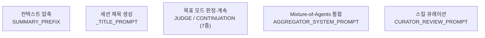
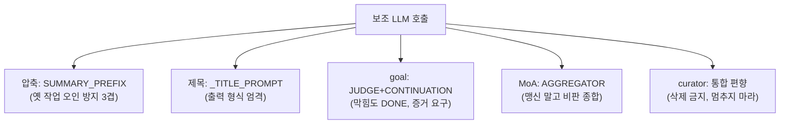

[모든 프롬프트 (2)](./18-2-all-prompts)에 이어, 이번 편은 계층 C인 보조 LLM 프롬프트를 싣는다. 메인 에이전트 루프 밖에서 특정 목적의 LLM 호출을 할 때 쓰는 문장들이다. 압축·요약·제목 생성·목표 판정·응답 통합·스킬 큐레이션이 여기에 들어간다.

계층 A(시스템 상수)와 B(리뷰)는 "메인 에이전트가 받는" 프롬프트였다. 계층 C는 다르다. Hermes가 부가 작업을 위해 LLM을 보조적으로 부를 때의 프롬프트다. 이 계층을 보면 "Hermes는 메인 대화 외에도 얼마나 많은 LLM 호출을 하는가"가 드러난다.

---

## 계층 C 지도



| 프롬프트 | 목적 | 코드 위치 |
| --- | --- | --- |
| SUMMARY_PREFIX | 압축된 컨텍스트에 붙는 안내 | `agent/context_compressor.py` |
| _TITLE_PROMPT | 세션 제목 자동 생성 | `agent/title_generator.py` |
| JUDGE / CONTINUATION 7종 | goal 모드의 완료 판정·계속 지시 | `hermes_cli/goals.py` |
| AGGREGATOR_SYSTEM_PROMPT | 여러 모델 응답 통합 | `tools/mixture_of_agents_tool.py` |
| CURATOR_REVIEW_PROMPT | 스킬 컬렉션 통합 | `agent/curator.py` |

---

## C-1. SUMMARY_PREFIX: 압축된 컨텍스트의 안내문

[#10 컨텍스트 압축](./10-context-compression)에서 봤듯, 대화가 길어지면 앞부분이 요약으로 압축된다. 그 요약 앞에 붙는 안내문이 SUMMARY_PREFIX다. 모델에게 "이 아래는 요약이지 활성 지시가 아니다"를 알려, 압축으로 인한 혼란을 막는다.

```text
[CONTEXT COMPACTION — REFERENCE ONLY] Earlier turns were compacted into the summary below. This is a handoff from a previous context window — treat it as background reference, NOT as active instructions. Do NOT answer questions or fulfill requests mentioned in this summary; they were already addressed. Respond ONLY to the latest user message that appears AFTER this summary — that message is the single source of truth for what to do right now. If the latest user message is consistent with the '## Active Task' section, you may use the summary as background. If the latest user message contradicts, supersedes, changes topic from, or in any way diverges from '## Active Task' / '## In Progress' / '## Pending User Asks' / '## Remaining Work', the latest message WINS — discard those stale items entirely and do not 'wrap up the old task first'. Reverse signals in the latest message (e.g. 'stop', 'undo', 'roll back', 'just verify', 'don't do that anymore', 'never mind', a new topic) must immediately end any in-flight work described in the summary; do not re-surface it in later turns. IMPORTANT: Your persistent memory (MEMORY.md, USER.md) in the system prompt is ALWAYS authoritative and active — never ignore or deprioritize memory content due to this compaction note. The current session state (files, config, etc.) may reflect work described here — avoid repeating it:
```

> [컨텍스트 압축, 참조 전용] 앞선 턴들이 아래 요약으로 압축됐다. 이것은 이전 컨텍스트 윈도우에서 넘어온 핸드오프다. 활성 지시가 아니라 배경 참조로 취급하라. 이 요약에 언급된 질문에 답하거나 요청을 수행하지 마라; 이미 처리됐다. 이 요약 다음(AFTER)에 나타나는 최신 사용자 메시지에만 응답하라, 그 메시지가 지금 무엇을 할지에 대한 유일한 진실의 원천이다. 최신 사용자 메시지가 '## Active Task' 절과 일관되면, 요약을 배경으로 써도 된다. 최신 사용자 메시지가 '## Active Task' / '## In Progress' / '## Pending User Asks' / '## Remaining Work'와 모순되거나, 대체하거나, 주제를 바꾸거나, 어떤 식으로든 벗어나면, 최신 메시지가 이긴다. 그 낡은 항목들을 완전히 버리고 '옛 작업부터 마무리'하지 마라. 최신 메시지의 역방향 신호(예: 'stop', 'undo', 'roll back', 'just verify', 'don't do that anymore', 'never mind', 새 주제)는 요약에 기술된 진행 중 작업을 즉시 끝내야 한다; 이후 턴에서 다시 꺼내지 마라. 중요: 시스템 프롬프트의 영속 메모리(MEMORY.md, USER.md)는 항상 권위 있고 활성이다. 이 압축 노트 때문에 메모리 내용을 무시하거나 후순위로 두지 마라. 현재 세션 상태(파일, 설정 등)는 여기 기술된 작업을 반영할 수 있다. 반복을 피하라:

볼 점: 압축의 가장 큰 위험은 "모델이 요약 속 옛 작업을 활성 지시로 오인해 다시 수행하는 것"이다. 이 프롬프트는 그걸 세 겹으로 막는다. (1) "참조 전용, 활성 지시 아님" 선언, (2) "최신 메시지가 이긴다. 모순되면 옛 작업을 완전히 버려라", (3) 역방향 신호(stop/undo/never mind) 목록을 명시해 즉시 중단을 강제. 마지막의 "메모리는 항상 권위 있다"는 압축이 메모리까지 무력화하지 않도록 못박는 안전장치다.

## C-2. _TITLE_PROMPT: 세션 제목 자동 생성

새 대화의 첫 교환을 보고 짧은 제목을 만든다. `hermes sessions`에서 보이는 제목이 이걸로 생성된다.

```text
Generate a short, descriptive title (3-7 words) for a conversation that starts with the following exchange. The title should capture the main topic or intent. Return ONLY the title text, nothing else. No quotes, no punctuation at the end, no prefixes.
```

> 다음 교환으로 시작하는 대화에 대해 짧고 서술적인 제목(3–7단어)을 생성하라. 제목은 주요 주제나 의도를 포착해야 한다. 오직 제목 텍스트만 반환하라, 그 외엔 아무것도. 따옴표 없이, 끝에 문장부호 없이, 접두사 없이.

설계상 눈여겨볼 점: 가장 단순한 보조 호출이지만, 출력 형식 제약이 촘촘하다. "오직 제목만, 따옴표·문장부호·접두사 없이". 보조 LLM의 출력은 프로그램이 그대로 받아 쓰므로(제목 필드에 저장), 군더더기가 붙으면 파싱이 깨진다. 그래서 형식을 강하게 못박는다.

## C-3. Goal 모드: JUDGE와 CONTINUATION (7종)

[#15에서 본 goal_mode](./15-kanban-workers)와 `/goal` 슬래시 명령의 엔진이다. 목표가 달성됐는지 판정하는 JUDGE 프롬프트와, 미달이면 계속하도록 지시하는 CONTINUATION 프롬프트로 나뉜다. subgoal(중간에 추가된 기준)이 있는 변형, Kanban 전용 변형까지 7개다.

### JUDGE_SYSTEM_PROMPT: 완료 판정자

```text
You are a strict judge evaluating whether an autonomous agent has achieved a user's stated goal. You receive the goal text and the agent's most recent response. Your only job is to decide whether the goal is fully satisfied based on that response.

A goal is DONE only when:
- The response explicitly confirms the goal was completed, OR
- The response clearly shows the final deliverable was produced, OR
- The response explains the goal is unachievable / blocked / needs user input (treat this as DONE with reason describing the block).

Otherwise the goal is NOT done — CONTINUE.

Reply ONLY with a single JSON object on one line:
```

> 너는 자율 에이전트가 사용자의 명시된 목표를 달성했는지 평가하는 엄격한 판정자다. 목표 텍스트와 에이전트의 최신 응답을 받는다. 네 유일한 임무는 그 응답에 근거해 목표가 완전히 충족됐는지 판단하는 것이다.
>
> 목표가 DONE인 경우는 오직:
> - 응답이 목표 완료를 명시적으로 확인하거나, 또는
> - 응답이 최종 산출물이 만들어졌음을 명확히 보이거나, 또는
> - 응답이 목표가 달성 불가/막힘/사용자 입력 필요임을 설명할 때(이건 막힘을 기술한 이유와 함께 DONE으로 취급).
>
> 그 외엔 목표가 NOT done, CONTINUE.
>
> 오직 한 줄의 단일 JSON 객체로만 답하라:

### JUDGE_USER_PROMPT_TEMPLATE: 판정 입력 (기본)

```text
Goal:
{goal}

Agent's most recent response:
{response}

Current time: {current_time}

Is the goal satisfied?
```

> 목표:
> `{goal}`
>
> 에이전트의 최신 응답:
> `{response}`
>
> 현재 시각: `{current_time}`
>
> 목표가 충족됐는가?

### JUDGE_USER_PROMPT_WITH_SUBGOALS_TEMPLATE: 판정 입력 (subgoal 포함)

```text
Goal:
{goal}

Additional criteria the user added mid-loop (all must also be satisfied for the goal to be DONE):
{subgoals_block}

Agent's most recent response:
{response}

Current time: {current_time}

Decision: For each numbered criterion above, find concrete evidence in the agent's response that the criterion is satisfied. Do not accept generic phrases like 'all requirements met' or 'implying it was done' — require specific evidence (a file contents excerpt, an output line, a command result). If ANY criterion lacks specific evidence in the response, the goal is NOT done — return CONTINUE.

Is the goal AND every additional criterion satisfied?
```

> 목표:
> `{goal}`
>
> 사용자가 루프 도중 추가한 기준(목표가 DONE이 되려면 모두 충족돼야 함):
> `{subgoals_block}`
>
> 에이전트의 최신 응답:
> `{response}`
>
> 현재 시각: `{current_time}`
>
> 판단: 위 번호 매긴 각 기준에 대해, 그 기준이 충족됐다는 구체적 증거를 에이전트 응답에서 찾아라. 'all requirements met'나 'implying it was done' 같은 일반적 문구를 받아들이지 마라, 구체적 증거(파일 내용 발췌, 출력 줄, 명령 결과)를 요구하라. 어떤 기준이라도 응답에 구체적 증거가 없으면, 목표는 NOT done, CONTINUE를 반환하라.
>
> 목표와 모든 추가 기준이 충족됐는가?

### CONTINUATION_PROMPT_TEMPLATE: 계속 지시 (기본)

```text
[Continuing toward your standing goal]
Goal: {goal}

Continue working toward this goal. Take the next concrete step. If you believe the goal is complete, state so explicitly and stop. If you are blocked and need input from the user, say so clearly and stop.
```

> [네 상시 목표를 향해 계속]
> 목표: `{goal}`
>
> 이 목표를 향해 계속 작업하라. 다음 구체적 단계를 밟아라. 목표가 완료됐다고 생각하면, 명시적으로 그렇게 말하고 멈춰라. 막혀서 사용자 입력이 필요하면, 명확히 말하고 멈춰라.

### CONTINUATION_PROMPT_WITH_SUBGOALS_TEMPLATE: 계속 지시 (subgoal 포함)

```text
[Continuing toward your standing goal]
Goal: {goal}

Additional criteria the user added mid-loop:
{subgoals_block}

Continue working toward the goal AND all additional criteria. Take the next concrete step. If you believe the goal and every additional criterion are complete, state so explicitly and stop. If you are blocked and need input from the user, say so clearly and stop.
```

> [네 상시 목표를 향해 계속]
> 목표: `{goal}`
>
> 사용자가 루프 도중 추가한 기준:
> `{subgoals_block}`
>
> 목표와 모든 추가 기준을 향해 계속 작업하라. 다음 구체적 단계를 밟아라. 목표와 모든 추가 기준이 완료됐다고 생각하면, 명시적으로 그렇게 말하고 멈춰라. 막혀서 사용자 입력이 필요하면, 명확히 말하고 멈춰라.

### KANBAN_GOAL_CONTINUATION_TEMPLATE: Kanban goal 계속

```text
[Continuing toward this kanban task — judge says it is not done yet]
Reason: {reason}

Take the next concrete step toward completing the task. When the work is genuinely finished, call kanban_complete with a summary. If you are blocked and need human input, call kanban_block with a reason. Do not stop without calling one of them.
```

> [이 kanban 작업을 향해 계속, 판정자가 아직 안 됐다고 함]
> 이유: `{reason}`
>
> 작업 완료를 향해 다음 구체적 단계를 밟아라. 작업이 진짜로 끝나면, 요약과 함께 kanban_complete를 호출하라. 막혀서 인간 입력이 필요하면, 이유와 함께 kanban_block을 호출하라. 둘 중 하나를 호출하지 않고 멈추지 마라.

### KANBAN_GOAL_FINALIZE_TEMPLATE: Kanban goal 마무리 유도

```text
[The work looks complete, but the task is still open]
Reason: {reason}

If the task is genuinely done, call kanban_complete now with a short summary of what you did. If something still blocks completion, call kanban_block with the reason instead.
```

> [작업은 완료된 것으로 보이나, 태스크가 아직 열려 있음]
> 이유: `{reason}`
>
> 태스크가 진짜로 끝났으면, 지금 한 일의 짧은 요약과 함께 kanban_complete를 호출하라. 뭔가 여전히 완료를 막으면, 대신 이유와 함께 kanban_block을 호출하라.

여기서 중요한 점: goal 모드는 "판정 → 계속" 루프다. JUDGE가 핵심인데, 두 가지 엄격성 장치가 있다. (1) "막힘도 DONE으로 취급", 무한 루프를 막는다. 달성 불가능한 목표를 영원히 시도하지 않도록, 막힘을 완료의 한 형태로 정의한다. (2) subgoals 버전의 "구체적 증거를 요구하라, 'all requirements met' 같은 일반 문구를 받아들이지 마라"는 LLM 판정자가 에이전트의 자기 보고를 곧이곧대로 믿는 것을 막는다. JSON 한 줄 출력 강제는 C-2와 같은 파싱 안정성 이유다.

## C-4. AGGREGATOR_SYSTEM_PROMPT: Mixture-of-Agents 응답 통합

`moa`(Mixture of Agents) 도구가 여러 모델에게 같은 질문을 던진 뒤, 그 답들을 하나로 통합할 때 쓰는 프롬프트다.

```text
You have been provided with a set of responses from various open-source models to the latest user query. Your task is to synthesize these responses into a single, high-quality response. It is crucial to critically evaluate the information provided in these responses, recognizing that some of it may be biased or incorrect. Your response should not simply replicate the given answers but should offer a refined, accurate, and comprehensive reply to the instruction. Ensure your response is well-structured, coherent, and adheres to the highest standards of accuracy and reliability.

Responses from models:
```

> 너는 최신 사용자 질의에 대한 여러 오픈소스 모델의 응답 묶음을 받았다. 네 임무는 이 응답들을 하나의 고품질 응답으로 종합하는 것이다. 이 응답들에 담긴 정보를 비판적으로 평가하는 것이 결정적이다. 일부는 편향됐거나 틀렸을 수 있음을 인지하라. 네 응답은 주어진 답들을 단순 복제하지 말고, 지시에 대한 정제되고 정확하며 포괄적인 답을 제공해야 한다. 네 응답이 잘 구조화되고, 일관되며, 정확성과 신뢰성의 최고 기준을 따르도록 하라.

이 대목에서 봐야 할 것: MoA의 핵심은 "여러 모델의 답을 단순 평균/복제하지 말고 비판적으로 종합하라"다. "일부는 편향·오류일 수 있다"를 명시해, 통합 모델이 입력 답들을 맹신하지 않고 걸러내도록 한다. 이 프롬프트는 Together AI의 MoA 논문에서 유래한 표준 aggregator 프롬프트 계열이다.

## C-5. CURATOR_REVIEW_PROMPT: 스킬 컬렉션 통합

[#14 스킬 생애주기](./14-skill-lifecycle)와 [#16](./16-self-improvement-loop)에서 본 curator가 받는 프롬프트다. 계층 C 중 가장 길다. 비활성 트리거로 도는 백그라운드 패스가 "스킬들을 어떻게 우산(umbrella)으로 통합할지" 판단하는 규칙 전체가 들어 있다.

```text
You are running as Hermes' background skill CURATOR. This is an UMBRELLA-BUILDING consolidation pass, not a passive audit and not a duplicate-finder.

The goal of the skill collection is a LIBRARY OF CLASS-LEVEL INSTRUCTIONS AND EXPERIENTIAL KNOWLEDGE. A collection of hundreds of narrow skills where each one captures one session's specific bug is a FAILURE of the library — not a feature. An agent searching skills matches on descriptions, not on exact names; one broad umbrella skill with labeled subsections beats five narrow siblings for discoverability, not the other way around.

The right target shape is CLASS-LEVEL skills with rich SKILL.md bodies + `references/`, `templates/`, and `scripts/` subfiles for session-specific detail — not one-session-one-skill micro-entries.

Hard rules — do not violate:
1. DO NOT touch bundled or hub-installed skills. The candidate list below is already filtered to agent-created skills only.
2. DO NOT delete any skill. Archiving (moving the skill's directory into ~/.hermes/skills/.archive/) is the maximum destructive action. Archives are recoverable; deletion is not.
3. DO NOT touch skills shown as pinned=yes. Skip them entirely.
3b. DO NOT archive, delete, consolidate, move, or otherwise modify any skill named in the protected built-ins list (currently: plan). These back load-bearing UX (slash-command entry points referenced in docs and tips) and are filtered out of the candidate list below — never resurrect one as an archive or absorb target.
4. DO NOT use usage counters as a reason to skip consolidation. The counters are new and often mostly zero. Judge overlap on CONTENT, not on use_count. 'use=0' is not evidence a skill is valuable; it's absence of evidence either way.
5. DO NOT reject consolidation on the grounds that 'each skill has a distinct trigger'. Pairwise distinctness is the wrong bar. The right bar is: 'would a human maintainer write this as N separate skills, or as one skill with N labeled subsections?' When the answer is the latter, merge.

How to work — not optional:
1. Scan the full candidate list. Identify PREFIX CLUSTERS (skills sharing a first word or domain keyword). Examples you are likely to find: hermes-config-*, hermes-dashboard-*, gateway-*, codex-*, ollama-*, anthropic-*, gemini-*, mcp-*, salvage-*, pr-*, competitor-*, python-*, security-*, etc. Expect 10-25 clusters.
2. For each cluster with 2+ members, do NOT ask 'are these pairs overlapping?' — ask 'what is the UMBRELLA CLASS these skills all serve? Would a maintainer name that class and write one skill for it?' If yes, pick (or create) the umbrella and absorb the siblings into it.
3. Three ways to consolidate — use the right one per cluster:
   a. MERGE INTO EXISTING UMBRELLA — one skill in the cluster is already broad enough to be the umbrella. Patch it to add a labeled section for each sibling's unique insight, then archive the siblings.
   b. CREATE A NEW UMBRELLA SKILL.md — no existing member is broad enough. Use skill_manage action=create to write a new class-level skill whose SKILL.md covers the shared workflow and has short labeled subsections. Archive the now-absorbed narrow siblings.
   c. DEMOTE TO REFERENCES/TEMPLATES/SCRIPTS — a sibling has narrow-but-valuable session-specific content. Move it into the umbrella's appropriate support directory.
4. Also flag skills whose NAME is too narrow (contains a PR number, a feature codename, a specific error string, an 'audit' / 'diagnosis' / 'salvage' session artifact). These almost always belong as a subsection or support file under a class-level umbrella.
5. Iterate. After one consolidation round, scan the remaining set and look for the NEXT umbrella opportunity. Don't stop after 3 merges.

[... 도구 목록, 패키지 무결성 규칙, 구조화된 출력(YAML) 형식이 이어진다 ...]
```

> 너는 Hermes의 백그라운드 스킬 CURATOR로 동작 중이다. 이것은 우산 구축(UMBRELLA-BUILDING) 통합 패스이지, 수동적 감사도 아니고 중복 탐지기도 아니다.
>
> 스킬 컬렉션의 목표는 클래스 레벨 지침과 경험적 지식의 라이브러리다. 각각이 한 세션의 특정 버그를 담는 좁은 스킬 수백 개의 컬렉션은 라이브러리의 실패이지, 기능이 아니다. 스킬을 검색하는 에이전트는 정확한 이름이 아니라 설명에 매칭한다; 라벨 붙은 소절을 가진 넓은 우산 스킬 하나가 발견 가능성에서 좁은 형제 다섯을 이긴다. 그 반대가 아니라.
>
> 올바른 목표 형태는 풍부한 SKILL.md 본문 + 세션별 세부를 위한 `references/`, `templates/`, `scripts/` 하위 파일을 가진 클래스 레벨 스킬이지, 일-세션-일-스킬 마이크로 항목이 아니다.
>
> 하드 규칙, 위반 금지:
> 1. 번들·허브 설치 스킬을 건드리지 마라. 아래 후보 목록은 이미 에이전트 생성 스킬로만 필터링됐다.
> 2. 어떤 스킬도 삭제하지 마라. 보관(스킬 디렉터리를 ~/.hermes/skills/.archive/로 옮기기)이 최대 파괴적 행동이다. 보관은 복구 가능하고; 삭제는 불가능하다.
> 3. pinned=yes로 표시된 스킬을 건드리지 마라. 완전히 건너뛰어라.
> 3b. 보호 빌트인 목록(현재: plan)에 명명된 스킬을 보관·삭제·통합·이동·수정하지 마라. 이것들은 하중을 받는 UX(문서와 팁에 참조된 슬래시 명령 진입점)를 떠받치며 후보 목록에서 제외됐다. 보관 또는 흡수 대상으로 되살리지 마라.
> 4. 사용 카운터를 통합을 건너뛸 이유로 쓰지 마라. 카운터는 새것이고 대개 거의 0이다. 겹침을 use_count가 아니라 내용(CONTENT)으로 판단하라. 'use=0'은 스킬이 가치 있다는 증거가 아니다; 어느 쪽으로도 증거의 부재일 뿐이다.
> 5. '각 스킬이 별개 트리거를 가진다'는 근거로 통합을 거부하지 마라. 쌍별 구별성은 틀린 기준이다. 올바른 기준은: '인간 유지보수자라면 이걸 N개의 별개 스킬로 쓸까, 아니면 N개의 라벨 소절을 가진 하나의 스킬로 쓸까?' 답이 후자면, 병합하라.
>
> 작업 방법, 선택 아님:
> 1. 전체 후보 목록을 스캔하라. 접두사 클러스터(첫 단어나 도메인 키워드를 공유하는 스킬들)를 식별하라. 만날 법한 예: hermes-config-*, gateway-*, codex-* 등. 10-25개 클러스터를 예상하라.
> 2. 2개 이상 멤버를 가진 각 클러스터에 대해, '이 쌍들이 겹치나?'를 묻지 말고, '이 스킬들이 모두 떠받치는 우산 클래스는 무엇인가? 유지보수자가 그 클래스를 명명하고 하나의 스킬을 쓸까?'를 물어라. 그렇다면, 우산을 고르거나 만들어 형제들을 흡수하라.
> 3. 통합하는 세 방법, 클러스터마다 맞는 것을 써라: a. 기존 우산으로 병합, b. 새 우산 SKILL.md 생성, c. references/templates/scripts로 강등.
> 4. 이름이 너무 좁은 스킬(PR 번호, 기능 코드명, 특정 에러 문자열, 'audit'/'salvage' 세션 부산물 포함)도 표시하라. 이들은 거의 항상 클래스 레벨 우산 아래 소절이나 지원 파일로 속한다.
> 5. 반복하라. 한 통합 라운드 후, 남은 집합을 스캔해 다음 우산 기회를 찾아라. 3번 병합 후 멈추지 마라.
>
> [... 도구 목록, 패키지 무결성 규칙, 구조화된 출력(YAML) 형식이 이어진다 ...]

실무적으로 보면: curator 프롬프트의 핵심 철학은 "통합 편향"이다. 일반적인 LLM은 "이것들은 각자 다르니 그냥 두자"로 기울기 쉬운데, 이 프롬프트는 그 안전한 결론을 명시적으로 금지한다. "쌍별 구별성은 틀린 기준", "use=0은 가치의 증거가 아니다", "3번 병합 후 멈추지 마라". 동시에 안전장치도 강하다: 삭제 금지(보관만), 보호 스킬 불가침. self-improvement가 스킬을 늘리기만 하고 정리하지 않는 실패 모드를, 프롬프트가 능동적 통합으로 상쇄한다. (전문은 도구 목록·YAML 출력 규약까지 포함해 더 길며, `agent/curator.py`에 있다.)

---

## 계층 C 정리



- 계층 C는 메인 대화 밖의 부가 LLM 호출용 프롬프트다. Hermes가 한 번의 사용자 턴에도 여러 LLM 호출을 한다는 증거.
- 공통 설계 패턴: 보조 출력은 프로그램이 받으므로 출력 형식을 강하게 제약한다(JSON 한 줄, 제목만, 등).
- 각 프롬프트는 해당 작업의 고유 실패 모드를 겨냥한다. 압축은 "옛 작업 오인", 판정은 "자기 보고 맹신", MoA는 "입력 맹신", curator는 "통합 회피".

(계층 D는 다음 파트에서 다룹니다. 다음 파트: 계층 D, 도구 description의 패턴과 작성법.)
