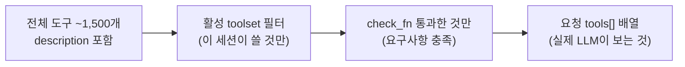
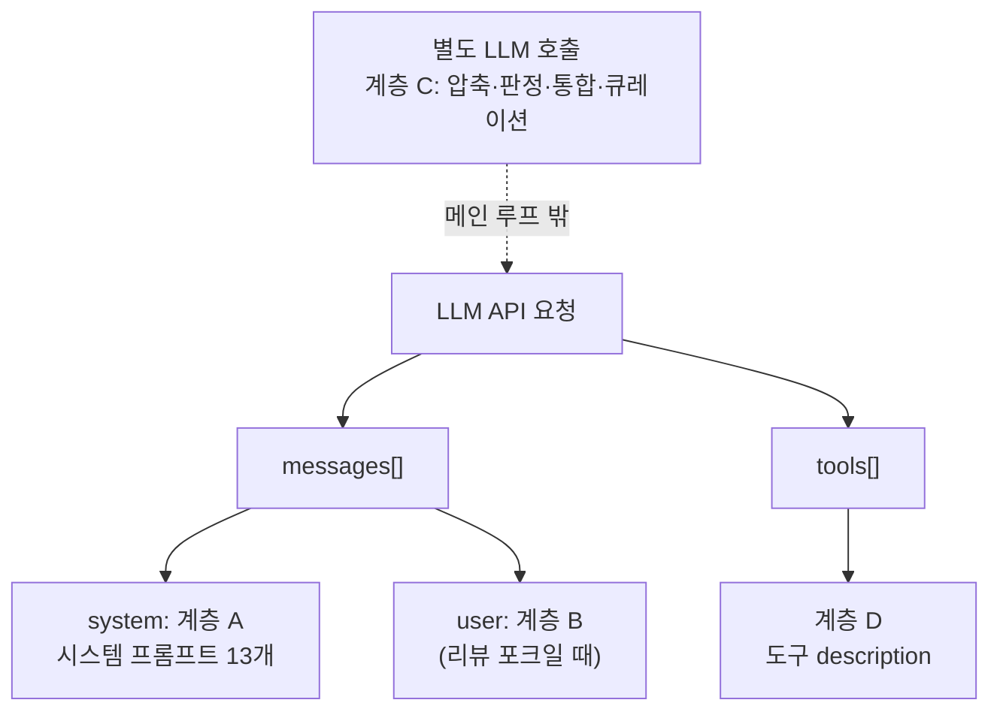

[모든 프롬프트 (3)](./18-3-all-prompts)에 이어, 이번 편은 마지막 계층 D인 도구 description을 본다. 앞선 계층 A~C는 산문 프롬프트라 원문을 실었지만, 도구 description은 1,500개가 넘어서 전부 나열하는 게 의미 없다. 대신 "도구 description도 LLM에게 가는 프롬프트다"라는 관점에서 구조와 작성 패턴을 짚고, #18 전체를 닫는다.

---

## 왜 도구 description이 "프롬프트"인가

흔히 프롬프트라고 하면 시스템 메시지나 사용자 메시지를 떠올린다. 하지만 LLM에게 보내는 API 요청에는 도구 정의도 함께 들어간다. 그리고 각 도구의 `description` 필드는 자연어 문장이다. 즉 LLM이 읽고 "이 도구를 언제, 어떻게 쓸지" 판단하는 근거가 된다. 이건 명백히 프롬프트의 일부다.

```python
# LLM API 요청의 구조 (단순화)
{
  "messages": [...],          # 계층 A·B·C가 여기 (system / user)
  "tools": [
    {
      "type": "function",
      "function": {
        "name": "web_search",
        "description": "...",   # ← 계층 D: 이것도 LLM이 읽는 프롬프트
        "parameters": {
          "properties": {
            "query": { "description": "..." }  # ← 파라미터마다 또 description
          }
        }
      }
    },
    ... (수십 개 도구)
  ]
}
```

[#4 도구 시스템](./04-tools-system)에서 도구가 어떻게 등록·디스패치되는지 봤다. 여기서는 그 도구들의 description이 어떻게 쓰여 있고, 좋은 description이 무엇인지, 프롬프트 엔지니어 관점에서, 본다.

규모를 다시 짚으면: 도구 schema의 description이 약 1,500개, 파라미터 description은 그보다 더 많다. 전수 수록은 자동생성 덤프지 글이 아니므로, 패턴만 다룬다. 전체 목록이 필요하면 `hermes tools list`나 코드(`tools/*.py`)가 출처다.

---

## 도구 description의 구조

도구는 `tools/registry.py`의 `registry.register(...)`로 등록된다. 실제 등록 구조는 이렇다(terminal 도구 예).

```python
registry.register(
    name="terminal",
    toolset="terminal",
    schema=TERMINAL_SCHEMA,          # 여기 안에 description이 있다
    handler=_handle_terminal,
    check_fn=check_terminal_requirements,
    emoji="💻",
    max_result_size_chars=100_000,
)
```

핵심은 두 층의 description이다.

1. 도구 레벨 description (`schema`의 `description`), "이 도구가 무엇을 하는가"
2. 파라미터 레벨 description (각 `properties`의 `description`), "이 인자가 무엇인가"

LLM은 두 층을 함께 읽고, 도구를 부를지, 부른다면 어떤 인자로 부를지 결정한다.

---

## 좋은 도구 description의 패턴

Hermes 도구들의 description을 보면 일관된 작성 패턴이 있다. 실제 예시로 추출한다.

### 패턴 1: 무엇을 하는지 + 무엇을 반환하는지

`read_terminal` 도구의 description 전체 내용이다.

```text
Read what's currently shown in the in-app terminal pane of the Hermes desktop GUI (the embedded shell beside this chat). Call with no arguments to get the visible screen plus the total line count (`total_lines`). To page through scrollback, pass `start_line` (0 = oldest line) and `count`; valid lines are [0, total_lines). Returns JSON: {total_lines, start, end, viewport_rows, cursor_row, text}.
```

읽어보면 네 가지가 한 문장 안에 압축돼 있다. (1) 무엇을 하나(터미널 화면 읽기), (2) 기본 호출법(인자 없이), (3) 고급 호출법(start_line/count로 페이징), (4) 반환 형식(JSON 구조). 도구 description은 사용 설명서이자 API 문서다.

### 패턴 2: 언제 쓰고 언제 안 쓰는지 (경계 명시)

좋은 description은 "이 도구를 쓸 때"만 적지 않고 "안 쓸 때"도 적는다. `web_search`의 query 파라미터 description.

```text
The search query to look up on the web. You may include backend-supported operators such as site:example.com, filetype:pdf, intitle:word, -term, or "exact phrase".
```

검색 연산자까지 알려줘, LLM이 단순 키워드를 넘어 정교한 쿼리를 짜게 한다. 파라미터 description이 "그냥 검색어"가 아니라 "이렇게 쓰면 더 강력하다"까지 담는다.

### 패턴 3: 함정과 권장 조합 경고

`terminal` 도구의 `background` 파라미터 description은 경고를 담는다.

```text
Run the command in the background. Almost always pair with notify_on_complete=true — without it, the process runs silently and you'll have no way to learn it finished short of calling process(action='poll') yourself...
```

"거의 항상 notify_on_complete=true와 함께 써라"는 권장 조합과, "안 그러면 조용히 돌아서 끝난 걸 모른다"는 함정을 동시에 명시한다. 도구 description이 모델의 흔한 실수를 선제적으로 막는다.

이 세 패턴을 종합하면, Hermes 도구 description의 작성 원칙은 이렇다.

| 원칙 | 설명 |
| --- | --- |
| 무엇을/어떻게/무엇 반환 | 기능 + 호출법 + 반환 형식을 한 곳에 |
| 경계 명시 | 언제 쓰고 언제 안 쓰는지, 다른 도구와의 차이 |
| 함정 선제 차단 | 흔한 실수와 권장 조합을 미리 경고 |
| 파라미터도 프롬프트 | 인자 description에 연산자·예시·제약을 담음 |

---

## description은 토큰을 쓴다: 그래서 조건부로 들어간다

도구 description은 공짜가 아니다. 1,500개 도구의 description을 매 요청에 다 넣으면 토큰이 폭발한다. 그래서 [#3](./03-system-prompt)·[#4](./04-tools-system)에서 봤듯, 활성화된 toolset의 도구만 요청에 들어간다.



여기서 [#4의 `check_fn`](./04-tools-system) 철학이 다시 나온다. 요구사항(API 키, 바이너리 등)을 충족 못 한 도구는 LLM에게 아예 안 보인다. 그래서 "쓸 수 없는 도구의 description"이 프롬프트를 낭비하지 않는다. 계층 A의 "도구 있을 때만 guidance 주입"과 같은 원리가 도구 description 자체에도 적용된다. 보이는 도구 = 쓸 수 있는 도구 = description도 그때만 토큰을 쓴다.

이게 계층 D를 계층 A~C와 잇는 핵심 통찰이다. 시스템 프롬프트 guidance(계층 A)와 도구 description(계층 D)은 짝이다. 메모리 도구가 켜지면, 계층 A의 `MEMORY_GUIDANCE`("메모리를 이렇게 써라")와 계층 D의 memory 도구 description("이 도구는 이런 인자를 받는다")이 함께 들어간다. 하나는 정책, 하나는 사용법이다.

---

## #18 전체 정리: LLM에게 가는 모든 프롬프트

네 파트에 걸쳐 Hermes가 LLM에게 보내는 프롬프트 전부를 펼쳤다. 한 장으로 모은다.



| 계층 | 프롬프트 | 위치 | 파트 |
| --- | --- | --- | --- |
| A | 시스템 프롬프트 상수 13개 | `messages[0]` system | [18-1](./18-1-all-prompts) |
| B | Background review 3개 | 리뷰 포크의 user | [18-2](./18-2-all-prompts) |
| C | 보조 LLM 프롬프트 11개 | 별도 LLM 호출 | [18-3](./18-3-all-prompts) |
| D | 도구 description ~1,500개 | `tools[].description` | 이 파트 |

네 파트를 관통하는 프롬프트 엔지니어링 원칙을 정리하면.

- 조건부 주입: 모든 계층이 "필요할 때만" 들어간다. 도구가 없으면 그 guidance도, 그 description도 안 들어간다. 캐시와 토큰을 위해서다.
- 형식이 곧 설계: 같은 의도라도 모델에 맞춰 형식을 바꾼다(계층 A의 GPT용 XML vs Gemini용 불릿). 절차적 프롬프트는 번호 매긴 단계로(KANBAN), 보조 출력은 엄격한 형식 제약으로(계층 C의 JSON 한 줄).
- 실패 모드를 겨냥: 각 프롬프트는 추상적 지시가 아니라 구체적 실패를 막는다. "말만 하고 안 하기"(A-7), "가짜 결과 지어내기"(A-8), "옛 작업 오인"(C-1), "자기 보고 맹신"(C-3), "스킬 폭증"(B-2), "통합 회피"(C-5).
- 자기 방어: self-improvement 프롬프트(계층 B·C-5)는 무엇을 배울지만큼 무엇을 안 배울지를 정한다. "도구가 안 된다"를 굳히지 않기, 환경 탓 실패를 스킬로 만들지 않기.
- 보안도 프롬프트: 신뢰 채널 구분(A-12 steer), UI 인젝션 무시(A-11), 비밀 입력 금지(A-11)가 코드가 아니라 프롬프트로 구현된다.

Hermes의 프롬프트는 "AI에게 친절히 부탁하는 글"이 아니다. 모델별 약점, 흔한 실패 모드, 토큰 비용, 보안 위협, 자기 개선의 함정까지 계산해 설계한 엔지니어링 산물이다. 그 내용이 이 네 파트에 나뉘어 담겨 있다.
